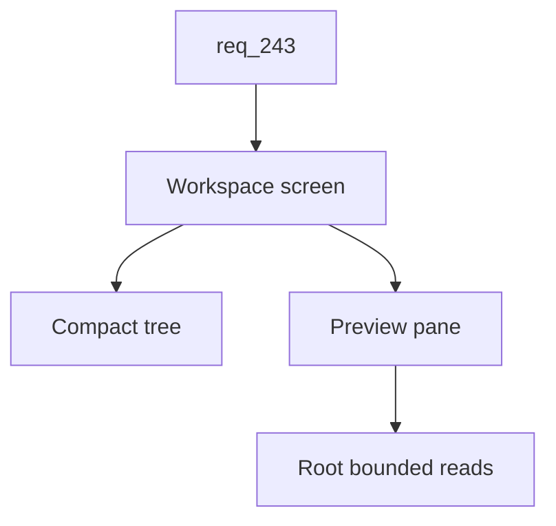

## item_418_add_workspace_file_explorer_view_to_the_viewer - Add workspace file explorer view to the viewer
> From version: 2.8.0
> Schema version: 1.0
> Status: Ready
> Understanding: 95%
> Confidence: 85%
> Progress: 0%
> Complexity: High
> Theme: Viewer operator workflow
> Reminder: Update status/understanding/confidence/progress and linked request/task references when you edit this doc.

# Problem
The viewer gives operators workflow, Git, CI, and CDX perspectives, but it does not provide a direct workspace file perspective. Operators should be able to open a Workspace screen before Git, browse files compactly, and preview the selected object without leaving the viewer.

# Scope
- In:
  - Workspace navigation button placed before Git when workspace capability is available.
  - Capability-gated unavailable state when the selected project cannot expose a workspace root.
  - Compact tree view on the left.
  - Preview/details pane on the right for the selected file or directory.
  - Bounded file read API constrained to the selected workspace root.
  - Preview handling for text/code, markdown/plain text, images when supported, directories, large files, and binary/unsupported files.
  - Ignored or collapsed heavy directories such as `.git`, `node_modules`, build output, and dependency caches.
- Out:
  - Editing, creating, deleting, or renaming files.
  - Full-text workspace search.
  - Git diff rendering inside this Workspace screen.
  - Loading entire large workspaces or large files eagerly.

# Acceptance criteria
- AC1: A Workspace navigation button is shown before Git when the selected project exposes workspace file capability.
- AC2: The Workspace navigation entry is hidden, disabled, or explained when workspace capability is unavailable.
- AC3: The Workspace screen uses a compact left tree and right preview/details layout.
- AC4: Selecting a directory shows useful directory details and supports expanding/collapsing children.
- AC5: Selecting a text/code file shows a bounded preview without loading beyond configured size limits.
- AC6: Selecting a binary, unsupported, missing, or oversized file shows metadata and a clear non-preview state.
- AC7: File and directory requests are normalized and rejected when they escape the selected workspace root.
- AC8: Heavy directories are ignored, collapsed, or lazily loaded so initial rendering stays responsive.
- AC9: Tests cover capability gating, tree rendering, selection, root traversal rejection, large file fallback, and binary/unsupported fallback.

# AC Traceability
- request-AC7 -> This backlog slice. Proof: AC1 and AC2 define Workspace navigation and gating.
- request-AC8 -> This backlog slice. Proof: AC3 and AC4 define the tree and preview layout.
- request-AC9 -> This backlog slice. Proof: AC5 through AC8 define preview limits and root safety.
- request-AC10 -> This backlog slice. Proof: AC9 requires workspace UI and safety tests.

# Decision framing
- Product framing: Not needed
- Product signals: (none detected)
- Product follow-up: No product brief follow-up is expected based on current signals.
- Architecture framing: Not needed
- Architecture signals: (none detected)
- Architecture follow-up: No architecture decision follow-up is expected based on current signals.

# Links
- Product brief(s): (none yet)
- Architecture decision(s): (none yet)
- Request: `logics/request/req_243_persist_viewer_preferences_and_add_configurable_cdx_status_and_workspace_views.md`
- Primary task(s): `task_218_implement_persisted_viewer_preferences_cdx_status_controls_and_workspace_file_view`

# AI Context
- Summary: Add a capability-gated Workspace screen with compact tree navigation and safe file previews.
- Keywords: workspace-view, file-tree, preview-pane, root-bounded-read, large-file, binary-file, viewer-navigation
- Use when: Implementing or testing workspace file browsing in the local viewer.
- Skip when: The work is only about Git diffs, CDX status, or Logics document navigation.

# Priority
- Impact: High
- Urgency: Medium

# Notes
- The first implementation should be read-only and conservative about file sizes and ignored folders.

# Tasks
- `task_218_implement_persisted_viewer_preferences_cdx_status_controls_and_workspace_file_view`
