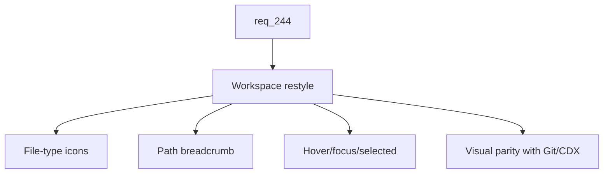

## item_419_restyle_the_workspace_explorer_screen - Restyle the Workspace Explorer screen
> From version: 2.8.1
> Schema version: 1.0
> Status: Done
> Understanding: 85%
> Confidence: 80%
> Progress: 100%
> Complexity: Medium
> Theme: Viewer operator workflow
> Reminder: Update status/understanding/confidence/progress and linked request/task references when you edit this doc.

# Problem
The Workspace/Explorer screen introduced in `req_243` is functional but visually unfinished compared to the Git, CI, and CDX screens. Operators perceive it as raw and lose confidence when using it as the primary file-inspection surface. The fix is a frontend polish slice over the existing data model and endpoints; no backend change is required.

# Scope
- In:
  - CSS restyle of the Workspace tree, breadcrumb, and preview panes in `clients/viewer/viewer.css` and the relevant `clients/shared-web/media/css/*.css` files.
  - Consistent file-type icon set for tree entries (folder, generic file, code, markdown, image, binary/unsupported).
  - Visible breadcrumb of the current path above the preview pane.
  - Explicit hover, focus, and selected states on tree rows, reachable via mouse and keyboard.
  - Spacing, density, and typography aligned with the Git and CDX screens.
  - Empty state and unavailable-capability state visually aligned with the rest of the viewer.
- Out:
  - File editing, creating, deleting, or renaming.
  - Changes to the workspace tree/read backend endpoints.
  - New preview formats beyond the ones already supported by `item_418`.
  - Search inside the workspace.

# Acceptance criteria
- AC1: The Workspace tree uses a consistent file-type icon set (folder, file, code, markdown, image, binary/unsupported) rendered from the existing media assets.
- AC2: A breadcrumb of the current selection path is shown above the preview pane and reflects the selected tree entry.
- AC3: Tree rows expose explicit hover, focus, and selected visual states, reachable via mouse and keyboard.
- AC4: Spacing, density, and typography of the Workspace screen visually match the Git and CDX screens at the same viewport sizes.
- AC5: The Workspace empty state and unavailable-capability state share the same visual language as the equivalent states in the other viewer screens.
- AC6: The restyle does not change any backend endpoint, preference key, or accessibility hook required by `item_418`.
- AC7: Tests cover the icon mapping for known file extensions, the breadcrumb rendering for nested selections, and the selected-state attribute on the tree row.

# AC Traceability
- request-AC1 -> This backlog slice. Proof: AC1 through AC5 define the explicit visual polish targets.
- request-AC11 -> This backlog slice. Proof: AC7 requires automated tests for the restyle hooks.
- request-AC8 -> This backlog slice. Evidence needed: Running a command from the Commands sub-screen streams stdout and stderr in real time into a log panel, exposes the exit code on completion, and allows stopping a running command without killing the viewer process.
- request-AC9 -> This backlog slice. Evidence needed: All Workshop subprocess execution is bounded to the selected workspace root, refuses to spawn outside it, and gracefully degrades (with a clear empty state) when the project exposes no workspace, no scripts, or no terminal capability.
- request-AC10 -> This backlog slice. Evidence needed: The new backend transport (WebSocket or equivalent) is feature-gated, documented in the viewer architecture notes, and falls back cleanly when the transport is unavailable so existing viewer features keep working.
- request-AC12 -> This backlog slice. Evidence needed: Tests cover the Explorer restyle markup and accessibility hooks, Workshop tab persistence, command discovery from `package.json` and `pyproject.toml`, command run/stop and exit-code reporting, terminal session lifecycle, cross-platform PTY behavior on Linux/macOS/Windows, and workspace-root sandboxing of spawned processes.

# Decision framing
- Product framing: Not needed
- Product signals: (none detected)
- Product follow-up: No product brief follow-up is expected based on current signals.
- Architecture framing: Not needed
- Architecture signals: (none detected)
- Architecture follow-up: No architecture decision follow-up is expected based on current signals.

# Links
- Product brief(s): (none yet)
- Architecture decision(s): (none yet)
- Request: `logics/request/req_244_restyle_the_explorer_and_add_a_workshop_screen_with_terminals_and_command_runner.md`
- Primary task(s): `task_219_implement_explorer_restyle_and_workshop_screen_with_terminals_and_command_runner`

# AI Context
- Summary: Polish the Workspace Explorer screen with file-type icons, a breadcrumb, explicit row states, and visual parity with Git/CDX.
- Keywords: explorer-restyle, workspace-icons, breadcrumb, hover-focus-selected, viewer-css, visual-parity
- Use when: Implementing or testing the visual polish of the Workspace/Explorer screen in the local viewer.
- Skip when: The work is about backend tree/read endpoints, new preview formats, or non-Workspace viewer screens.

# Priority
- Impact: Medium
- Urgency: Medium

# Notes
- This is the lowest-risk slice of `req_244` and a good first PR to ship independently.
- Task `task_219_implement_explorer_restyle_and_workshop_screen_with_terminals_and_command_runner` was finished via `logics-manager flow finish task` on 2026-06-15.

# Tasks
- `task_219_implement_explorer_restyle_and_workshop_screen_with_terminals_and_command_runner`
