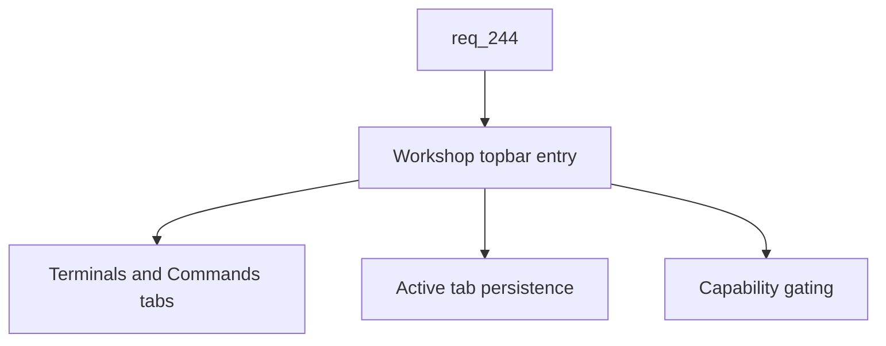

## item_420_add_workshop_topbar_entry_with_terminal_and_command_sub_screens - Add Workshop topbar entry with terminal and command sub-screens
> From version: 2.8.1
> Schema version: 1.0
> Status: Done
> Understanding: 85%
> Confidence: 82%
> Progress: 100%
> Complexity: High
> Theme: Viewer operator workflow
> Reminder: Update status/understanding/confidence/progress and linked request/task references when you edit this doc.

# Problem
The viewer topbar exposes Explorer, Git, CI, CDX, and Settings entries, but it has no dedicated surface for live execution work. Operators need a single Workshop entry, placed between Explorer and Git, that hosts two clearly separated sub-screens (Terminals and Commands). This slice delivers only the navigation, capability gating, layout, and persistent tab state. The actual terminal and command runtimes are delivered by `item_421` and `item_422`.

# Scope
- In:
  - New Workshop button in the viewer topbar, positioned between Explorer and Git.
  - Capability gating consistent with Explorer/Git/CI/CDX (hidden, disabled, or explained state).
  - Two-tab layout inside the Workshop screen with `Terminals` and `Commands` sub-screens.
  - Persistence of the active Workshop tab through the existing versioned viewer preferences payload.
  - Empty/placeholder content inside each sub-screen so the navigation can ship before the runtimes land.
  - Parity of the markup between the browser viewer and the VS Code webview chrome.
- Out:
  - PTY backend, terminal emulator, terminal session lifecycle (delivered by `item_421`).
  - Command discovery, execution, and log streaming (delivered by `item_422`).
  - Restyle of the Explorer screen (delivered by `item_419`).
  - Any new persisted state beyond the active Workshop tab key.

# Acceptance criteria
- AC1: A Workshop button is added to the viewer topbar between the Explorer and Git buttons.
- AC2: The Workshop button is gated on workspace capability availability in the same way as the Explorer/Git/CI/CDX buttons and shows a consistent unavailable state when capability is missing.
- AC3: Selecting Workshop opens a screen with two sub-tabs labelled `Terminals` and `Commands`, each rendered with a placeholder empty state until the linked runtimes ship.
- AC4: The active Workshop sub-tab is persisted through the existing versioned viewer preferences payload and restored on viewer restart.
- AC5: Switching Workshop sub-tabs does not refetch viewer state or reset other persisted preferences.
- AC6: The Workshop markup is rendered identically by the browser viewer and the VS Code webview chrome.
- AC7: Tests cover the topbar position, capability gating, sub-tab switching, and active-tab persistence.

# AC Traceability
- request-AC2 -> This backlog slice. Proof: AC1 and AC2 add the Workshop topbar entry with capability gating.
- request-AC3 -> This backlog slice. Proof: AC3 through AC5 define the two-tab layout and persistence.
- request-AC11 -> This backlog slice. Proof: AC7 requires automated tests for navigation and persistence.
- request-AC8 -> This backlog slice. Evidence needed: Running a command from the Commands sub-screen streams stdout and stderr in real time into a log panel, exposes the exit code on completion, and allows stopping a running command without killing the viewer process.
- request-AC9 -> This backlog slice. Evidence needed: All Workshop subprocess execution is bounded to the selected workspace root, refuses to spawn outside it, and gracefully degrades (with a clear empty state) when the project exposes no workspace, no scripts, or no terminal capability.
- request-AC10 -> This backlog slice. Evidence needed: The new backend transport (WebSocket or equivalent) is feature-gated, documented in the viewer architecture notes, and falls back cleanly when the transport is unavailable so existing viewer features keep working.
- request-AC12 -> This backlog slice. Evidence needed: Tests cover the Explorer restyle markup and accessibility hooks, Workshop tab persistence, command discovery from `package.json` and `pyproject.toml`, command run/stop and exit-code reporting, terminal session lifecycle, cross-platform PTY behavior on Linux/macOS/Windows, and workspace-root sandboxing of spawned processes.

# Decision framing
- Product framing: Not needed
- Product signals: (none detected)
- Product follow-up: No product brief follow-up is expected based on current signals.
- Architecture framing: Not needed
- Architecture signals: (none detected)
- Architecture follow-up: No architecture decision follow-up is expected based on current signals.

# Links
- Product brief(s): (none yet)
- Architecture decision(s): (none yet)
- Request: `logics/request/req_244_restyle_the_explorer_and_add_a_workshop_screen_with_terminals_and_command_runner.md`
- Primary task(s): `task_219_implement_explorer_restyle_and_workshop_screen_with_terminals_and_command_runner`

# AI Context
- Summary: Add the Workshop topbar entry, the Terminals/Commands sub-tab layout, and the persisted active-tab preference.
- Keywords: workshop-topbar, sub-tab-layout, capability-gating, viewer-preferences, terminals-tab, commands-tab
- Use when: Implementing or testing the Workshop navigation and tab persistence in the local viewer.
- Skip when: The work is about PTY transport, command discovery/execution, or the Explorer restyle.

# Priority
- Impact: High
- Urgency: Medium

# Notes
- Ship the navigation slice before the runtimes so `item_421` and `item_422` can mount inside a stable container.
- Implementation reference: extend the existing versioned viewer preferences payload (`logics.localViewer.preferences.v1`) with a new `workshop.activeTab` key holding `terminals` or `commands`. No new backend endpoint, no new transport, no new dependency. CSS-only chrome change layered on top of the existing topbar pattern (`#viewer-workspace`/`#viewer-git` buttons). VS Code webview chrome reads the same markup via `clients/viewer/browser-host.js`.
- Task `task_219_implement_explorer_restyle_and_workshop_screen_with_terminals_and_command_runner` was finished via `logics-manager flow finish task` on 2026-06-15.

# Tasks
- `task_219_implement_explorer_restyle_and_workshop_screen_with_terminals_and_command_runner`
