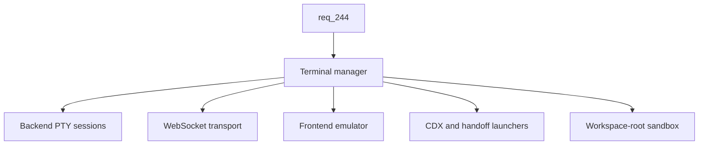

## item_421_add_in_app_terminal_manager_with_pty_transport_and_cdx_handoff_launchers - Add in-app terminal manager with PTY transport and CDX handoff launchers
> From version: 2.8.1
> Schema version: 1.0
> Status: Ready
> Understanding: 75%
> Confidence: 65%
> Progress: 0%
> Complexity: High
> Theme: Viewer operator workflow
> Reminder: Update status/understanding/confidence/progress and linked request/task references when you edit this doc.

# Problem
Operators leave the Logics viewer whenever they need an interactive shell, a CDX session, or a handoff command. This breaks the cockpit experience and adds friction to every CDX mission and handoff. The Workshop screen needs a robust, visually finished terminal manager backed by real PTYs, plus first-class affordances to launch CDX sessions and handoffs directly inside a new Workshop terminal session.

# Scope
- In:
  - Backend PTY management with create/resize/write/read/close operations, multiplexed by session id.
  - New backend transport for PTY I/O (WebSocket preferred, SSE+POST acceptable fallback) bolted onto the existing viewer HTTP server.
  - Frontend terminal rendering via a maintained emulator (xterm.js or equivalent), vendored or fetched in line with existing offline-friendly asset bundling.
  - Multi-session UI: list of sessions, create/rename/switch/close, in-session buffer kept while switching sub-tabs.
  - ANSI color, interactive input, copy/paste, and terminal resize on container resize.
  - First-class launchers that open a new Workshop terminal already running a CDX session or a handoff command, reusing the existing CDX mission/handoff metadata.
  - Cleanup of PTY sessions when the viewer shuts down or the underlying client disconnects.
- Out:
  - Persisting terminal scrollback or session state to disk between viewer restarts.
  - Cross-machine sync of terminals.
  - Replacing or merging with the existing CDX status screen.
  - Spawning sessions outside the selected workspace root.

# Acceptance criteria
- AC1: The Terminals sub-screen supports creating, renaming, switching between, and closing multiple terminal sessions, with the session list persistent within a viewer session.
- AC2: Each terminal session is backed by a real PTY on the backend and rendered with a maintained terminal emulator on the frontend.
- AC3: Sessions support interactive input, ANSI color, copy/paste, and resize when the container resizes.
- AC4: Switching to another Workshop sub-tab or another viewer screen and back preserves the session buffer for the lifetime of the viewer process.
- AC5: A first-class affordance launches a CDX session inside a new Workshop terminal, reusing the canonical CDX mission metadata.
- AC6: A first-class affordance launches a handoff command inside a new Workshop terminal, reusing the canonical handoff metadata.
- AC7: All PTY processes are spawned with the selected workspace root as their working directory and refuse to spawn when no workspace root is available.
- AC8: PTY processes are terminated when the viewer shuts down or when the underlying client connection is closed for longer than a bounded grace window.
- AC9: The new backend transport is feature-gated and falls back to a clear unavailable state when the host or platform cannot support it, without breaking existing viewer features.
- AC10: Tests cover the session lifecycle (create/rename/switch/close), the workspace-root sandbox, the CDX and handoff launchers, and the transport unavailable fallback.

# AC Traceability
- request-AC4 -> This backlog slice. Proof: AC1 and AC4 define multi-session lifecycle and buffer persistence within a viewer session.
- request-AC5 -> This backlog slice. Proof: AC2 and AC3 define the PTY backing and the emulator features.
- request-AC6 -> This backlog slice. Proof: AC5 and AC6 define the CDX and handoff launchers.
- request-AC9 -> This backlog slice. Proof: AC7 and AC8 define workspace-root sandboxing and cleanup of subprocesses.
- request-AC10 -> This backlog slice. Proof: AC9 requires the transport to be feature-gated with a clean fallback.
- request-AC11 -> This backlog slice. Proof: AC10 requires automated tests for the terminal session lifecycle.

# Decision framing
- Product framing: Not needed
- Product signals: (none detected)
- Product follow-up: No product brief follow-up is expected based on current signals.
- Architecture framing: Needed
- Architecture signals: New backend transport (WebSocket or equivalent); new third-party runtime dependency (PTY library and terminal emulator); cross-platform support implications.
- Architecture follow-up: An ADR should be authored to record the transport choice (WebSocket vs SSE+POST), the PTY library, the terminal emulator, and the bundling/vendoring approach.

# Links
- Product brief(s): (none yet)
- Architecture decision(s): (none yet — ADR follow-up required, see Decision framing)
- Request: `logics/request/req_244_restyle_the_explorer_and_add_a_workshop_screen_with_terminals_and_command_runner.md`
- Primary task(s): `task_219_implement_explorer_restyle_and_workshop_screen_with_terminals_and_command_runner`

# AI Context
- Summary: Deliver a robust, visually finished in-app terminal manager with PTY-backed sessions, a WebSocket-style transport, and CDX/handoff launchers, sandboxed to the workspace root.
- Keywords: terminal-manager, pty, websocket, xterm, multi-session, cdx-launcher, handoff-launcher, workspace-sandbox, transport-fallback
- Use when: Implementing or testing the Workshop terminal sub-screen, the PTY transport, or the CDX/handoff launchers.
- Skip when: The work is about command discovery/execution from package.json or pyproject, or the Explorer restyle.

# Priority
- Impact: High
- Urgency: Medium

# Notes
- This slice introduces the new runtime dependency and the new transport; ship it after `item_420` so it mounts into a stable container, and after the ADR is recorded.

# Tasks
- `task_219_implement_explorer_restyle_and_workshop_screen_with_terminals_and_command_runner`
