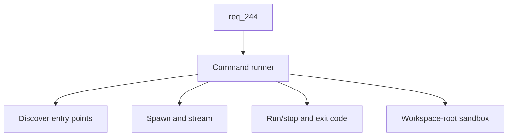

## item_422_add_command_runner_driven_by_package_json_and_pyproject_entry_points - Add command runner driven by package.json and pyproject entry points
> From version: 2.8.1
> Schema version: 1.0
> Status: Done
> Understanding: 88%
> Confidence: 85%
> Progress: 100%
> Complexity: High
> Theme: Viewer operator workflow
> Reminder: Update status/understanding/confidence/progress and linked request/task references when you edit this doc.

# Problem
Recurring developer tasks (start a dev server, run tests, run a lint) live in `package.json` `scripts` and in `pyproject.toml` (project/poetry scripts) but require a context switch to a terminal. The Workshop Commands sub-screen needs to discover these entry points, present them grouped by source, and let operators run/stop them with streamed logs without leaving the viewer.

# Scope
- In:
  - Backend discovery of entry points from at least `package.json` `scripts` and `pyproject.toml` (`[project.scripts]`, `[tool.poetry.scripts]`).
  - Backend execution of a selected entry point as a subprocess, with stdout and stderr streamed to the client via SSE or the same transport used for terminals.
  - Backend reporting of exit code on completion and support for stopping a running command without killing the viewer process.
  - Workspace-root sandboxing of all spawned processes; refusal to spawn when no workspace root is available.
  - Frontend Commands sub-screen: list grouped by source (npm scripts, project scripts, poetry scripts), label, underlying command line, run/stop button per entry, and a log panel per running command.
  - Visual distinction between long-running commands (servers, no exit) and one-shot commands (tests, lint) based on running state.
  - Graceful empty state when no entry points are discovered.
- Out:
  - Running arbitrary ad-hoc shell commands typed by the operator (those belong in `item_421` terminal sessions).
  - Editing `package.json`, `pyproject.toml`, or any source of entry points from the viewer.
  - Persisting command history or log output between viewer restarts.
  - Discovering entry points beyond the supported sources (Makefile, custom runners) in this slice.

# Acceptance criteria
- AC1: The Commands sub-screen discovers and lists entry points from `package.json` `scripts` and `pyproject.toml` (project and poetry scripts).
- AC2: Entries are grouped by source, each with a clear label and the underlying command line visible to the operator.
- AC3: Each entry exposes a run button that starts the command and a stop button that becomes available while it runs.
- AC4: Running a command streams stdout and stderr in real time into a log panel attached to the entry.
- AC5: On completion, the exit code is shown and the run/stop affordance returns to the runnable state.
- AC6: Stopping a running command terminates the underlying subprocess without killing the viewer process and updates the UI within a bounded grace window.
- AC7: All spawned processes run with the selected workspace root as their working directory and the spawn is refused when no workspace root is available.
- AC8: A graceful empty state is shown when no entry points are discovered, with a hint pointing to the supported sources.
- AC9: Tests cover entry point discovery from `package.json` and `pyproject.toml`, run/stop lifecycle, exit-code reporting, stream backpressure handling, and workspace-root sandboxing.

# AC Traceability
- request-AC7 -> This backlog slice. Proof: AC1 and AC2 define discovery and grouped presentation.
- request-AC8 -> This backlog slice. Proof: AC3 through AC6 define run/stop, streaming, and exit-code reporting.
- request-AC9 -> This backlog slice. Proof: AC7 enforces the workspace-root sandbox.
- request-AC11 -> This backlog slice. Proof: AC9 requires automated tests for discovery and lifecycle.
- request-AC10 -> This backlog slice. Evidence needed: The new backend transport (WebSocket or equivalent) is feature-gated, documented in the viewer architecture notes, and falls back cleanly when the transport is unavailable so existing viewer features keep working.
- request-AC12 -> This backlog slice. Evidence needed: Tests cover the Explorer restyle markup and accessibility hooks, Workshop tab persistence, command discovery from `package.json` and `pyproject.toml`, command run/stop and exit-code reporting, terminal session lifecycle, cross-platform PTY behavior on Linux/macOS/Windows, and workspace-root sandboxing of spawned processes.

# Decision framing
- Product framing: Not needed
- Product signals: (none detected)
- Product follow-up: No product brief follow-up is expected based on current signals.
- Architecture framing: Not needed (transport choice and PTY library are decided in the `item_421` ADR; this slice reuses the existing or chosen transport)
- Architecture signals: (none detected beyond what `item_421` already records)
- Architecture follow-up: No additional architecture decision follow-up is expected.

# Links
- Product brief(s): (none yet)
- Architecture decision(s): (none yet — relies on the `item_421` ADR for transport choice)
- Request: `logics/request/req_244_restyle_the_explorer_and_add_a_workshop_screen_with_terminals_and_command_runner.md`
- Primary task(s): `task_219_implement_explorer_restyle_and_workshop_screen_with_terminals_and_command_runner`

# AI Context
- Summary: Deliver the Workshop Commands sub-screen that discovers package.json and pyproject entry points, streams logs, and lets operators run/stop them with workspace-root sandboxing.
- Keywords: command-runner, package-json-scripts, pyproject-scripts, sse-streaming, run-stop, exit-code, workspace-sandbox
- Use when: Implementing or testing the Workshop Commands sub-screen and its discovery/execution backend.
- Skip when: The work is about PTY terminal sessions, the Explorer restyle, or the Workshop navigation scaffolding.

# Priority
- Impact: High
- Urgency: Medium

# Notes
- This slice can ship in parallel with `item_421` once the Workshop container from `item_420` is available; it does not require PTY.
- Researched implementation reference: parse `package.json` `scripts` via stdlib `json` and `pyproject.toml` via stdlib `tomllib` (Python 3.11+, already required by the project) reading `[project.scripts]` and `[tool.poetry.scripts]`. Stream stdout/stderr via Server-Sent Events on the existing stdlib `http.server` (no new transport dependency for this slice): a long-lived `Content-Type: text/event-stream` response framed as `event: stdout|stderr|exit\ndata: <payload>\n\n`, flushed per chunk; `ThreadingHTTPServer` natively handles a per-connection thread so SSE works out of the box. Subprocess management: `subprocess.Popen` with `start_new_session=True` on Unix and `creationflags=subprocess.CREATE_NEW_PROCESS_GROUP` on Windows so stop can target the whole process tree via `os.killpg(pid, signal.SIGTERM)` then `SIGKILL` after a 5-second grace on Unix, or `Popen.send_signal(signal.CTRL_BREAK_EVENT)` then `Popen.kill()` on Windows. Exit code is read from `Popen.wait()` in the streaming thread and emitted as the final `event: exit` frame.
- Task `task_219_implement_explorer_restyle_and_workshop_screen_with_terminals_and_command_runner` was finished via `logics-manager flow finish task` on 2026-06-15.

# Tasks
- `task_219_implement_explorer_restyle_and_workshop_screen_with_terminals_and_command_runner`
