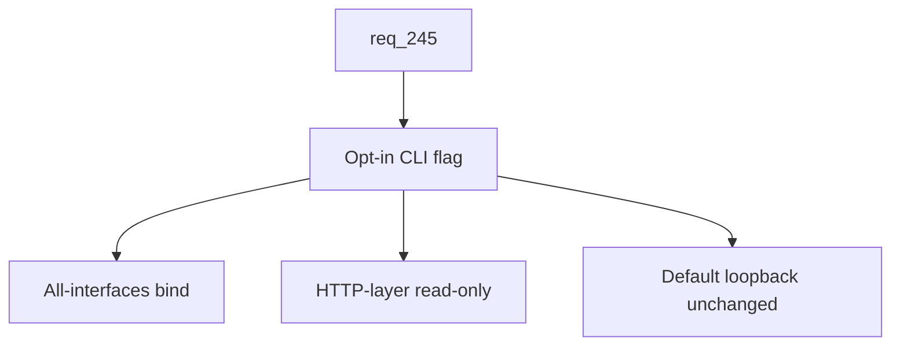

## item_423_add_lan_opt_in_cli_flag_with_http_layer_read_only_enforcement - Add LAN opt-in CLI flag with HTTP-layer read-only enforcement
> From version: 2.8.1
> Schema version: 1.0
> Status: In Progress
> Understanding: 90%
> Confidence: 85%
> Progress: 40%
> Complexity: High
> Theme: Viewer operator workflow
> Reminder: Update status/understanding/confidence/progress and linked request/task references when you edit this doc.

# Problem
The viewer already accepts a low-level `--host` argument, but exposing the viewer on the LAN today requires the operator to manually pass `--host 0.0.0.0` and offers no safety net. The first slice of `req_245` introduces a single opt-in CLI flag that switches the bind to all interfaces, classifies the launch as LAN mode end-to-end, and enforces a read-only posture at the HTTP layer for any mutating endpoint. The auth, QR code, and banner are delivered by the other slices and build on this foundation.

# Scope
- In:
  - New opt-in CLI flag (for example `--lan`) on the viewer entry point, distinct from the existing raw `--host` argument.
  - Bind switch to all interfaces only when the flag is set; default loopback remains unchanged.
  - A single "LAN mode" runtime flag carried through the viewer process so other components can branch on it.
  - HTTP-layer read-only enforcement: every endpoint that mutates state (current CDX launchers, future Workshop terminals/commands from `req_244`, any future file edits) refuses requests in LAN mode with a clear unauthorized response, even when no token check is involved.
  - Plain-language documentation of the security posture in the launch output (what is exposed, what is blocked).
- Out:
  - Token generation, query-to-session handoff, header enforcement (delivered by `item_424`).
  - QR code, in-app banner, copy-URL affordance (delivered by `item_425`).
  - HTTPS/TLS termination, public internet exposure, multi-user accounts.

# Acceptance criteria
- AC1: The viewer CLI exposes a new opt-in flag that enables LAN mode, distinct from the existing raw `--host` argument.
- AC2: Without the flag, the viewer binds to loopback as before and exhibits no LAN-specific behavior at any layer.
- AC3: With the flag, the viewer binds to all interfaces and carries a single runtime "LAN mode" indicator that other components can branch on.
- AC4: In LAN mode, every endpoint that mutates state outside the viewer process (CDX launchers, future Workshop terminals/commands, any future file edits) refuses requests with a clear unauthorized response that does not leak repository state.
- AC5: The HTTP-layer read-only enforcement is applied at the request-handler level, not only in the UI, so a direct curl against a mutating endpoint is refused.
- AC6: The launch output clearly states the security posture in plain language when LAN mode is enabled (what is exposed, what is blocked).
- AC7: Tests cover loopback-only behavior without the flag, all-interfaces bind with the flag, the LAN-mode indicator branching, and HTTP-layer rejection of mutating endpoints in LAN mode.

# AC Traceability
- request-AC1 -> This backlog slice. Proof: AC1 through AC3 introduce the opt-in flag, preserve the loopback default, and carry the LAN-mode indicator.
- request-AC6 -> This backlog slice. Proof: AC4 and AC5 enforce read-only at the HTTP layer for current and future mutating actions.
- request-AC8 -> This backlog slice. Proof: AC2 guarantees no LAN-specific behavior when the flag is absent.
- request-AC9 -> This backlog slice. Proof: AC6 surfaces the security posture in plain language at launch.
- request-AC10 -> This backlog slice. Proof: AC7 requires automated tests for the bind, the indicator, and the HTTP-layer enforcement.

# Decision framing
- Product framing: Not needed
- Product signals: (none detected)
- Product follow-up: No product brief follow-up is expected based on current signals.
- Architecture framing: Needed
- Architecture signals: New security surface (LAN exposure), HTTP-layer enforcement of read-only mode, interaction with current and future mutating endpoints.
- Architecture follow-up: An ADR should be authored to record the LAN auth model, the read-only enforcement layer, and the contract that any new mutating endpoint must opt into the LAN gate.

# Links
- Product brief(s): (none yet)
- Architecture decision(s): `adr_024_lan_viewer_auth_model_read_only_contract_and_qr_library_choice`
- Request: `logics/request/req_245_expose_the_viewer_on_the_local_network_with_token_authentication_and_read_only_safety.md`
- Primary task(s): `task_220_implement_lan_exposure_with_token_auth_qr_code_and_read_only_safety`

# AI Context
- Summary: Add the opt-in LAN CLI flag, switch the bind to all interfaces only when set, carry a runtime LAN-mode indicator, and enforce read-only at the HTTP request-handler level for any mutating endpoint.
- Keywords: lan-flag, opt-in, all-interfaces-bind, lan-mode-indicator, http-layer-readonly, viewer-cli
- Use when: Implementing or testing the LAN CLI flag, the read-only HTTP enforcement, or the LAN-mode runtime indicator in the local viewer.
- Skip when: The work is about token generation, QR code rendering, the in-app banner, or mobile responsive styling.

# Priority
- Impact: High
- Urgency: Medium

# Notes
- This is the foundation slice of `req_245`; ship it first so the token slice and the UX slice can build on a working LAN-mode switch and read-only contract.
- Researched implementation reference: add `--lan` to `logics_manager/viewer.py` argparse (default off). When set, override the bind host to `0.0.0.0` and stamp a process-wide `LAN_MODE = True` (the ADR may move this to a config object). Read-only enforcement: a maintained `MUTATING_ROUTES` registry (set of `(method, path_pattern)` tuples) is checked at the top of `LogicsViewerRequestHandler.do_GET`/`do_POST`/`do_DELETE` before any dispatch; in LAN mode, any match returns `403 Forbidden` with a generic body that does not leak repository state. The contract for adding any new write endpoint is to extend `MUTATING_ROUTES`, so the gate cannot be forgotten per-handler. The launch output uses `_network_viewer_url` (already in `logics_manager/viewer.py:2631`) to derive the LAN URL and prints a plain-language posture summary above the existing bind message.

# Tasks
- `task_220_implement_lan_exposure_with_token_auth_qr_code_and_read_only_safety`
