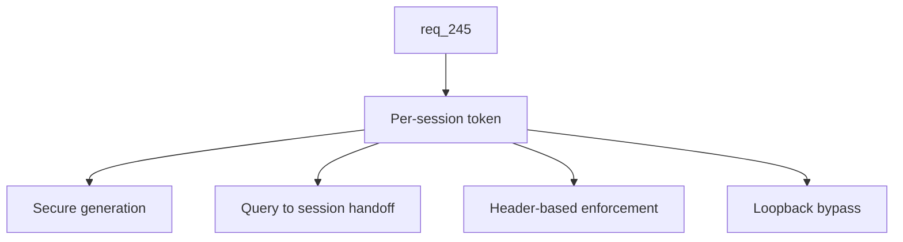

## item_424_add_per_session_token_auth_with_query_to_session_handoff - Add per-session token auth with query-to-session handoff
> From version: 2.8.1
> Schema version: 1.0
> Status: Ready
> Understanding: 90%
> Confidence: 85%
> Progress: 0%
> Complexity: High
> Theme: Viewer operator workflow
> Reminder: Update status/understanding/confidence/progress and linked request/task references when you edit this doc.

# Problem
With LAN mode enabled by `item_423`, the viewer is reachable from any device on the local network. Without authentication, anyone on the wifi can scrape the full repository state. This slice introduces a per-session token generated at launch, required on every non-loopback request, with a frictionless handoff from a one-time query string on first load to a browser-session-scoped header on subsequent requests.

# Scope
- In:
  - Token generation at viewer launch using a cryptographically secure source with enough entropy that brute force on a LAN is not realistic.
  - Tokens are kept in memory only, regenerated on every launch, and never persisted to disk or written to any file that could be checked in.
  - Token acceptance via a query string parameter on first load and via an HTTP header on subsequent requests.
  - Client-side storage in `sessionStorage` only (not `localStorage`), so closing the tab invalidates the convenience.
  - HTTP-layer enforcement: any non-loopback request without a valid token is rejected with a clear unauthorized response that does not leak repository state.
  - Loopback bypass: requests from loopback continue to work without a token, so the default single-machine workflow is unchanged.
  - Tests for token generation, query-to-session handoff, header enforcement, loopback bypass, and rejection of unauthorized requests.
- Out:
  - Multi-user accounts, role-based access control, persistent credentials across launches.
  - HTTPS/TLS termination inside the viewer.
  - Persistent token storage (`--lan-token-file` is explicitly out of scope for this slice).
  - QR code rendering and in-app banner (delivered by `item_425`).
  - HTTP-layer read-only enforcement of mutating endpoints (delivered by `item_423`).

# Acceptance criteria
- AC1: The viewer generates a fresh per-session token at every LAN-mode launch using a cryptographically secure source with enough entropy that brute force on a LAN is not realistic.
- AC2: Tokens are kept in memory only and are never persisted to disk, log files, or any artifact that could be checked in or shared accidentally.
- AC3: The viewer accepts the token through a query string parameter on first load and through an HTTP header on subsequent requests.
- AC4: The client stores the token in `sessionStorage` only (not `localStorage`), so closing the tab invalidates the convenience and forces a re-handoff from a fresh URL.
- AC5: Any non-loopback request without a valid token is rejected at the HTTP-handler level with a clear unauthorized response that does not leak repository state.
- AC6: Requests originating from loopback continue to work without a token, so the default single-machine workflow is unchanged.
- AC7: Tests cover secure token generation, the absence of persistence, the query-to-session handoff, header enforcement, loopback bypass, and rejection of unauthorized non-loopback requests.

# AC Traceability
- request-AC2 -> This backlog slice. Proof: AC1 and AC2 define secure per-session token generation without persistence.
- request-AC4 -> This backlog slice. Proof: AC3 and AC4 define the query-to-session handoff and the `sessionStorage`-only client storage.
- request-AC5 -> This backlog slice. Proof: AC5 and AC6 define the non-loopback rejection and the loopback bypass at the HTTP layer.
- request-AC10 -> This backlog slice. Proof: AC7 requires automated tests for the auth path.

# Decision framing
- Product framing: Not needed
- Product signals: (none detected)
- Product follow-up: No product brief follow-up is expected based on current signals.
- Architecture framing: Not needed (the LAN auth model is recorded by the `item_423` ADR; this slice implements the contract decided there)
- Architecture signals: (none detected beyond what `item_423` already records)
- Architecture follow-up: No additional architecture decision follow-up is expected.

# Links
- Product brief(s): (none yet)
- Architecture decision(s): (none yet — relies on the `item_423` ADR for the LAN auth model)
- Request: `logics/request/req_245_expose_the_viewer_on_the_local_network_with_token_authentication_and_read_only_safety.md`
- Primary task(s): `task_220_implement_lan_exposure_with_token_auth_qr_code_and_read_only_safety`

# AI Context
- Summary: Generate a per-session token at launch, hand it off from a one-time query string to a `sessionStorage`-scoped header, enforce it at the HTTP handler level for non-loopback requests, and bypass it for loopback.
- Keywords: per-session-token, sessionstorage, query-to-session-handoff, http-header-auth, loopback-bypass, lan-auth
- Use when: Implementing or testing the LAN token auth layer, the query-to-session handoff, or the HTTP-layer rejection of unauthorized requests.
- Skip when: The work is about the LAN CLI flag, the QR code, the in-app banner, or mobile responsive styling.

# Priority
- Impact: High
- Urgency: Medium

# Notes
- Depends on `item_423` for the LAN-mode runtime indicator and the request-handler hook.
- Researched implementation reference: generate the token at launch with `secrets.token_urlsafe(32)` (256 bits of entropy, URL-safe, ~43 chars — small enough to embed in a QR code without size pressure). Compare incoming tokens with `hmac.compare_digest` to avoid timing leaks. Handoff: the launch URL is `http://<lan-ip>:<port>/?t=<token>`; on first load the client-side bootstrap reads the query, stores the token in `sessionStorage` under key `logics.lanToken`, then calls `history.replaceState({}, "", location.pathname)` to scrub the token from the URL bar and the browser history. All subsequent fetches add an `Authorization: Bearer <token>` header. Loopback bypass: the handler checks `self.client_address[0]` against `{"127.0.0.1", "::1"}` and skips the token gate when the source is loopback. Refusal mode: any non-loopback request without a valid token returns `401 Unauthorized` with a generic body.

# Tasks
- `task_220_implement_lan_exposure_with_token_auth_qr_code_and_read_only_safety`
