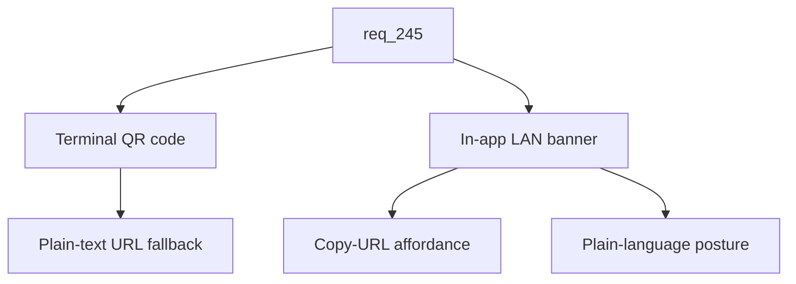

## item_425_add_lan_qr_code_launch_output_and_in_app_banner - Add LAN QR code launch output and in-app banner
> From version: 2.8.1
> Schema version: 1.0
> Status: Ready
> Understanding: 85%
> Confidence: 80%
> Progress: 0%
> Complexity: Medium
> Theme: Viewer operator workflow
> Reminder: Update status/understanding/confidence/progress and linked request/task references when you edit this doc.

# Problem
Once LAN mode is enabled (`item_423`) and protected by a per-session token (`item_424`), the operator still has to read the URL, copy the token, type both into a phone, and remember whether the current viewer is loopback or exposed. This slice removes that friction with a QR code printed at launch and a permanent in-app banner that signals LAN mode and exposes a copy-URL affordance.

# Scope
- In:
  - QR code rendering in the terminal at viewer launch, encoding the full URL with the embedded token (e.g. `http://192.168.1.42:8765/?t=...`), so the operator can scan it directly with the phone camera.
  - Plain-text fallback: URL and token are also printed in clear text next to the QR code in case the terminal does not support the QR character set.
  - Pure-Python QR rendering preferred (e.g. `qrcode[pure]`) to keep the bundled CLI distribution simple; any added dependency must be evaluated against existing distribution constraints.
  - In-app banner in the viewer topbar that is rendered only in LAN mode, with a visually distinctive style (e.g. ambered), a short status (LAN exposed, token active), and a copy-URL affordance.
  - Banner copy is plain language so the operator understands the security posture at a glance (anyone on the network with the token can read; write actions are disabled).
  - Tests for QR rendering presence in LAN-mode launch output, absence in default mode, banner rendering in LAN mode and absence in default mode, and the copy-URL affordance.
- Out:
  - Token generation and HTTP-layer enforcement (delivered by `item_424`).
  - HTTP-layer read-only enforcement (delivered by `item_423`).
  - Persistent banner customization beyond what is needed to signal LAN mode.

# Acceptance criteria
- AC1: The viewer launch output prints a scannable QR code in LAN mode that encodes the full URL with the embedded token, so the operator can open the viewer on a phone without retyping.
- AC2: The launch output also prints the URL and the token in plain text next to the QR code as a fallback for terminals that do not render the QR character set cleanly.
- AC3: No QR code or token output appears when LAN mode is not enabled.
- AC4: The viewer renders a permanent, visually distinctive banner in the topbar whenever LAN mode is active, with a short status (LAN exposed, token active).
- AC5: The banner exposes a copy-URL affordance that copies the current URL (with the token) to the clipboard.
- AC6: The banner copy explains the security posture in plain language so the operator can reason about the risk (anyone on the network with the token can read; write actions are disabled).
- AC7: The banner is not rendered when LAN mode is not enabled.
- AC8: Any QR rendering dependency is pure-Python (or already part of the bundled distribution) and does not introduce a native build step.
- AC9: Tests cover QR presence and plain-text fallback in LAN-mode launch output, absence in default mode, banner rendering in LAN mode and absence in default mode, and the copy-URL affordance.

# AC Traceability
- request-AC3 -> This backlog slice. Proof: AC1 and AC2 define the QR code launch output with the embedded token and the plain-text fallback.
- request-AC7 -> This backlog slice. Proof: AC4, AC5, and AC6 define the in-app banner, its copy-URL affordance, and the plain-language security posture.
- request-AC8 -> This backlog slice. Proof: AC3 and AC7 guarantee no QR or banner output when LAN mode is not enabled.
- request-AC9 -> This backlog slice. Proof: AC6 enforces plain-language documentation of the security model in the banner.
- request-AC10 -> This backlog slice. Proof: AC9 requires automated tests for the QR output and the banner rendering.

# Decision framing
- Product framing: Not needed
- Product signals: (none detected)
- Product follow-up: No product brief follow-up is expected based on current signals.
- Architecture framing: Not needed (relies on the `item_423` ADR for the LAN posture and on `item_424` for the token contract)
- Architecture signals: New runtime dependency (QR library) to be evaluated against bundled distribution constraints.
- Architecture follow-up: The choice of QR library should be recorded in the `item_423` ADR addendum rather than as a separate decision.

# Links
- Product brief(s): (none yet)
- Architecture decision(s): (none yet — relies on the `item_423` ADR)
- Request: `logics/request/req_245_expose_the_viewer_on_the_local_network_with_token_authentication_and_read_only_safety.md`
- Primary task(s): `task_220_implement_lan_exposure_with_token_auth_qr_code_and_read_only_safety`

# AI Context
- Summary: Print a QR code with the embedded token at LAN launch, add a permanent in-app banner that signals LAN mode and copies the URL, and explain the security posture in plain language in both places.
- Keywords: qr-code, lan-banner, copy-url, launch-output, plain-language-security, pure-python-qrcode
- Use when: Implementing or testing the QR launch output, the LAN banner, or the copy-URL affordance.
- Skip when: The work is about the LAN CLI flag, token auth, read-only HTTP enforcement, or mobile responsive styling.

# Priority
- Impact: Medium
- Urgency: Medium

# Notes
- Depends on `item_424` for the token value and on `item_423` for the LAN-mode runtime indicator.

# Tasks
- `task_220_implement_lan_exposure_with_token_auth_qr_code_and_read_only_safety`
