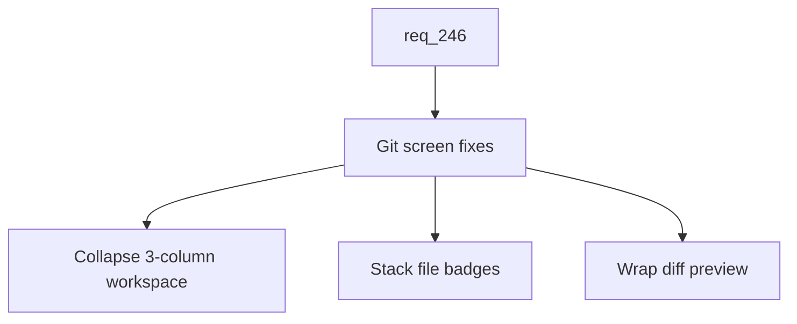

## item_426_fix_git_screen_layout_and_diff_preview_at_small_breakpoints - Fix Git screen layout and diff preview at small breakpoints
> From version: 2.8.1
> Schema version: 1.0
> Status: Ready
> Understanding: 85%
> Confidence: 80%
> Progress: 0%
> Complexity: Medium
> Theme: Viewer operator workflow
> Reminder: Update status/understanding/confidence/progress and linked request/task references when you edit this doc.

# Problem
The operator flagged the Git screen as illegible on small viewports. The CSS audit confirms two concrete root causes: `.viewer-git__workspace` is a 3-column grid (`domains | content | detail`) that only collapses at 700px (`clients/viewer/viewer.css:1555`), and `.viewer-git__diff pre` uses `white-space: pre` which forces horizontal scroll for any diff line wider than the viewport. File metadata badges inside `.viewer-git__file` also crowd badly when stacked next to each other on narrow widths.

# Scope
- In:
  - Collapse `.viewer-git__workspace` to a single column at `<=600px`.
  - Stack file metadata badges vertically inside `.viewer-git__file` at `<=600px` and reduce the badge font size at `<=420px`.
  - Wrap long lines in the diff preview at `<=420px` with `white-space: pre-wrap` (or equivalent) while preserving monospace alignment.
  - Soften the diff container so it does not introduce horizontal scroll at the viewport level (per-line scrolling is acceptable on intentionally wide content).
  - Tests asserting the new media query rules and the resulting layout collapse on Git-specific selectors.
- Out:
  - Backend or data-model changes around Git status, diff, or file list.
  - New preview formats (images, large files) beyond what is already supported.
  - The Workspace/Explorer restyle (tracked in `item_419`).
  - Other multi-column viewer screens (tracked in `item_427`).
  - Chrome and small UI at `<=420px` (tracked in `item_428`).

# Acceptance criteria
- AC1: At `<=600px`, the `.viewer-git__workspace` grid collapses to a single column with the `domains`, `content`, and `detail` panes stacked in that reading order.
- AC2: At `<=600px`, the file metadata badges inside `.viewer-git__file` stack vertically instead of crowding horizontally.
- AC3: At `<=420px`, the badge font size is reduced to keep the file row readable on phone portrait viewports.
- AC4: At `<=420px`, the diff preview wraps long lines with `white-space: pre-wrap` (or equivalent) while preserving monospace alignment, so no horizontal scroll appears at the viewport level.
- AC5: At desktop widths above 600px, the Git screen visually matches its current layout; no regression in spacing, density, or column ordering.
- AC6: Tests assert the new media query rules for the Git workspace grid, the file badge stacking, and the diff preview wrapping at the targeted breakpoints.

# AC Traceability
- request-AC1 -> This backlog slice. Proof: AC1 introduces the `<=600px` breakpoint for the Git workspace grid as part of the new responsive baseline.
- request-AC2 -> This backlog slice. Proof: AC1, AC2, and AC4 deliver the Git workspace collapse, file metadata stacking, and diff wrapping called out in the request.
- request-AC11 -> This backlog slice. Proof: AC4 eliminates viewport-level horizontal scroll on the Git diff preview at phone widths.
- request-AC12 -> This backlog slice. Proof: AC6 requires automated tests for the new Git-specific media query rules.

# Decision framing
- Product framing: Not needed
- Product signals: (none detected)
- Product follow-up: No product brief follow-up is expected based on current signals.
- Architecture framing: Not needed
- Architecture signals: (none detected)
- Architecture follow-up: No architecture decision follow-up is expected based on current signals.

# Links
- Product brief(s): (none yet)
- Architecture decision(s): (none yet)
- Request: `logics/request/req_246_make_the_viewer_responsive_on_tablet_and_phone_breakpoints.md`
- Primary task(s): `task_221_implement_responsive_viewer_at_tablet_and_phone_breakpoints`

# AI Context
- Summary: Collapse the Git workspace grid at `<=600px`, stack the file metadata badges, and wrap the diff preview at `<=420px` so the Git screen becomes readable on tablet and phone viewports without regressing desktop.
- Keywords: git-responsive, viewer-git-workspace, diff-preview-wrap, file-badge-stack, breakpoint-600, breakpoint-420
- Use when: Implementing or testing the responsive fixes for the Git screen at tablet and phone widths.
- Skip when: The work is about other multi-column screens, chrome, the LAN exposure, or the Workshop screen.

# Priority
- Impact: High
- Urgency: Medium

# Notes
- This is the operator-flagged priority slice of `req_246`; ship it first so the rest of the responsive pass benefits from the same established breakpoints.

# Tasks
- `task_221_implement_responsive_viewer_at_tablet_and_phone_breakpoints`
