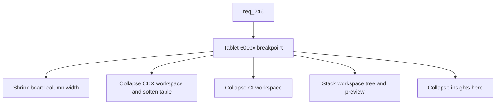

## item_427_collapse_multi_column_viewer_grids_at_tablet_breakpoint - Collapse multi-column viewer grids at tablet breakpoint
> From version: 2.8.1
> Schema version: 1.0
> Status: Ready
> Understanding: 85%
> Confidence: 80%
> Progress: 0%
> Complexity: Medium
> Theme: Viewer operator workflow
> Reminder: Update status/understanding/confidence/progress and linked request/task references when you edit this doc.

# Problem
The CSS audit shows that several viewer screens use multi-column grids and tables that only collapse at 860px or never collapse at all, forcing horizontal scroll on tablet portrait viewports. Concrete offenders: the board columns (`--board-column-width: 260px` with `flex: 0 0 260px`), the CDX status table (`min-width: 920px`), the CI and Workspace grids (collapse at 860px), and the insights hero (2-column at 540px minimum). This slice introduces a `<=600px` tablet breakpoint that collapses or softens all of these without regressing desktop.

# Scope
- In:
  - `<=600px` tablet breakpoint applied to: `.board` / `.column` (shrink `--board-column-width` to fit the viewport), `.viewer-cdx__workspace` and `.viewer-cdx__table` (single column workspace, soften the 920px table `min-width` with reduced font size), `.viewer-ci__workspace` (single column), `.viewer-workspace` (single column, stack tree and preview vertically).
  - The insights hero (`.viewer-insights__hero`) is included here at `<=600px` rather than waiting for the existing 700px breakpoint, to keep the tablet behavior consistent.
  - Soften the hard `min-width` declarations on `.viewer-filter-panel`, `.viewer-cdx__table`, and `.column` so they can shrink below their current floors on small viewports.
  - Tests asserting the collapse of each grid at the new tablet breakpoint and the softened `min-width` values.
- Out:
  - Git screen fixes (delivered by `item_426`).
  - Topbar, toolbar, filter panel, details, and document inset at the `<=420px` phone breakpoint (delivered by `item_428`).
  - Any backend, data model, or endpoint change.
  - Visual language, palette, or component design changes beyond the breakpoint adjustments.

# Acceptance criteria
- AC1: At `<=600px`, `.board` shrinks `--board-column-width` so the columns fit the viewport instead of forcing horizontal scroll across multiple 260px columns.
- AC2: At `<=600px`, the CDX status workspace (`.viewer-cdx__workspace`) collapses to a single column, and the CDX table (`.viewer-cdx__table`) softens its 920px `min-width` with a reduced font size so the table fits the viewport.
- AC3: At `<=600px`, the CI workspace (`.viewer-ci__workspace`) collapses to a single column instead of waiting for the existing 860px breakpoint.
- AC4: At `<=600px`, the Workspace screen (`.viewer-workspace`) collapses its tree/preview split into a single column with the tree stacked above the preview.
- AC5: At `<=600px`, the insights hero (`.viewer-insights__hero`) collapses to a single column instead of waiting for the existing 700px breakpoint.
- AC6: Hard `min-width` values on `.viewer-filter-panel`, `.viewer-cdx__table`, and `.column` are softened so they can shrink below their current floors on small viewports, without regressing desktop readability.
- AC7: At desktop widths above 600px, every targeted screen visually matches its current layout; no regression in spacing, density, or column counts.
- AC8: Tests assert the new media query rules for the board, CDX workspace and table, CI workspace, Workspace screen, and insights hero at the `<=600px` breakpoint.

# AC Traceability
- request-AC1 -> This backlog slice. Proof: AC1 through AC5 introduce the `<=600px` breakpoint across the targeted screens.
- request-AC3 -> This backlog slice. Proof: AC1 shrinks the board column width to fit the viewport at the tablet breakpoint.
- request-AC4 -> This backlog slice. Proof: AC2 collapses the CDX workspace and softens the table `min-width`.
- request-AC5 -> This backlog slice. Proof: AC3 and AC4 collapse the CI and Workspace grids at `<=600px`.
- request-AC9 -> This backlog slice. Proof: AC5 collapses the insights hero at `<=600px`.
- request-AC11 -> This backlog slice. Proof: AC6 softens the hard `min-width` floors that were causing viewport-level horizontal scroll.
- request-AC12 -> This backlog slice. Proof: AC8 requires automated tests for the new tablet-breakpoint rules.

# Decision framing
- Product framing: Not needed
- Product signals: (none detected)
- Product follow-up: No product brief follow-up is expected based on current signals.
- Architecture framing: Not needed
- Architecture signals: (none detected)
- Architecture follow-up: No architecture decision follow-up is expected based on current signals.

# Links
- Product brief(s): (none yet)
- Architecture decision(s): (none yet)
- Request: `logics/request/req_246_make_the_viewer_responsive_on_tablet_and_phone_breakpoints.md`
- Primary task(s): `task_221_implement_responsive_viewer_at_tablet_and_phone_breakpoints`

# AI Context
- Summary: Collapse the board, CDX, CI, Workspace, and insights grids at `<=600px` and soften the hard `min-width` floors on the filter panel, CDX table, and board columns, without regressing desktop.
- Keywords: tablet-breakpoint, 600px, board-collapse, cdx-table, ci-workspace, viewer-workspace, insights-hero, min-width-softening
- Use when: Implementing or testing the tablet-breakpoint collapse of multi-column viewer grids.
- Skip when: The work is about the Git screen, the phone-breakpoint chrome, the LAN exposure, or the Workshop screen.

# Priority
- Impact: High
- Urgency: Medium

# Notes
- Ship after `item_426` so the Git fix establishes the `<=600px` breakpoint convention used by this slice.

# Tasks
- `task_221_implement_responsive_viewer_at_tablet_and_phone_breakpoints`
