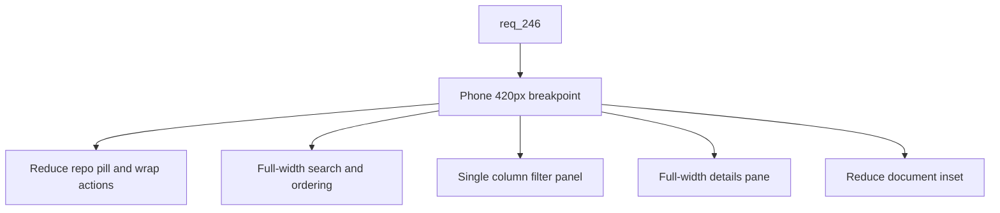

## item_428_adapt_viewer_chrome_and_small_ui_at_phone_breakpoint - Adapt viewer chrome and small UI at phone breakpoint
> From version: 2.8.1
> Schema version: 1.0
> Status: Done
> Understanding: 85%
> Confidence: 80%
> Progress: 100%
> Complexity: Medium
> Theme: Viewer operator workflow
> Reminder: Update status/understanding/confidence/progress and linked request/task references when you edit this doc.

# Problem
Even with the Git fix (`item_426`) and the tablet collapse (`item_427`), the viewer chrome and small UI elements still break at phone portrait widths. The CSS audit identified the concrete offenders: the topbar repo pill is locked at `max-width: 220px`, the actions row does not wrap until 700px, the toolbar search has `min-width: 160px`, the filter panel is a 3-column grid at all widths, the details pane keeps its 300px sidebar treatment, and the document inset (`inset: 64px 20px 20px`) is unchanged. This slice introduces the `<=420px` phone breakpoint across the remaining chrome.

# Scope
- In:
  - Topbar at `<=420px`: reduce `.viewer-topbar__repo` `max-width`, wrap `.viewer-topbar__actions` so primary actions stay reachable without horizontal scroll.
  - Toolbar at `<=420px`: full-width search input, ordering control wraps under the search.
  - Filter panel at `<=420px`: collapse the 3-column grid (`.viewer-filter-panel`) into a single column.
  - Details pane at `<=420px`: use the full viewport width with reduced padding and a smaller header title font size, instead of the desktop 300px sidebar treatment.
  - Document inset at `<=420px`: reduce the `inset: 64px 20px 20px` so reading width is preserved.
  - Update banner (`.viewer-update`) at `<=420px`: stack vertically so the embedded code block does not overflow.
  - Tests asserting the new media query rules and the resulting layout adjustments at the phone breakpoint.
- Out:
  - Git screen fixes (delivered by `item_426`).
  - Tablet-breakpoint grid collapses (delivered by `item_427`).
  - Any backend, data model, or endpoint change.
  - A separate mobile-only navigation, drawer, or off-canvas layout (explicitly out of scope per `req_246`).

# Acceptance criteria
- AC1: At `<=420px`, the topbar reduces the repo pill `max-width`, wraps the actions row, and keeps the primary actions reachable without horizontal scroll.
- AC2: At `<=420px`, the toolbar search becomes full-width and the ordering control wraps below the search.
- AC3: At `<=420px`, the filter panel (`.viewer-filter-panel`) collapses its 3-column grid into a single column.
- AC4: At `<=420px`, the details pane (`.details`) uses the full viewport width with reduced padding and a smaller header title font size, instead of the desktop 300px sidebar treatment.
- AC5: At `<=420px`, the document inset is reduced so reading width is preserved.
- AC6: At `<=420px`, the update banner (`.viewer-update`) stacks its content vertically so the embedded code block does not overflow the viewport.
- AC7: At desktop widths above 420px, every targeted chrome region visually matches its current layout; no regression in spacing or layout.
- AC8: Tests assert the new media query rules for the topbar, toolbar, filter panel, details pane, document inset, and update banner at the `<=420px` breakpoint.

# AC Traceability
- request-AC1 -> This backlog slice. Proof: AC1 through AC6 deliver the `<=420px` breakpoint on the chrome and small UI elements.
- request-AC6 -> This backlog slice. Proof: AC3 collapses the filter panel into a single column and AC2 makes the toolbar search full-width.
- request-AC7 -> This backlog slice. Proof: AC1 covers the topbar repo pill, actions wrapping, and reachability.
- request-AC8 -> This backlog slice. Proof: AC4 collapses the details pane to full width with reduced padding and font size.
- request-AC10 -> This backlog slice. Proof: AC5 reduces the document inset to preserve reading width.
- request-AC11 -> This backlog slice. Proof: AC1 through AC6 eliminate viewport-level horizontal scroll on the chrome at phone widths.
- request-AC12 -> This backlog slice. Proof: AC8 requires automated tests for the new phone-breakpoint rules.
- request-AC9 -> This backlog slice. Evidence needed: The insights hero (`.viewer-insights__hero`) collapses to a single column at <=420px, instead of waiting for the existing 700px breakpoint.

# Decision framing
- Product framing: Not needed
- Product signals: (none detected)
- Product follow-up: No product brief follow-up is expected based on current signals.
- Architecture framing: Not needed
- Architecture signals: (none detected)
- Architecture follow-up: No architecture decision follow-up is expected based on current signals.

# Links
- Product brief(s): (none yet)
- Architecture decision(s): (none yet)
- Request: `logics/request/req_246_make_the_viewer_responsive_on_tablet_and_phone_breakpoints.md`
- Primary task(s): `task_221_implement_responsive_viewer_at_tablet_and_phone_breakpoints`

# AI Context
- Summary: Adapt the topbar, toolbar, filter panel, details pane, document inset, and update banner at the `<=420px` phone breakpoint, without regressing desktop.
- Keywords: phone-breakpoint, 420px, viewer-topbar, viewer-toolbar, viewer-filter-panel, details-pane, document-inset, update-banner
- Use when: Implementing or testing the phone-breakpoint chrome adjustments in the local viewer.
- Skip when: The work is about the Git screen, the tablet-breakpoint grids, the LAN exposure, or the Workshop screen.

# Priority
- Impact: High
- Urgency: Medium

# Notes
- Ship after `item_427` so the tablet-breakpoint convention is in place before the phone-breakpoint chrome is layered on top.
- Task `task_221_implement_responsive_viewer_at_tablet_and_phone_breakpoints` was finished via `logics-manager flow finish task` on 2026-06-15.

# Tasks
- `task_221_implement_responsive_viewer_at_tablet_and_phone_breakpoints`
