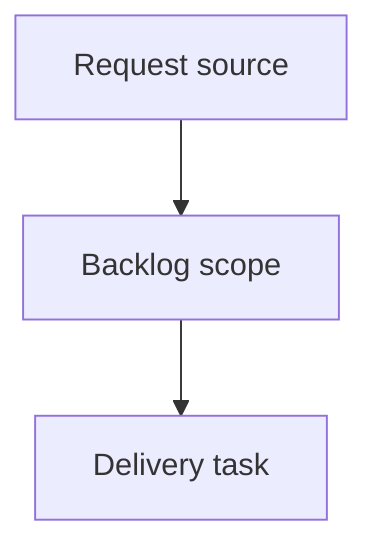

## item_429_remove_mandatory_mermaid_from_logics_workflow_docs - Remove mandatory Mermaid from Logics workflow docs
> From version: 2.9.8
> Schema version: 1.0
> Status: Ready
> Understanding: 90%
> Confidence: 85%
> Progress: 0%
> Complexity: High
> Theme: Operator workflow and runtime integration
> Reminder: Update status/understanding/confidence/progress and linked request/task references when you edit this doc.

# Problem
Remove Mermaid as a mandatory, hand-maintained artifact from the Logics request, backlog, and task workflow.
Preserve workflow clarity through structured Markdown fields and CLI or viewer-generated relationship graphs.
Reduce recurring lint failures and token overhead caused by fragile Mermaid generation in AI-assisted edits.

# Scope
- In:
  - remove mandatory Mermaid blocks from workflow document generation for requests, backlog items, and tasks
  - update lint and audit behavior so absence of workflow Mermaid is valid
  - keep legacy workflow docs with Mermaid non-blocking during transition
  - preserve generated relationship graphs through CLI or viewer code derived from structured links
  - update tests and docs that currently assume Mermaid is required in workflow docs
- Out:
  - removing Mermaid support from ADRs, product briefs, architecture docs, or arbitrary Markdown
  - broad schema redesign unrelated to Mermaid removal
  - visual redesign of `cdx view` beyond what is needed to keep graph visibility available

# Acceptance criteria
- AC1: New request, backlog, and task templates no longer include mandatory Mermaid blocks.
- AC2: `logics-manager lint` no longer requires Mermaid kind or signature comments for workflow docs.
- AC3: Existing workflow docs with Mermaid remain readable and do not become blocking failures during the migration window.
- AC4: Relationship graph functionality remains available through generated CLI or viewer output derived from workflow links.
- AC5: Documentation explains that Mermaid is optional or legacy in workflow docs and not the authoritative source of flow state.
- AC6: Migration behavior is explicit: either remove existing workflow Mermaid blocks with a command or tolerate them as non-blocking legacy content.

# AC Traceability
- request-AC1 -> This backlog slice. Proof: AC1: New request, backlog, and task templates no longer include mandatory Mermaid blocks.
- request-AC2 -> This backlog slice. Proof: AC2: `logics-manager lint` no longer requires Mermaid kind or signature comments for workflow docs.
- request-AC3 -> This backlog slice. Proof: AC3: Existing workflow docs with Mermaid remain readable and do not become blocking failures during the migration window.
- request-AC4 -> This backlog slice. Proof: AC4: Relationship graph functionality remains available through generated CLI or viewer output derived from workflow links.
- request-AC5 -> This backlog slice. Proof: AC5: Documentation explains that Mermaid is optional or legacy in workflow docs and not the authoritative source of flow state.
- request-AC6 -> This backlog slice. Proof: AC6: Migration behavior is explicit: either remove existing workflow Mermaid blocks with a command or tolerate them as non-blocking legacy content.

# Decision framing
- Product framing: Not needed
- Product signals: (none detected)
- Product follow-up: No product brief follow-up is expected based on current signals.
- Architecture framing: Not needed
- Architecture signals: (none detected)
- Architecture follow-up: No architecture decision follow-up is expected based on current signals.

# Implementation notes
- Template generation should produce workflow docs without Mermaid blocks by default.
- Lint should validate workflow source data first: indicators, lineage, references, status, progress, and linked backlog or task refs.
- Mermaid-specific validation should be skipped when no Mermaid block exists.
- If a workflow doc still contains Mermaid, validation should either remain compatible with the legacy format or report non-blocking migration guidance.
- `refresh-mermaid-signatures` should not be required for normal workflow edits once Mermaid is absent.
- Existing generated graph features should consume structured relationships instead of reading Mermaid as the source of truth.

# Migration notes
- Prefer a small, explicit migration path over broad automatic churn.
- Acceptable options:
  - add a command that removes workflow Mermaid blocks from selected docs
  - tolerate existing Mermaid as legacy and only generate Mermaid-free docs going forward
- The implementation should document which option is chosen.

# Validation plan
- Add or update tests for request, backlog, and task generation without Mermaid.
- Add or update lint tests proving Mermaid metadata is not required for workflow docs.
- Add or update tests proving legacy Mermaid does not block unrelated workflow edits.
- Run `logics-manager lint --require-status`.
- Run `logics-manager audit --legacy-cutoff-version 1.1.0 --group-by-doc`.

# Links
- Product brief(s): (none yet)
- Architecture decision(s): (none yet)
- Request: `logics/request/req_247_remove_mandatory_mermaid_from_logics_workflow_docs.md`
- Primary task(s): (none yet)

# AI Context
- Summary: Remove mandatory Mermaid from Logics workflow docs
- Keywords: backlog-groom, request, remove mandatory mermaid from logics workflow docs, bounded slice
- Use when: Use when implementing or reviewing the delivery slice for Remove mandatory Mermaid from Logics workflow docs.
- Skip when: Skip when the change is unrelated to this delivery slice or its linked request.

# Priority
- Impact:
- Urgency:

# Notes
- Hybrid rationale: Derived from request `req_247_remove_mandatory_mermaid_from_logics_workflow_docs` and kept bounded to one coherent delivery slice.
- Source file: `logics/request/req_247_remove_mandatory_mermaid_from_logics_workflow_docs.md`.
- Generated locally by logics-manager.

# Tasks
- `task_223_remove_mandatory_mermaid_from_logics_workflow_docs`
