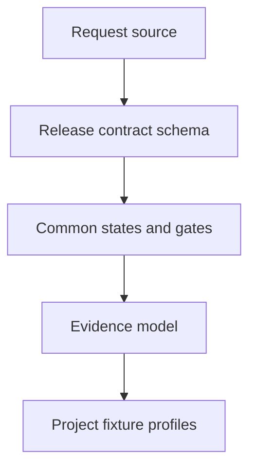

## item_430_define_the_release_workflow_contract_and_schema - Define the release workflow contract and schema
> From version: 2.8.1
> Schema version: 1.0
> Status: Ready
> Understanding: 95%
> Confidence: 90%
> Progress: 100%
> Complexity: High
> Theme: Operator workflow and runtime integration
> Reminder: Update status/understanding/confidence/progress and linked request/task references when you edit this doc.

# Problem
Release workflows are currently learned by repetition across projects instead of being declared by the repo. This slice defines the common contract and schema that projects can use to describe version files, changelog expectations, validation gates, git/tag policy, GitHub release behavior, and external publication checks.

# Scope
- In:
  - a project-owned release workflow declaration format
  - common release states and gate names
  - evidence fields required to trust a gate result
  - example profiles for at least `logics-manager`, `cdx-manager`, and `cp-wc-26`
- Out:
  - implementing the full CLI execution engine
  - viewer rendering
  - MCP exposure

# Acceptance criteria
- AC1: A schema or equivalent structured config can represent version sources, changelog paths, validation commands, git/tag policy, GitHub release behavior, and external checks.
- AC2: The common state machine covers planning, preparation, local validation, commit/push, CI, GitHub release, external publication, and blocked states.
- AC3: Evidence fields are defined well enough to detect stale or mismatched release proof.
- AC4: Fixture contracts cover the release shapes of `logics-manager`, `cdx-manager`, and `cp-wc-26` without hard-coding those projects into the core model.
- AC5: Documentation explains what a repo must add before assistants can rely on the release workflow.

# AC Traceability
- request-AC1 -> This backlog slice. Proof: Defines the project release contract.
- request-AC3 -> This backlog slice. Proof: Defines the release state machine and gates.
- request-AC6 -> This backlog slice. Proof: Keeps repo-specific profiles outside the core implementation.
- request-AC7 -> This backlog slice. Proof: Adds fixture coverage for known project release patterns.
- request-AC8 -> This backlog slice. Proof: Defines stale or missing evidence as blocked state.

# Decision framing
- Product framing: Not needed
- Product signals: (none detected)
- Product follow-up: No product brief follow-up is expected based on current signals.
- Architecture framing: Not needed
- Architecture signals: (none detected)
- Architecture follow-up: No architecture decision follow-up is expected based on current signals.
- Use repo-owned release artifacts under logics/release/: a JSON Schema for the common contract, a README for operator and assistant rules, and fixture profiles for known project release patterns. Leave executable CLI/viewer/MCP behavior to sibling backlog items.

# Links
- Product brief(s): (none yet)
- Architecture decision(s): (none yet)
- Request: `req_248_release_workflow_multi_project_ai_assistants`
- Primary task(s): `task_224_define_the_release_workflow_contract_and_schema`

# AI Context
- Summary: Define the release workflow contract, states, evidence model, and initial project fixtures.
- Keywords: release-contract, schema, evidence-model, state-machine, fixture-profiles
- Use when: Use when implementing or reviewing the delivery slice for Define the release workflow contract and schema.
- Skip when: Skip when the change is unrelated to this delivery slice or its linked request.

# Priority
- Impact: High
- Urgency: High

# Notes
- Hybrid rationale: Derived from request `req_248_release_workflow_multi_project_ai_assistants` and kept bounded to one coherent delivery slice.
- Source file: `logics/request/req_248_release_workflow_multi_project_ai_assistants.md`.
- Generated locally by logics-manager.
- Task `task_224_define_the_release_workflow_contract_and_schema` was finished via `logics-manager flow finish task` on 2026-06-18.

# Tasks
- `task_224_define_the_release_workflow_contract_and_schema`
