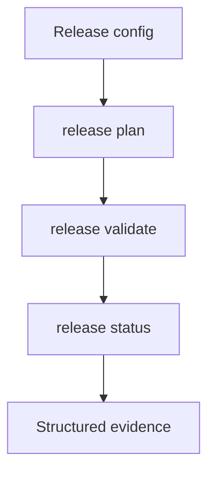

## item_431_implement_release_status_and_validation_commands - Implement release status and validation commands
> From version: 2.8.1
> Schema version: 1.0
> Status: Done
> Understanding: 97%
> Confidence: 91%
> Progress: 100%
> Complexity: High
> Theme: Operator workflow and runtime integration
> Reminder: Update status/understanding/confidence/progress and linked request/task references when you edit this doc.

# Problem
Operators and assistants need a single CLI surface that reports release readiness from repo-owned configuration and evidence. This slice implements release planning, status, and validation commands before any irreversible publication command is added.

# Scope
- In:
  - `logics-manager release plan <version>`
  - `logics-manager release status`
  - `logics-manager release validate <version>`
  - structured JSON output for agents and concise text output for operators
  - evidence collection and stale evidence detection for local gates
- Out:
  - GitHub release publication command
  - external registry publishing automation
  - viewer UI

# Acceptance criteria
- AC1: `release status` returns configured gates, current state, next action, blocking reasons, and evidence references.
- AC2: `release plan <version>` shows expected version/changelog/git/CI/publication steps without modifying files.
- AC3: `release validate <version>` checks config integrity and local release readiness gates.
- AC4: JSON output is stable enough for assistants and MCP clients to consume.
- AC5: Text output is compact enough for repeated CLI use.
- AC6: Tests cover success, missing config, stale evidence, failed command, and wrong commit/tag target scenarios where applicable.

# AC Traceability
- request-AC2 -> This backlog slice. Proof: Provides structured release status.
- request-AC3 -> This backlog slice. Proof: Separates plan, validation, CI, release, and publication states.
- request-AC8 -> This backlog slice. Proof: Blocks readiness when required proof is stale or missing.
- request-AC7 -> This backlog slice. Evidence needed: Validation covers at least fixture-style examples for the known release patterns from `logics-manager`, `cdx-manager`, and `cp-wc-26`.

# Decision framing
- Product framing: Not needed
- Product signals: (none detected)
- Product follow-up: No product brief follow-up is expected based on current signals.
- Architecture framing: Not needed
- Architecture signals: (none detected)
- Architecture follow-up: No architecture decision follow-up is expected based on current signals.
- Keep release validate non-destructive for this slice: it checks configured files, evidence freshness, gate status, and git cleanliness, but does not execute validation commands or publish anything.

# Links
- Product brief(s): (none yet)
- Architecture decision(s): (none yet)
- Request: `req_248_release_workflow_multi_project_ai_assistants`
- Primary task(s): `task_226_implement_release_status_and_validation_commands`

# AI Context
- Summary: Implement release status and validation commands
- Keywords: backlog-groom, request, implement release status and validation commands, bounded slice
- Use when: Use when implementing or reviewing the delivery slice for Implement release status and validation commands.
- Skip when: Skip when the change is unrelated to this delivery slice or its linked request.

# Priority
- Impact: High
- Urgency: High

# Notes
- Hybrid rationale: Derived from request `req_248_release_workflow_multi_project_ai_assistants` and kept bounded to one coherent delivery slice.
- Source file: `logics/request/req_248_release_workflow_multi_project_ai_assistants.md`.
- Generated locally by logics-manager.
- Task `task_226_implement_release_status_and_validation_commands` was finished via `logics-manager flow finish task` on 2026-06-18.

# Tasks
- `task_226_implement_release_status_and_validation_commands`
