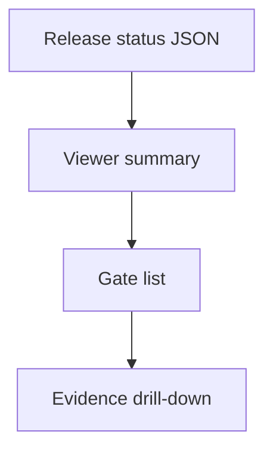

## item_432_expose_release_workflow_state_in_the_logics_viewer - Expose release workflow state in the Logics viewer
> From version: 2.8.1
> Schema version: 1.0
> Status: Ready
> Understanding: 97%
> Confidence: 91%
> Progress: 100%
> Complexity: High
> Theme: Operator workflow and runtime integration
> Reminder: Update status/understanding/confidence/progress and linked request/task references when you edit this doc.

# Problem
Release state must be understandable at a glance in the Logics viewer. Operators need to see whether a release is only planned, locally validated, pushed, waiting on CI, ready for GitHub release, or fully published, with drill-down proof for each gate.

# Scope
- In:
  - viewer release summary panel or focused release view
  - gate list with status, next action, and blocking reason
  - evidence drill-down for commands, commits, tags, CI runs, and publication checks
  - focus support for release refs or release workflow docs where practical
- Out:
  - redesigning unrelated workflow pages
  - implementing release commands
  - storing new evidence formats

# Acceptance criteria
- AC1: The viewer displays release state, target version, next action, and blocked gate in the first visible release area.
- AC2: Each gate shows a clear status such as pending, passed, failed, stale, skipped, or not configured.
- AC3: Evidence drill-down exposes the command, timestamp, commit/tag, conclusion, and linked CI/release URL when available.
- AC4: The view works for projects without release configuration by showing `not_configured` with setup guidance.
- AC5: Browser-host and bundled viewer assets stay synchronized and covered by focused tests.

# AC Traceability
- request-AC4 -> This backlog slice. Proof: Adds compact viewer representation and evidence drill-down.
- request-AC8 -> This backlog slice. Proof: Shows blocked/stale/missing proof instead of hiding it.
- request-AC6 -> This backlog slice. Evidence needed: The workflow supports repo-specific profiles without hard-coding the release habits of one project into the global implementation.
- request-AC7 -> This backlog slice. Evidence needed: Validation covers at least fixture-style examples for the known release patterns from `logics-manager`, `cdx-manager`, and `cp-wc-26`.

# Decision framing
- Product framing: Not needed
- Product signals: (none detected)
- Product follow-up: No product brief follow-up is expected based on current signals.
- Architecture framing: Not needed
- Architecture signals: (none detected)
- Architecture follow-up: No architecture decision follow-up is expected based on current signals.
- Expose release state in the existing document panel rather than adding a new top-level layout: this keeps the viewer compact and reuses the established CI/CDX status interaction pattern.

# Links
- Product brief(s): (none yet)
- Architecture decision(s): (none yet)
- Request: `req_248_release_workflow_multi_project_ai_assistants`
- Primary task(s): `task_227_expose_release_workflow_state_in_the_logics_viewer`

# AI Context
- Summary: Expose release workflow state in the Logics viewer
- Keywords: backlog-groom, request, expose release workflow state in the logics viewer, bounded slice
- Use when: Use when implementing or reviewing the delivery slice for Expose release workflow state in the Logics viewer.
- Skip when: Skip when the change is unrelated to this delivery slice or its linked request.

# Priority
- Impact: Medium
- Urgency: Medium

# Notes
- Hybrid rationale: Derived from request `req_248_release_workflow_multi_project_ai_assistants` and kept bounded to one coherent delivery slice.
- Source file: `logics/request/req_248_release_workflow_multi_project_ai_assistants.md`.
- Generated locally by logics-manager.
- Task `task_227_expose_release_workflow_state_in_the_logics_viewer` was finished via `logics-manager flow finish task` on 2026-06-18.

# Tasks
- (none yet)
- `task_227_expose_release_workflow_state_in_the_logics_viewer`
