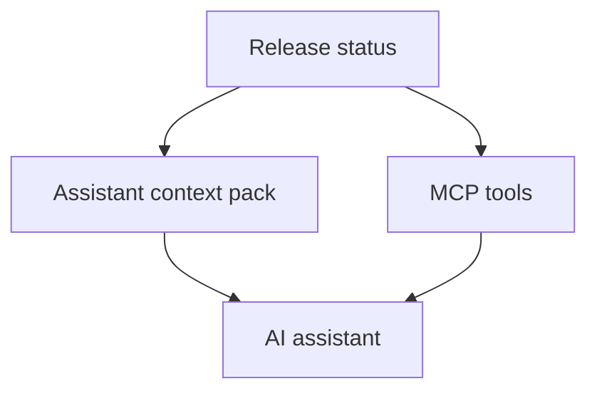

## item_433_expose_release_workflow_context_for_assistants_and_mcp_clients - Expose release workflow context for assistants and MCP clients
> From version: 2.8.1
> Schema version: 1.0
> Status: Ready
> Understanding: 90%
> Confidence: 85%
> Progress: 0%
> Complexity: High
> Theme: Operator workflow and runtime integration
> Reminder: Update status/understanding/confidence/progress and linked request/task references when you edit this doc.

# Problem
Assistants should not depend on prior conversation memory to know how a project releases. This slice exposes bounded release context through assistant and MCP surfaces so agents can discover the project contract, current state, next action, and evidence requirements.

# Scope
- In:
  - assistant context pack section for release workflows
  - MCP/read APIs for release status and release plan output
  - guidance text that tells agents which commands to run before preparing or claiming a release
  - safeguards around destructive or publication actions
- Out:
  - granting assistants automatic permission to publish releases
  - implementing provider-specific prompt hacks
  - replacing `AGENTS.md` instructions

# Acceptance criteria
- AC1: Context packs include release config presence, target version when known, current state, next action, and required gates.
- AC2: MCP or equivalent bounded surfaces can return release plan/status data without requiring broad file scans.
- AC3: Agent guidance states that release readiness must come from project-owned evidence, not conversational memory.
- AC4: Publication-oriented actions remain explicit and distinguishable from safe read/validate actions.
- AC5: Tests or fixtures show that another project can expose release context without custom assistant-specific code.

# AC Traceability
- request-AC5 -> This backlog slice. Proof: Exposes assistant and MCP release context.
- request-AC6 -> This backlog slice. Proof: Keeps context driven by project contract, not provider-specific prompts.
- request-AC8 -> This backlog slice. Proof: Requires agents to respect missing or stale evidence.

# Decision framing
- Product framing: Not needed
- Product signals: (none detected)
- Product follow-up: No product brief follow-up is expected based on current signals.
- Architecture framing: Not needed
- Architecture signals: (none detected)
- Architecture follow-up: No architecture decision follow-up is expected based on current signals.

# Links
- Product brief(s): (none yet)
- Architecture decision(s): (none yet)
- Request: `logics/request/req_248_release_workflow_multi_project_ai_assistants.md`
- Primary task(s): (none yet)

# AI Context
- Summary: Expose release workflow context for assistants and MCP clients
- Keywords: backlog-groom, request, expose release workflow context for assistants and mcp clients, bounded slice
- Use when: Use when implementing or reviewing the delivery slice for Expose release workflow context for assistants and MCP clients.
- Skip when: Skip when the change is unrelated to this delivery slice or its linked request.

# Priority
- Impact: High
- Urgency: Medium

# Notes
- Hybrid rationale: Derived from request `req_248_release_workflow_multi_project_ai_assistants` and kept bounded to one coherent delivery slice.
- Source file: `logics/request/req_248_release_workflow_multi_project_ai_assistants.md`.
- Generated locally by logics-manager.
