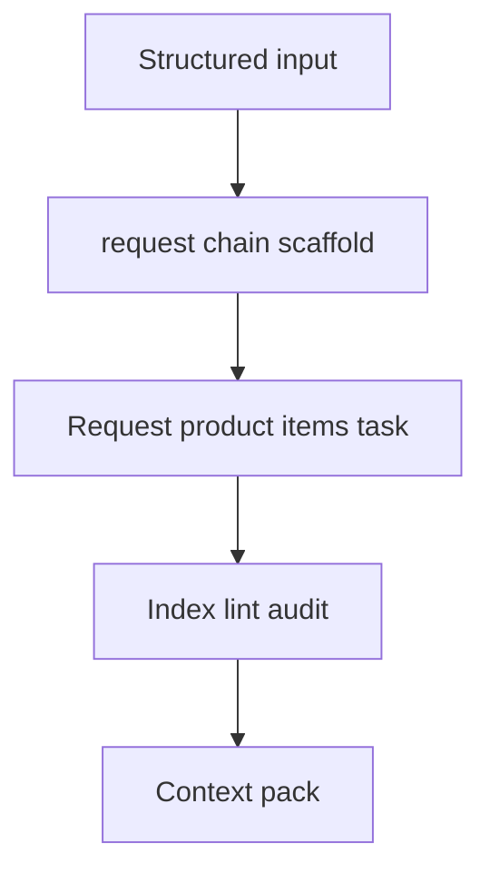

## item_434_add_rich_request_chain_scaffolding_for_development_ready_logics_work - Add rich request-chain scaffolding for development-ready Logics work
> From version: 2.8.1
> Schema version: 1.0
> Status: Done
> Understanding: 95%
> Confidence: 90%
> Progress: 100%
> Complexity: High
> Theme: Operator workflow and runtime integration
> Reminder: Update status/understanding/confidence/progress and linked request/task references when you edit this doc.

# Problem
The current generators create valid but generic docs. Agents then spend tokens reading examples, rewriting large sections, repairing signatures, adding traceability, updating the index, and creating context packs manually. This slice adds a richer scaffold command for a complete development-ready request chain.

# Scope
- In:
  - `flow scaffold request-chain` or equivalent rich scaffold entrypoint
  - structured input for request body, product brief, item split, orchestration task, AC mapping, and context-pack output
  - generated request/product/backlog/task docs with non-generic AI Context
  - index update and validation hooks
- Out:
  - implementing AC-aware split internals beyond the scaffold integration
  - rewriting historical generated docs
  - executing generated implementation tasks

# Acceptance criteria
- AC1: A scaffold command can generate request, product brief, backlog items, orchestration task, links, Mermaid signatures, and index updates from one structured input.
- AC2: Generated docs avoid generic placeholder problem statements when structured content is provided.
- AC3: The scaffold can optionally generate a context-pack corpus for the created refs.
- AC4: Dry-run output lists every file that would be created or changed.
- AC5: Tests cover successful scaffold, dry-run, invalid input, and existing-ref collision behavior.

# AC Traceability
- request-AC1 -> This backlog slice. Proof: Provides the rich request-chain scaffold.
- request-AC4 -> This backlog slice. Proof: Supports optional context-pack output during scaffold.
- request-AC6 -> This backlog slice. Proof: Requires dry-run and bounded file changes.
- request-AC8 -> This backlog slice. Proof: Documents the one-pass workflow in CLI help.
- request-AC7 -> This backlog slice. Evidence needed: Tests cover rich scaffold generation, AC-aware split metadata, fixable diagnostics, context-pack handoff, and failure cases where auto-fix should decline.

# Decision framing
- Product framing: Not needed
- Product signals: (none detected)
- Product follow-up: No product brief follow-up is expected based on current signals.
- Architecture framing: Not needed
- Architecture signals: (none detected)
- Architecture follow-up: No architecture decision follow-up is expected based on current signals.

# Links
- Product brief(s): `logics/product/prod_023_agent_authored_logics_workflow_scaffolding_and_validation.md`
- Architecture decision(s): (none yet)
- Request: `req_249_improve_logics_workflow_scaffolding_validation_agent_docs`
- Primary task(s): `task_225_add_rich_request_chain_scaffolding_for_development_ready_logics_work`

# AI Context
- Summary: Add a rich request-chain scaffold command that creates development-ready workflow docs and optional context-pack corpus from structured input.
- Keywords: request-chain-scaffold, rich-generation, context-pack, dry-run, generated-docs
- Use when: Use when implementing or reviewing the delivery slice for Add rich request-chain scaffolding for development-ready Logics work.
- Skip when: Skip when the change is unrelated to this delivery slice or its linked request.

# Priority
- Impact: High
- Urgency: High

# Notes
- Hybrid rationale: Derived from request `req_249_improve_logics_workflow_scaffolding_validation_agent_docs` and kept bounded to one coherent delivery slice.
- Source file: `logics/request/req_249_improve_logics_workflow_scaffolding_validation_agent_docs.md`.
- Generated locally by logics-manager.
- Task `task_225_add_rich_request_chain_scaffolding_for_development_ready_logics_work` was finished via `logics-manager flow finish task` on 2026-06-18.

# Tasks
- `task_225_add_rich_request_chain_scaffolding_for_development_ready_logics_work`

# Validation
- Covered by scaffold success, dry-run, invalid-input, collision tests, targeted flow/lint tests, release/MCP regression tests, py_compile, source lint/audit, and generated handoff context pack at logics/context-packs/scaffold_handoff_249.json.
