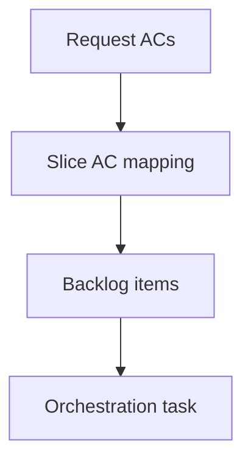

## item_435_make_request_splitting_ac_aware_and_task_orchestration_friendly - Make request splitting AC-aware and task-orchestration friendly
> From version: 2.8.1
> Schema version: 1.0
> Status: Ready
> Understanding: 90%
> Confidence: 85%
> Progress: 0%
> Complexity: High
> Theme: Operator workflow and runtime integration
> Reminder: Update status/understanding/confidence/progress and linked request/task references when you edit this doc.

# Problem
`flow split request` creates sibling backlog items, but agents still have to rewrite each item and manually map request ACs to the right slice. Task promotion also lacks orchestration-friendly metadata such as custom title and role.

# Scope
- In:
  - AC-aware split options
  - generated per-slice scope and AC traceability
  - orchestration task creation with custom title/summary
  - structured JSON output naming refs and mappings
- Out:
  - full rich scaffold command implementation
  - automatic task implementation

# Acceptance criteria
- AC1: `split request` can accept per-slice AC mappings without requiring manual item rewrites.
- AC2: Generated items include slice-specific problem, scope, ACs, and AC Traceability.
- AC3: Promotion or split can create an orchestration task with custom title, summary, and linked role.
- AC4: JSON output includes created refs, AC mappings, and task links.
- AC5: Tests cover valid mapping, unknown AC, duplicate mapping, omitted AC, and orchestration task options.

# AC Traceability
- request-AC2 -> This backlog slice. Proof: Provides AC-aware splitting and orchestration task metadata.
- request-AC6 -> This backlog slice. Proof: Keeps mappings explicit and rejects ambiguous input.
- request-AC7 -> This backlog slice. Proof: Defines mapping and task option test coverage.

# Decision framing
- Product framing: Not needed
- Product signals: (none detected)
- Product follow-up: No product brief follow-up is expected based on current signals.
- Architecture framing: Not needed
- Architecture signals: (none detected)
- Architecture follow-up: No architecture decision follow-up is expected based on current signals.

# Links
- Product brief(s): `logics/product/prod_023_agent_authored_logics_workflow_scaffolding_and_validation.md`
- Architecture decision(s): (none yet)
- Request: `logics/request/req_249_improve_logics_workflow_scaffolding_validation_agent_docs.md`
- Primary task(s): (none yet)

# AI Context
- Summary: Add AC-aware request splitting and orchestration task metadata so generated backlog items do not need manual traceability rewrites.
- Keywords: ac-aware-split, orchestration-task, request-traceability, structured-json, flow-promote
- Use when: Use when implementing or reviewing the delivery slice for Make request splitting AC-aware and task-orchestration friendly.
- Skip when: Skip when the change is unrelated to this delivery slice or its linked request.

# Priority
- Impact: High
- Urgency: High

# Notes
- Hybrid rationale: Derived from request `req_249_improve_logics_workflow_scaffolding_validation_agent_docs` and kept bounded to one coherent delivery slice.
- Source file: `logics/request/req_249_improve_logics_workflow_scaffolding_validation_agent_docs.md`.
- Generated locally by logics-manager.
