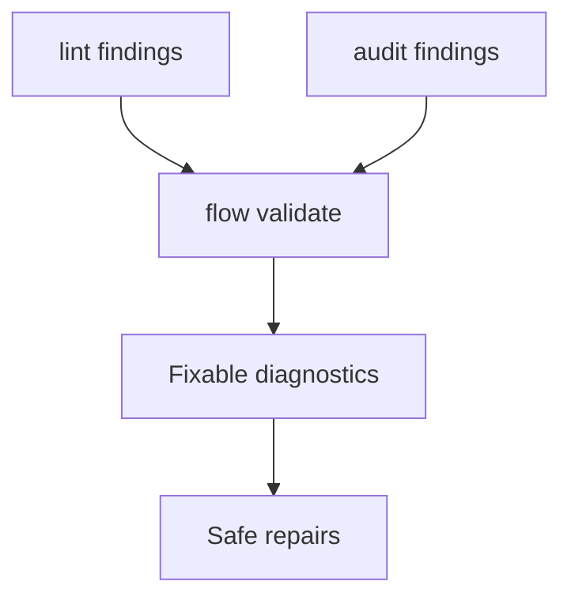

## item_436_add_deterministic_validation_repair_and_fixable_diagnostics - Add deterministic validation repair and fixable diagnostics
> From version: 2.8.1
> Schema version: 1.0
> Status: Ready
> Understanding: 90%
> Confidence: 85%
> Progress: 0%
> Complexity: High
> Theme: Operator workflow and runtime integration
> Reminder: Update status/understanding/confidence/progress and linked request/task references when you edit this doc.

# Problem
Agents currently run `lint`, then `audit`, then infer which repair command or manual patch is needed. Some deterministic fixes, such as Mermaid signatures and request AC traceability, are reported but not applied. This slice creates a clearer validation surface with fixable diagnostics.

# Scope
- In:
  - `flow validate <refs...> --fixable --explain`
  - optional `--apply-fixes` for deterministic safe repairs
  - deterministic fixes for Mermaid signatures, missing overview blocks, index drift, and planned AC traceability
  - clear refusal when a fix is ambiguous or unsafe
- Out:
  - broad content rewriting
  - changing audit rules to hide real blockers

# Acceptance criteria
- AC1: `flow validate` can report lint and audit state together for selected refs.
- AC2: Output distinguishes blocking, warning, fixable, unsafe, and informational findings.
- AC3: `--apply-fixes` repairs deterministic issues without touching unrelated workflow docs.
- AC4: Mermaid repair applies the exact expected signatures instead of only reporting them.
- AC5: Tests cover applied fix, dry-run, ambiguous fix refusal, and no-unrelated-doc-churn behavior.

# AC Traceability
- request-AC3 -> This backlog slice. Proof: Provides deterministic validation repair and fixable diagnostics.
- request-AC6 -> This backlog slice. Proof: Requires no unrelated workflow doc modifications.
- request-AC7 -> This backlog slice. Proof: Defines tests for fixable and unsafe cases.

# Decision framing
- Product framing: Not needed
- Product signals: (none detected)
- Product follow-up: No product brief follow-up is expected based on current signals.
- Architecture framing: Not needed
- Architecture signals: (none detected)
- Architecture follow-up: No architecture decision follow-up is expected based on current signals.

# Links
- Product brief(s): `logics/product/prod_023_agent_authored_logics_workflow_scaffolding_and_validation.md`
- Architecture decision(s): (none yet)
- Request: `logics/request/req_249_improve_logics_workflow_scaffolding_validation_agent_docs.md`
- Primary task(s): (none yet)

# AI Context
- Summary: Add a validation surface that merges lint/audit findings and can safely apply deterministic repairs.
- Keywords: flow-validate, lint-audit, fixable-diagnostics, mermaid-repair, ac-traceability
- Use when: Use when implementing or reviewing the delivery slice for Add deterministic validation repair and fixable diagnostics.
- Skip when: Skip when the change is unrelated to this delivery slice or its linked request.

# Priority
- Impact: High
- Urgency: High

# Notes
- Hybrid rationale: Derived from request `req_249_improve_logics_workflow_scaffolding_validation_agent_docs` and kept bounded to one coherent delivery slice.
- Source file: `logics/request/req_249_improve_logics_workflow_scaffolding_validation_agent_docs.md`.
- Generated locally by logics-manager.
