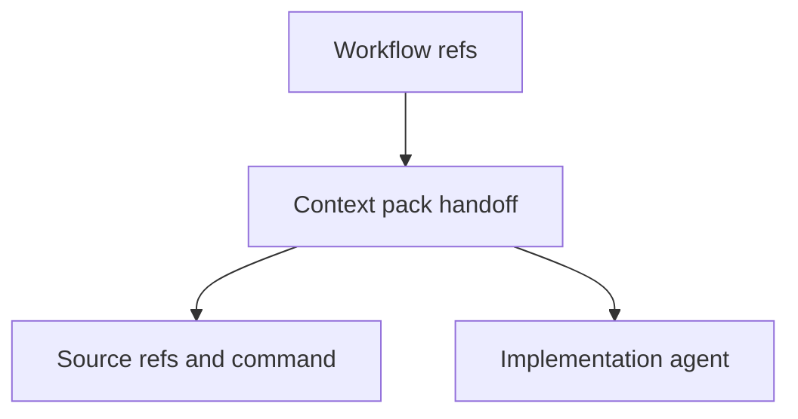

## item_437_improve_context_pack_corpus_generation_for_implementation_handoff - Improve context-pack corpus generation for implementation handoff
> From version: 2.8.1
> Schema version: 1.0
> Status: Done
> Understanding: 95%
> Confidence: 90%
> Progress: 100%
> Complexity: High
> Theme: Operator workflow and runtime integration
> Reminder: Update status/understanding/confidence/progress and linked request/task references when you edit this doc.

# Problem
After a workflow chain is created, an implementation agent still needs compact context. Today the agent must remember to run `sync context-pack`, choose refs, choose a path, and decide the profile. This slice makes context-pack corpus generation a first-class handoff step.

# Scope
- In:
  - predictable context-pack output path for workflow chains
  - profile presets for implementation handoff
  - inclusion of request, product brief, backlog items, orchestration task, and validation summary
  - structured metadata naming source refs and generation command
- Out:
  - replacing the existing context-pack engine
  - embedding large raw transcripts by default

# Acceptance criteria
- AC1: Context-pack handoff can be generated from a request-chain ref set with one command or scaffold option.
- AC2: Output includes request, product brief, backlog items, orchestration task, and validation summary when available.
- AC3: Output records source refs, mode, profile, generation timestamp, and command.
- AC4: The default handoff excludes stale unrelated docs unless explicitly requested.
- AC5: Tests cover generated pack shape, missing refs, profile selection, and bounded size behavior.

# AC Traceability
- request-AC1 -> This backlog slice. Proof: Supports optional context-pack output from scaffold.
- request-AC4 -> This backlog slice. Proof: Defines implementation-ready context-pack corpus generation.
- request-AC7 -> This backlog slice. Proof: Defines context-pack handoff tests.
- request-AC6 -> This backlog slice. Evidence needed: The improved flow preserves existing safety boundaries: no silent destructive edits, no publication actions, and no unrelated workflow docs modified by repair commands.
- request-AC8 -> This backlog slice. Evidence needed: Documentation and CLI help show the recommended one-pass workflow for turning a product conversation into development-ready Logics corpus.

# Decision framing
- Product framing: Not needed
- Product signals: (none detected)
- Product follow-up: No product brief follow-up is expected based on current signals.
- Architecture framing: Not needed
- Architecture signals: (none detected)
- Architecture follow-up: No architecture decision follow-up is expected based on current signals.

# Links
- Product brief(s): `logics/product/prod_023_agent_authored_logics_workflow_scaffolding_and_validation.md`
- Architecture decision(s): (none yet)
- Request: `logics/request/req_249_improve_logics_workflow_scaffolding_validation_agent_docs.md`
- Primary task(s): (none yet)

# AI Context
- Summary: Make context-pack corpus generation a first-class implementation handoff for newly scaffolded workflow chains.
- Keywords: context-pack, corpus-handoff, implementation-context, workflow-chain, bounded-context
- Use when: Use when implementing or reviewing the delivery slice for Improve context-pack corpus generation for implementation handoff.
- Skip when: Skip when the change is unrelated to this delivery slice or its linked request.

# Priority
- Impact: Medium
- Urgency: High

# Notes
- Hybrid rationale: Derived from request `req_249_improve_logics_workflow_scaffolding_validation_agent_docs` and kept bounded to one coherent delivery slice.
- Source file: `logics/request/req_249_improve_logics_workflow_scaffolding_validation_agent_docs.md`.
- Generated locally by logics-manager.
- Task `task_231_improve_context_pack_corpus_generation_for_implementation_handoff` was finished via `logics-manager flow finish task` on 2026-06-19.

# Tasks
- `task_231_improve_context_pack_corpus_generation_for_implementation_handoff`
