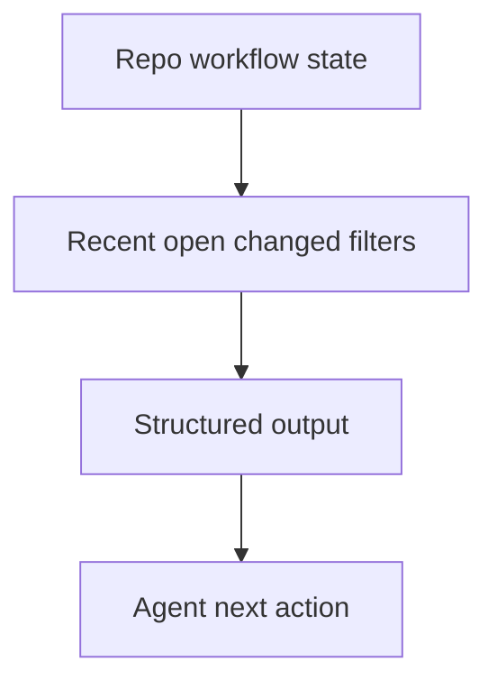

## item_438_improve_agent_ergonomics_for_recent_docs_and_structured_workflow_output - Improve agent ergonomics for recent docs and structured workflow output
> From version: 2.8.1
> Schema version: 1.0
> Status: Ready
> Understanding: 95%
> Confidence: 90%
> Progress: 5%
> Complexity: High
> Theme: Operator workflow and runtime integration
> Reminder: Update status/understanding/confidence/progress and linked request/task references when you edit this doc.

# Problem
Some existing command output is technically correct but low-signal for agents. For example, listing docs with a small limit may return old historical entries instead of current open docs. Agents need recent/open/changed filters and structured next-action output.

# Scope
- In:
  - `sync list-docs --recent`, `--open`, and `--changed`
  - structured JSON output for workflow creation and validation commands
  - next-action summaries suitable for assistants
  - command help examples for agent-authored workflow creation
- Out:
  - provider-specific assistant integrations
  - broad UI changes

# Acceptance criteria
- AC1: `sync list-docs` supports recent, open, and changed views that prioritize the current work over historical docs.
- AC2: Flow creation commands return structured next actions, created refs, changed files, and validation suggestions.
- AC3: Agent-facing text output stays concise while JSON output remains complete.
- AC4: Help text shows the recommended one-pass workflow for request-chain creation and corpus handoff.
- AC5: Tests cover sorting/filtering behavior and JSON schema stability for agent consumption.

# AC Traceability
- request-AC5 -> This backlog slice. Proof: Improves recent/open/changed doc discovery and structured next actions.
- request-AC8 -> This backlog slice. Proof: Updates command help for the recommended workflow.
- request-AC6 -> This backlog slice. Evidence needed: The improved flow preserves existing safety boundaries: no silent destructive edits, no publication actions, and no unrelated workflow docs modified by repair commands.
- request-AC7 -> This backlog slice. Evidence needed: Tests cover rich scaffold generation, AC-aware split metadata, fixable diagnostics, context-pack handoff, and failure cases where auto-fix should decline.

# Decision framing
- Product framing: Not needed
- Product signals: (none detected)
- Product follow-up: No product brief follow-up is expected based on current signals.
- Architecture framing: Not needed
- Architecture signals: (none detected)
- Architecture follow-up: No architecture decision follow-up is expected based on current signals.

# Links
- Product brief(s): `logics/product/prod_023_agent_authored_logics_workflow_scaffolding_and_validation.md`
- Architecture decision(s): (none yet)
- Request: `logics/request/req_249_improve_logics_workflow_scaffolding_validation_agent_docs.md`
- Primary task(s): (none yet)

# AI Context
- Summary: Improve command output and doc discovery so agents can find current workflow state without broad scans.
- Keywords: agent-ergonomics, recent-docs, open-docs, changed-docs, structured-output
- Use when: Use when implementing or reviewing the delivery slice for Improve agent ergonomics for recent docs and structured workflow output.
- Skip when: Skip when the change is unrelated to this delivery slice or its linked request.

# Priority
- Impact: Medium
- Urgency: Medium

# Notes
- Hybrid rationale: Derived from request `req_249_improve_logics_workflow_scaffolding_validation_agent_docs` and kept bounded to one coherent delivery slice.
- Source file: `logics/request/req_249_improve_logics_workflow_scaffolding_validation_agent_docs.md`.
- Generated locally by logics-manager.
