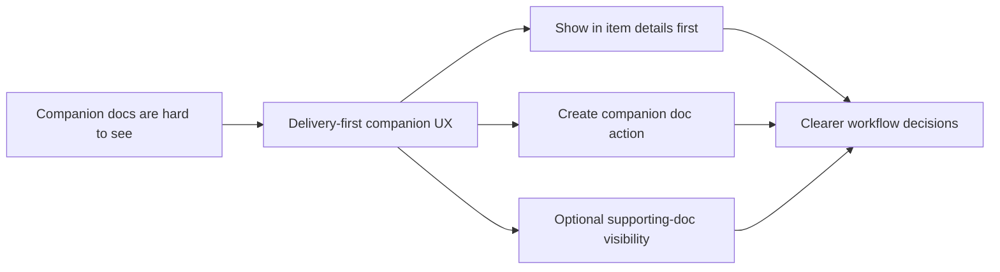

## prod_000_companion_docs_ux_for_the_vs_code_plugin - Companion docs UX for the VS Code plugin
> Date: 2026-03-14
> Status: Proposed
> Related request: `req_022_align_vs_code_plugin_with_companion_docs_workflow`
> Related backlog: `item_022_align_vs_code_plugin_with_companion_docs_workflow`
> Related task: `(none yet)`
> Related architecture: `adr_000_represent_companion_docs_in_the_vs_code_plugin_workflow_model`
> Reminder: Update status, linked refs, scope, decisions, success signals, and open questions when you edit this doc.

# Overview
The plugin should stay delivery-first while making companion docs easy to find and act on.
Users should understand that `product` and `architecture` are supporting decision artifacts attached to requests, backlog items, and tasks, not a second competing delivery board.
The UX should prioritize contextual visibility in item details, deliberate creation flows, and optional secondary visibility controls instead of default stage parity.

# Product problem
The kit now supports `product` and `architecture` docs, but the plugin still behaves as if only `request`, `backlog`, `task`, and `spec` matter.
This creates three user problems:
- companion docs can exist but remain practically invisible from the plugin;
- the board can become confusing if supporting docs are exposed with the same visual weight as delivery items;
- users do not have a clear path to create or navigate companion docs while staying inside the workflow cockpit.

# Target users and situations
- Primary user: repository maintainers and engineers using the plugin as the main Logics workflow cockpit.
- Secondary user: product or technical leads reviewing framing and decision artifacts linked to ongoing work.
- Situation: users are working from a request, backlog item, or task and need to understand or create the product/architecture companion docs tied to that work.

# Goals
- Keep the main plugin experience centered on delivery flow readability.
- Make companion docs discoverable in context from the relevant workflow items.
- Provide a clear creation path for companion docs without overloading existing delivery actions.
- Reduce ambiguity between delivery docs and supporting decision artifacts.

# Non-goals
- Full redesign of the plugin information architecture.
- Strong automatic decision detection inside the plugin in V1.
- Turning companion docs into default first-class board columns with the same weight as delivery stages.

# Scope and guardrails
- In: Companion-doc visibility in item details, explicit creation/navigation actions, and optional supporting-doc visibility controls.
- Out: Large-scale visual redesign, generalized AI decision suggestion inside the plugin, or duplication of kit-side governance rules.

# Key product decisions
- Companion docs should be shown contextually from primary workflow items first, not treated as default peer stages in the main board.
- The preferred creation path is a generic `Create companion doc` action that lets the user choose `Product brief` or `Architecture decision`.
- Supporting-doc visibility at board level should be secondary, explicit, and filterable.

# Success signals
- A user can identify linked companion docs from a request/backlog/task details panel without file hunting.
- A user can create a companion doc in two actions or fewer from the plugin.
- Board readability for the main delivery flow remains intact after companion-doc support is added.
- Regression tests cover the main companion-doc interaction paths.

# Open questions
- Should `spec` share the same supporting-doc visibility controls as `product` and `architecture` in V1, or remain on a separate toggle until a later cleanup?
