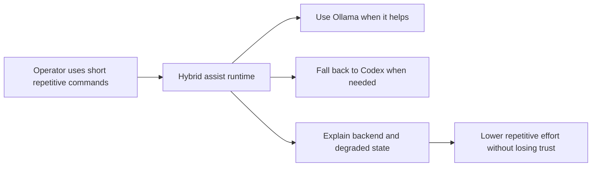

## prod_001_hybrid_assist_operator_experience_for_repetitive_logics_delivery_flows - Hybrid assist operator experience for repetitive Logics delivery flows
> Date: 2026-03-25
> Status: Proposed
> Related request: `req_089_add_a_hybrid_ollama_or_codex_local_orchestration_backend_for_repetitive_logics_delivery_tasks`
> Related backlog: `item_142_add_hybrid_commit_message_pr_summary_and_changelog_summary_assist_flows`
> Related task: `task_100_orchestration_delivery_for_req_089_to_req_095_hybrid_assist_runtime_portfolio_governance_portability_and_plugin_exposure`
> Related architecture: `adr_011_keep_hybrid_assist_runtime_contracts_shared_backend_agnostic_and_safely_bounded`
> Reminder: Update status, linked refs, scope, decisions, success signals, and open questions when you edit this doc.

# Overview
Operators should be able to keep using short, natural delivery commands while the Logics runtime decides whether to use Ollama or Codex behind the scenes, stays bounded, and explains fallback or degraded behavior clearly.

# Product problem
Repetitive delivery tasks such as commit messages, summaries, triage, and closure hygiene consume attention even though they are often structurally simple.
The hybrid runtime can reduce that friction, but only if the operator experience stays:
- simple to invoke;
- predictable when fallback happens;
- explicit about what remains assistive versus what can execute;
- trustworthy enough that users do not feel they are handing control to an opaque automation layer.

# Target users and situations
- Primary user: engineers and maintainers driving Logics delivery through terminal commands or agent sessions.
- Secondary user: leads or reviewers who need bounded summaries, triage, and closure signals without reading every raw artifact.
- Situation: the user is doing repetitive delivery work and wants a faster path that still preserves reviewability and control.

# Goals
- Let operators keep short, natural commands for repetitive delivery tasks.
- Use Ollama opportunistically where it gives real ROI, without breaking the flow when it is unavailable.
- Make fallback, degraded mode, and human-review boundaries easy to understand.
- Keep outputs bounded, structured, and auditable.

# Non-goals
- Autonomous code generation as part of the hybrid assist default path.
- Hiding backend choice or degraded behavior from the operator.
- Replacing real validation, review, or deterministic execution with model output alone.

# Scope and guardrails
- In: High-ROI repetitive assist flows, bounded review-oriented second-wave flows, shared degraded-state explanations, and operator-visible auditability.
- Out: Low-ROI or unsafe automation, broad autonomous coding, or opaque silent fallback behavior.

# Key product decisions
- Backend selection should be internal to the runtime, but backend provenance should still be visible in results.
- The safest default is still bounded assistance, with deterministic or reviewed execution only where the runtime contract supports it.
- The first portfolio should prioritize obvious ROI flows before expanding into more delicate review tasks.
- Review loops should be used to keep or retire flows based on observed value rather than enthusiasm alone.

# Success signals
- Operators can use representative hybrid assist flows without memorizing backend-specific commands.
- Fallback or degraded outcomes are visible and understandable.
- High-value assist flows are accepted often enough to justify staying enabled.
- Low-value or noisy flows are tightened or removed instead of accumulating indefinitely.

# Open questions
- Which assist flows should graduate out of `suggestion-only` first once shared contracts and auditability are proven?
- How much context can the runtime afford to gather before latency erodes the local-backend benefit?
- Which plugin surfaces should become default versus optional once the terminal flows stabilize?

