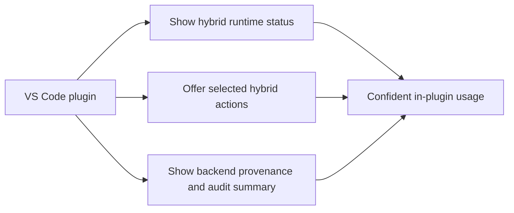

## prod_002_plugin_hybrid_assist_runtime_visibility_and_action_ux - Plugin hybrid assist runtime visibility and action UX
> Date: 2026-03-26
> Status: Proposed
> Related request: `req_095_adapt_the_vs_code_logics_plugin_to_expose_hybrid_assist_runtime_status_actions_audit_and_cross_agent_messaging`, `req_099_replace_repo_local_codex_overlays_with_a_global_published_logics_kit_and_managed_migration`
> Related backlog: `item_155_extend_plugin_environment_diagnostics_with_hybrid_runtime_health_backend_selection_and_degraded_state_visibility`, `item_169_migrate_plugin_docs_and_existing_overlay_ux_to_the_global_published_kit_model`
> Related task: `task_100_orchestration_delivery_for_req_089_to_req_095_hybrid_assist_runtime_portfolio_governance_portability_and_plugin_exposure`, `task_103_orchestration_delivery_for_req_099_global_logics_kit_publication_and_overlay_migration`
> Related architecture: `adr_012_keep_the_vs_code_plugin_as_a_thin_client_over_shared_hybrid_runtime_commands`, `adr_013_replace_repo_local_codex_workspace_overlays_with_a_global_published_logics_kit`
> Reminder: Update status, linked refs, scope, decisions, success signals, open questions, and migration-alignment notes when you edit this doc.

# Overview
The VS Code plugin should expose the hybrid assist runtime clearly enough that operators can see backend health, run a small set of valuable actions, and understand results without leaving the extension or guessing what happened.

# Product problem
The plugin is already a workflow cockpit, but the new hybrid runtime risks staying invisible there unless the extension shows:
- what backend health looks like;
- which hybrid actions are available;
- whether a result came from Ollama, Codex fallback, or a degraded state;
- how shared hybrid runtime concepts differ from Codex-specific global-kit affordances.

# Target users and situations
- Primary user: engineers who rely on the plugin as their main Logics cockpit.
- Secondary user: maintainers who want less terminal hopping for repetitive assist flows and diagnostics.
- Situation: the user is already in the plugin and wants to inspect runtime state, launch a bounded hybrid action, or understand a recent hybrid result.

# Goals
- Make hybrid runtime status visible in the plugin.
- Expose a small, high-value set of hybrid actions through the existing plugin affordances.
- Show backend provenance, fallback state, and concise audit information after a run.
- Keep the plugin understandable by separating shared runtime concepts from Codex-specific global-kit actions.

# Non-goals
- Turning the plugin into the owner of hybrid runtime logic.
- Exposing every possible hybrid action on day one.
- Hiding degraded behavior behind optimistic success wording.

# Scope and guardrails
- In: hybrid runtime diagnostics, selected high-value actions, concise audit/result surfaces, and wording cleanup.
- Out: full analytics dashboards, plugin-only runtime logic, or a giant new menu of experimental actions.

# Key product decisions
- The plugin should start with diagnostics first, then a small set of high-value actions, then result visibility.
- Hybrid runtime concepts should be named separately from Codex global-kit concepts.
- Result surfaces should favor concise summaries that link back to shared runtime artifacts instead of duplicating raw logs.
- UI growth should stay deliberate so the extension remains readable.

# Success signals
- A user can tell from the plugin whether the hybrid runtime is healthy, degraded, or falling back.
- A user can launch representative assist flows from the plugin without learning a new backend-specific mental model.
- A user can understand what happened after a run without opening raw logs first.
- Plugin messaging no longer implies that all hybrid runtime behavior is Codex-only.

# Open questions
- Which hybrid actions belong in the Tools menu versus the command palette in the first plugin wave?
- How much audit detail should the plugin show inline before linking out to fuller structured artifacts?
- When should plugin surfaces expose Claude-related compatibility hints directly versus leaving them in shared runtime docs?
