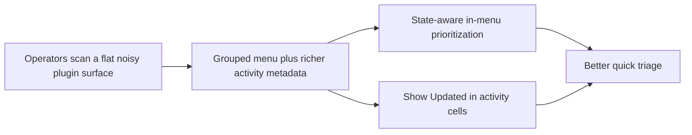

## prod_003_plugin_tools_menu_and_activity_scanability - Plugin tools menu and activity scanability
> Date: 2026-04-09
> Status: Validated
> Related request: `req_112_restructure_the_tools_menu_information_architecture_without_moving_actions_out_of_the_menu`, `req_113_show_updated_timestamps_in_activity_cells`
> Related backlog: `item_199_restructure_the_tools_menu_information_architecture_without_moving_actions_out_of_the_menu`, `item_200_show_updated_timestamps_in_activity_cells`
> Related task: `task_107_orchestration_delivery_for_req_107_to_req_117_across_maintenance_hardening_ui_refinement_and_modularization`
> Related architecture: `adr_002_keep_the_plugin_webview_as_a_modular_vanilla_frontend`
> Reminder: Update status, linked refs, scope, decisions, success signals, and open questions when you edit this doc.

# Overview
The plugin should make high-frequency tools and recent activity easier to scan without moving the user into a broader navigation redesign.
The chosen direction is to keep every action inside the tools menu, but add hierarchy, state-aware recommendation, and clearer labels while also making activity entries expose `Updated` at the point of triage.
The expected outcome is faster in-panel action selection, better recent-item triage, and less need to open details just to recover basic context.

# Product problem
- The tools menu had become a long flat list, which made operators re-read the whole menu to find the right action.
- Recent activity cells hid a key piece of triage context by omitting `Updated`, even though that field already existed in richer surfaces.
- The plugin width is constrained, so the answer cannot be “show more chrome everywhere”; the experience needs better scanability inside the existing compact surfaces.

# Target users and situations
- Primary user: engineers using the extension as their main Logics cockpit during delivery and repo maintenance.
- Secondary user: maintainers who jump between validation, triage, and repair actions and need low-friction scanning.
- Situation: the user opens the tools menu or the activity panel while already focused on execution and wants to choose the next action quickly.

# Goals
- Reduce the scan cost of the tools menu without removing actions from it.
- Surface the most relevant menu actions according to current repository state while preserving full discoverability.
- Make activity cells informative enough for quick triage by exposing `Updated` directly in the compact list.
- Preserve readability and usability in narrow extension layouts.

# Non-goals
- Moving primary actions into a separate persistent toolbar surface.
- Turning the menu into a dense configuration dashboard.
- Expanding the activity panel into a full details view or duplicating all item metadata there.

# Scope and guardrails
- In: grouped tools-menu sections, a contextual `Recommended` block within the menu, label cleanup, disabled-state clarity, and compact `Updated` metadata in activity cells.
- Out: command-palette redesign, major navigation restructuring, new workflow stages, or broader activity-panel information architecture changes.

# Key product decisions
- Keep all existing actions in the tools menu and improve organization instead of splitting surfaces.
- Use a contextual `Recommended` section to raise the most relevant actions without hiding the rest of the menu.
- Favor short, operator-readable labels over long procedural wording where meaning remains intact.
- Add one more line of metadata to activity cells only when it materially improves triage, with graceful fallback when timestamps are missing or invalid.

# Success signals
- Operators can locate likely next actions by scanning section headers before reading individual menu items.
- Disabled actions remain understandable because their placement and titles still explain why they matter.
- Activity cells expose enough context that users can decide whether to open an item without losing list density.
- Regression tests protect grouped menu structure, recommendation behavior, and the `Updated` rendering contract.

# References
- `logics/request/req_112_restructure_the_tools_menu_information_architecture_without_moving_actions_out_of_the_menu.md`
- `logics/request/req_113_show_updated_timestamps_in_activity_cells.md`
- `logics/backlog/item_199_restructure_the_tools_menu_information_architecture_without_moving_actions_out_of_the_menu.md`
- `logics/backlog/item_200_show_updated_timestamps_in_activity_cells.md`
- `logics/tasks/task_107_orchestration_delivery_for_req_107_to_req_117_across_maintenance_hardening_ui_refinement_and_modularization.md`
- `logics/architecture/adr_002_keep_the_plugin_webview_as_a_modular_vanilla_frontend.md`
# Open questions
- Should the `Recommended` section later become user-configurable, or is repository-state-only prioritization sufficient?
- Should activity timestamps stay absolute only, or would a compact relative-time treatment improve scanability without adding noise?
