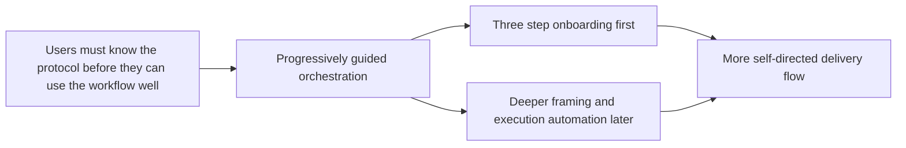

## prod_004_logics_auto_orchestration_vision - Logics auto orchestration vision
> Date: 2026-04-03
> Status: Proposed
> Related request: `req_119_three_step_onboarding_for_need_framing_and_execution`
> Related backlog: `item_208_define_the_three_step_onboarding_model_and_operator_copy`, `item_209_add_the_three_step_onboarding_model_to_guided_request_entry_surfaces_and_validate_workflow_alignment`
> Related task: `task_109_orchestration_delivery_for_req_119_three_step_onboarding`
> Related architecture: (none yet)
> Reminder: Update status, linked refs, scope, decisions, success signals, and open questions when you edit this doc.

# Overview
Logics should eventually move beyond a workflow that users must manually pilot step by step.
The product direction is to let users start from a simple expressed need while the system progressively absorbs more of the framing, preparation, and delivery orchestration.
The immediate product slice remains a three-step onboarding model, while auto orchestration stays as a bounded follow-on vision rather than current delivery scope.
The expected outcome is a future workflow that feels more guided and less protocol-heavy without sacrificing control, traceability, or operator trust.

# Product problem
- The current workflow is powerful, but it still expects the operator to understand the sequence of request creation, refinement, backlog generation, orchestration, and execution.
- Existing surfaces already expose many actions, but they do not yet give a sufficiently simple mental model for what the system does for the user versus what the user must still drive manually.
- A direct jump to full automation would risk overpromising behavior before the product has a stable entry model, clear guardrails, and a credible trust model.

# Target users and situations
- Primary user: engineers using Logics from the VS Code extension or adjacent agent bridges who want the workflow to feel guided instead of procedural.
- Secondary user: maintainers evolving the kit and plugin UX who need a clear product north star for how much orchestration should eventually become user-facing.
- Situation: the operator starts from a new need and should not have to reconstruct the full internal protocol before knowing how to proceed.

# Goals
- Define the long-term product direction for a more self-orchestrating Logics workflow.
- Keep the near-term focus on onboarding and workflow comprehension rather than collapsing directly into automation work.
- Establish guardrails for future autonomy so later backlog items can be evaluated against a clear product intent.

# Non-goals
- Shipping full auto orchestration as part of the current onboarding slice.
- Locking a final implementation for autonomy modes, Git checkpoint policy, or wave execution semantics.
- Replacing the canonical request, backlog, task workflow model with a hidden black-box system.

# Scope and guardrails
- In: product framing for future auto orchestration, relationship to the three-step onboarding model, autonomy guardrails, and expected user value.
- Out: immediate implementation commitments for end-to-end execution automation, silent high-risk actions, or rigid wave-to-commit rules.

# Key product decisions
- Treat Need, Framing, and Execution as the user-facing mental model, even if preparation remains an internal system phase.
- Deliver the three-step onboarding first so the entry model is stable before increasing autonomy deeper in the workflow.
- Use this brief as the product frame for later exploration of autonomy levels, diagnostic behavior, and progressive orchestration.
- Prefer assisted orchestration with visible checkpoints over opaque full automation that hides decision points from the operator.

# Success signals
- New workflow requests can reference a stable product direction when proposing deeper automation features.
- The onboarding slice can ship without reopening the broader question of whether Logics should become more self-orchestrating over time.
- Future backlog items about autonomy, waves, or guided execution can be evaluated against explicit guardrails instead of ad hoc expectations.
- Operators increasingly experience Logics as a guided system rather than a protocol they must memorize.

# References
- `logics/request/req_119_three_step_onboarding_for_need_framing_and_execution.md`
- `logics/backlog/item_208_define_the_three_step_onboarding_model_and_operator_copy.md`
- `logics/backlog/item_209_add_the_three_step_onboarding_model_to_guided_request_entry_surfaces_and_validate_workflow_alignment.md`
- `logics/tasks/task_109_orchestration_delivery_for_req_119_three_step_onboarding.md`
- `logics/instructions.md`
- `logics/skills/logics-flow-manager/SKILL.md`
- `src/logicsViewProvider.ts`
- `src/logicsViewDocumentController.ts`
- `media/toolsPanelLayout.js`
- `.claude/agents/logics-flow-manager.md`
- `.claude/agents/logics-hybrid-delivery-assistant.md`

# Open questions
- When should autonomy levels become user-visible instead of staying as an internal behavior policy?
- Which current entry surface should own the eventual transition from simple onboarding to richer guided orchestration?
- How much delivery traceability must remain explicit to preserve operator trust once the system starts making more workflow decisions on the user's behalf?
