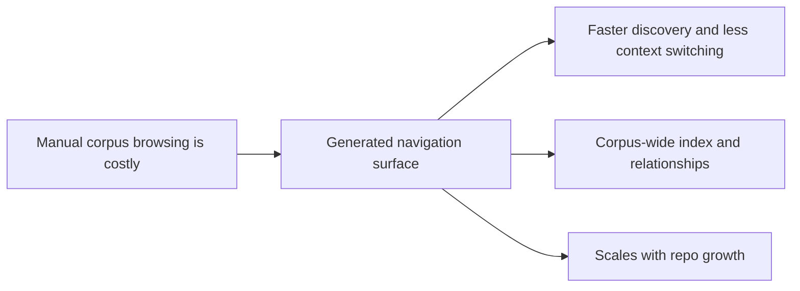

## prod_005_logics_corpus_navigation_views - Logics corpus navigation views
> Date: 2026-04-09
> Status: Proposed
> Related request: `req_134_generated_corpus_index_and_relationship_views`
> Related backlog: `item_257_generated_corpus_index_and_relationship_views`
> Related task: `task_117_generated_corpus_index_and_relationship_views`
> Related architecture: `adr_016_use_generated_corpus_index_and_relationship_views_for_logics_navigation`
> Reminder: Update status, linked refs, scope, decisions, success signals, and open questions when you edit this doc. Refreshed for the generated navigation sync.

# Overview
The Logics corpus has outgrown ad hoc directory browsing.
The product direction is a generated navigation layer that makes the corpus feel searchable, inspectable, and connected from one maintained surface.
The user value is faster discovery of the right doc, fewer context switches, and less time spent reconstructing relationships manually.
The expected outcome is a corpus navigation experience that scales with repo growth instead of becoming a maintenance tax.

# Product problem
Users can already find individual docs, but the path from “I need a related artifact” to “I have the right file” is too manual once the corpus gets large.
The friction grows as requests, backlog items, tasks, product briefs, and architecture notes multiply.
The product needs a lightweight navigation surface that keeps discovery cheap without changing the source-of-truth model.

# Target users and situations
- Contributors navigating the Logics corpus day to day
- Maintainers trying to understand the shape of the workflow and the most connected docs
- AI-assisted operators who need a compact, trustworthy map of the corpus before drafting or triaging

# Goals
- Make the corpus easier to browse than a raw directory tree
- Surface the most important relationships and clusters at a glance
- Preserve the repo as the source of truth while making discovery cheaper

# Non-goals
- Replace the existing workflow docs with a separate database
- Design a full-blown graph editor or interactive knowledge-map UI
- Move source-of-truth content out of Markdown

# Scope and guardrails
- In: generated index and relationship views, plus the minimum refresh/guardrail story needed to keep them trustworthy
- In: summary stats that help people understand the corpus at a glance
- Out: major UX redesign of the main orchestrator, or a bespoke data store
- Guardrail: the generated views should stay derivable from repo content and stay easy to refresh
- Guardrail: the experience should remain readable in a plain text workflow if needed

# Key product decisions
- Prefer generated views over manually curated navigation pages
- Keep the surface repo-native and diffable instead of introducing a hidden index store
- Optimize for scanability and trust, not for visual complexity

# Success signals
- Fewer manual directory traversals when locating a related doc
- Faster identification of clusters, orphans, and heavily linked docs
- Fewer stale or missing relationship references in the corpus
- Positive maintainer feedback that the corpus is easier to navigate as it grows

# References
- `logics/request/req_134_generated_corpus_index_and_relationship_views.md`
- `logics/backlog/item_257_generated_corpus_index_and_relationship_views.md`
- `logics/tasks/task_117_generated_corpus_index_and_relationship_views.md`
- `logics/architecture/adr_016_use_generated_corpus_index_and_relationship_views_for_logics_navigation.md`
# Open questions
- Should the generated views live as plain markdown files only, or also be surfaced inside the extension as a dedicated insight view?
