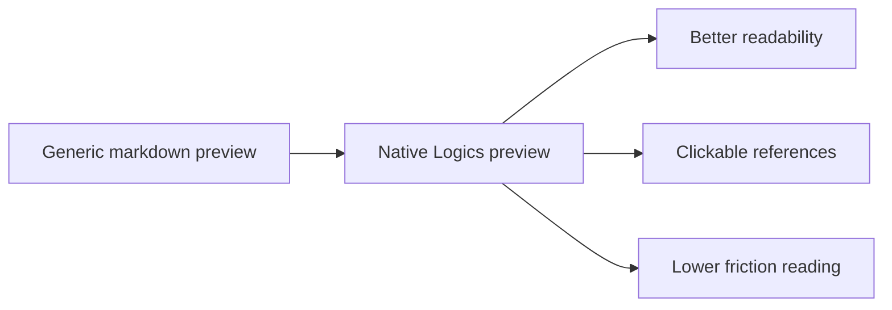

## prod_006_custom_logics_markdown_preview_experience - Custom Logics markdown preview experience
> Date: 2026-04-09
> Status: Validated
> Related request: `req_142_add_a_polished_logics_markdown_preview_screen`
> Related backlog: `item_265_add_a_polished_logics_markdown_preview_screen`
> Related task: `task_121_add_a_polished_logics_markdown_preview_screen`
> Related architecture: `adr_017_route_logics_document_reads_to_a_native_preview`
> Reminder: Update status, linked refs, scope, decisions, success signals, and open questions when you edit this doc.

# Overview
The product direction is to give Logics documents a native preview experience inside the plugin instead of bouncing users into the generic VS Code markdown preview.

# Product problem
Users cannot comfortably read and navigate Logics markdown through the generic editor preview, which makes relationships harder to understand.

# Target users and situations
- Contributors reading requests, backlog items, tasks, product briefs, architecture decisions, and specs.

# Goals
- Make document reading feel native to Logics.
- Keep navigation in the workflow surface instead of the IDE markdown viewer.

# Non-goals
- Rewriting the markdown syntax or changing document storage formats.
- Building a full markdown editor; this is a preview and navigation surface.

# Scope and guardrails
- In: a custom preview pane, clickable references, formatted document names, and Logics-themed rendering.
- Out: unrelated editor features, content editing, or generic markdown authoring.

# Key product decisions
- The preview should replace the read/double-click path for Logics docs.
- Relationships should be first-class navigation targets rather than plain text.

# Success signals
- Users open Logics docs without leaving the plugin.
- Linked docs are clicked more often from the preview than from raw markdown.

# References
- `logics/request/req_142_add_a_polished_logics_markdown_preview_screen.md`
- `logics/backlog/item_265_add_a_polished_logics_markdown_preview_screen.md`

# Open questions
- Which markdown constructs should be rendered natively versus passed through as raw markdown?
