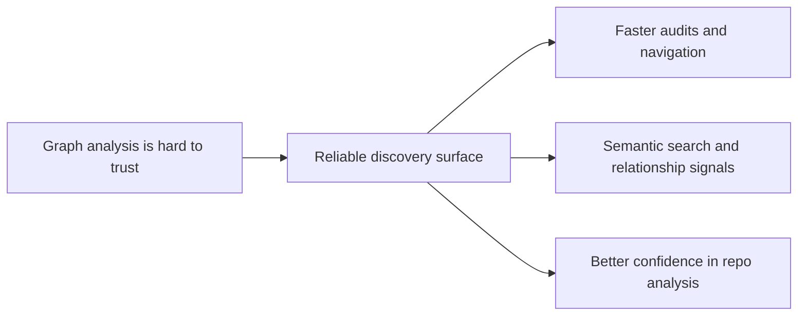

## prod_007_graph_embeddings_for_audit_discovery - Graph embeddings for audit discovery
> Date: 2026-04-12
> Status: Proposed
> Related request: `req_170_address_codebase_audit_findings_from_april_2026_settings_hooks_graph_embeddings_and_test_fragmentation`
> Related backlog: `item_313_fix_settings_hooks_format_and_initialize_graph_embeddings`
> Related task: `task_134_wave_1_maintenance_hardening_graph_embeddings_coverage_and_static_analysis`
> Related architecture: (none yet)
> Reminder: Update status, linked refs, scope, decisions, success signals, and open questions when you edit this doc.

# Overview
The product direction is to make graph-based discovery trustworthy enough that maintainers can use it as a practical audit and navigation aid.
The user value is faster investigation of code relationships, fewer blind spots during audits, and better confidence in the generated graph signals.
The expected outcome is a corpus that remains easy to inspect with semantic search, impact-radius analysis, and relationship views as it grows.

# Product problem
Maintainers need a dependable way to inspect relationships, spot regressions, and navigate large code and documentation surfaces without manually tracing everything.
When the graph is incomplete or unavailable, audit work becomes slower and less trustworthy.
The product needs a discovery surface that keeps relationship analysis cheap and reproducible while staying repo-native.

# Target users and situations
- Maintainers running audits and reviewing structural changes
- Contributors trying to understand the blast radius of a change
- AI-assisted operators who need a compact, reliable relationship map before making edits

# Goals
- Make relationship discovery trustworthy enough for routine audit work
- Reduce manual tracing when investigating connected docs, tests, and implementation files
- Keep discovery outputs derived from repo content rather than from a separate hidden store

# Non-goals
- Build a standalone graph editor or a replacement for the repo
- Promise perfect graph completeness for every possible dynamic import or generated edge
- Move analysis out of the repository workflow

# Scope and guardrails
- In: semantic search availability, relationship visibility, and audit-oriented discovery quality
- In: lightweight trust signals that help users know when graph data is useful
- Out: a new knowledge-base backend or a bespoke analytics warehouse
- Guardrail: the graph should stay refreshable from repo state and remain explainable when coverage is partial
- Guardrail: known gaps should be documented rather than hidden

# Key product decisions
- Prefer repo-native graph discovery over a separate indexing product
- Optimize for maintainers and AI-assisted operators who need fast directional understanding
- Treat incomplete coverage as an explicit product constraint, not an invisible failure

# Success signals
- Maintainers can locate related files faster during audits
- Graph-based navigation is used routinely as a first pass before deeper code reading
- Fewer surprise relationship gaps during review and maintenance work
- Audit findings become easier to reproduce and explain

# References
- `logics/request/req_170_address_codebase_audit_findings_from_april_2026_settings_hooks_graph_embeddings_and_test_fragmentation.md`
- `logics/backlog/item_313_fix_settings_hooks_format_and_initialize_graph_embeddings.md`
- `logics/tasks/task_134_wave_1_maintenance_hardening_graph_embeddings_coverage_and_static_analysis.md`

# Open questions
- What level of partial graph coverage is acceptable before the discovery surface becomes misleading?
- Should the repo surface explicit graph health warnings when embeddings or import coverage are stale?
