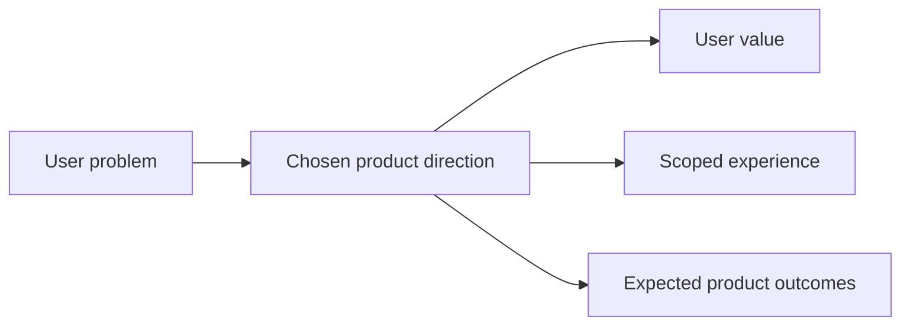

## prod_008_add_a_corpus_explorer_with_map_and_timeline_views_to_logics_insights - Add a corpus explorer with map and timeline views to Logics Insights
> Date: 2026-04-12
> Status: Proposed
> Related request: `req_184_add_a_corpus_explorer_with_map_and_timeline_views_to_logics_insights`
> Related backlog: `item_331_add_a_corpus_explorer_with_map_and_timeline_views_to_logics_insights`
> Related task: `task_142_add_a_corpus_explorer_with_map_and_timeline_views_to_logics_insights`
> Related architecture: (none yet)
> Reminder: Update status, linked refs, scope, decisions, success signals, and open questions when you edit this doc.

# Overview
Let operators see the current Logics corpus as a connected system inside Insights, with map and timeline views that stay tied to the active repository.

# Product problem
The current Insights surface shows metrics, but it does not make the corpus relationships or delivery history easy to scan. Users need a compact, visual way to understand what is connected, what is active, and how the project evolved.

# Target users and situations
- Logics operators and maintainers who need to inspect the current repository corpus quickly.

# Goals
- Give the user one Insights entry point that can switch between a relationship map and a time-oriented corpus view.
- Keep the experience scoped to the active project rather than a generic analytics dashboard.

# Non-goals
- A full graph editor.
- Arbitrary node editing or corpus mutation.
- A replacement for the existing request/backlog/task docs.

# Scope and guardrails
- In: A compact corpus explorer inside Logics Insights with map and timeline modes.
- Out: unrelated analytics charts, edit tools, or a global graph workspace.

# Key product decisions
- The explorer should prioritize readability and orientation over exhaustive detail.
- The current repository should be the default lens.

# Success signals
- Operators can answer "what is connected to what?" and "what is active now?" without leaving Insights.
- The view remains readable inside the compact panel without decorative filler.

# References
- `logics/request/req_184_add_a_corpus_explorer_with_map_and_timeline_views_to_logics_insights.md`
- `logics/backlog/item_331_add_a_corpus_explorer_with_map_and_timeline_views_to_logics_insights.md`
- `logics/tasks/task_142_add_a_corpus_explorer_with_map_and_timeline_views_to_logics_insights.md`

# Open questions
- Which level of density is optimal for the map before filters or staged expansion are required?
