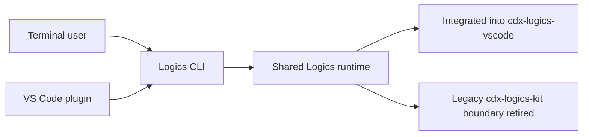

## prod_009_logics_cli_as_the_primary_operator_surface_and_unified_runtime_api - Logics CLI as the primary operator surface and unified runtime API
> Date: 2026-04-23
> Status: Active
> Related request: `req_188_unify_logics_into_a_bundled_cli_and_integrated_runtime`
> Related backlog: `item_339_integrate_the_runtime_into_cdx_logics_vscode_and_remove_the_skills_checkout`, `item_340_package_logics_manager_as_a_polished_installable_cli`, `item_341_generate_assistant_bridges_and_instructions_from_the_integrated_runtime`
> Related task: `task_148_integrate_the_runtime_into_cdx_logics_vscode_and_remove_the_skills_checkout`, `task_149_package_logics_manager_as_a_polished_installable_cli`, `task_150_generate_assistant_bridges_and_instructions_from_the_integrated_runtime`
> Related architecture: (none yet)
> Reminder: Update status, linked refs, scope, decisions, success signals, and open questions when you edit this doc.

# Overview
Logics should have one stable CLI that can be used with or without the VS Code plugin.
The CLI should become the canonical operator API for the Logics runtime, with the plugin acting as a full UX client that delegates runtime execution instead of reimplementing workflow logic.
The target binary name is `logics-manager`.
In the final state, the Logics runtime code should live directly inside `cdx-logics-vscode`, and the standalone `cdx-logics-kit` dependency should no longer be required as a separate repo boundary for normal usage.
The repository should be able to function without `cdx-logics-kit` at all once the migration is complete.
Once functional, `logics-manager` should be distributable through both `pip` and `npm`.
The CLI should have polished, attractive terminal output and a deliberately good command UX, not just raw functional behavior.
The simplest target model is one repo, one runtime, one CLI, and no manual skills bootstrap path.
The canonical user contract should be one binary with one behavior surface, even if the packaging can later ship through more than one channel.
In the client repository, the user should end up with only the Logics Markdown corpus and normal project docs, not a managed `skills/` tree or other runtime scaffolding.
The product runtime should be implemented in Python, with TypeScript kept only for the VS Code plugin plumbing that is strictly required by the extension host and UI.

# Product problem
Today, the plugin is the most visible operator surface, but the actual Logics capability set is split across repo-local scripts, kit-bound commands, and plugin-specific affordances.
That split creates three problems:
- users cannot reliably use Logics without opening VS Code;
- the plugin can drift from the kit if capabilities are duplicated or only partially exposed;
- the long-term ownership model stays unclear because `cdx-logics-kit` remains a separate dependency instead of a runtime module owned directly by `cdx-logics-vscode`.

There is a second layer of complexity inside the current product shape:
- skills are treated like a separately managed runtime payload;
- bridge files and overlay-like runtime helpers add extra local setup state;
- assistant-facing adaptors are entangled with the workflow runtime instead of being derived from it.

That makes the project harder to adopt, harder to reason about, and harder to package as a single installable tool.

The product should also avoid parasitic setup in the client repo:
- no manually maintained `skills/` checkout;
- no hand-written bridge files as a required setup step;
- no repeated `AGENTS.md` edits just to keep the assistant aware of flow manager usage.

The product needs a single command surface that:
- covers everything the plugin can already do;
- exposes the full Logics kit lifecycle and workflow management surface;
- stays scriptable enough for terminal, CI, automation, and future higher-level integrations.

# Target users and situations
- Primary user: repository maintainers who want to run Logics directly from the terminal.
- Secondary user: VS Code plugin users who want the same behavior through the UI without duplicated logic.
- Secondary user: automation or agent workflows that need a local API-like command surface for Logics operations.
- Situation: the user is managing workflow docs, runtime helpers, validation, release, or kit lifecycle actions and wants a single predictable entrypoint.

# Goals
- Provide a CLI that can do everything the plugin can do today, without requiring the plugin.
- Make the CLI the canonical place for workflow and runtime behavior, not a second implementation.
- Expose a stable, machine-readable contract so the plugin can delegate to the CLI instead of mirroring logic in TypeScript.
- Support the full Logics kit surface through the same CLI contract, including repo bootstrap, validation, workflow operations, runtime diagnostics, release-oriented actions, and every other supported kit capability.
- Eliminate the standalone `cdx-logics-kit` dependency by integrating the runtime into `cdx-logics-vscode` directly.
- Preserve behavior across the migration so the new integrated runtime is a drop-in replacement, not a partial port.
- Allow command names and packaging details to evolve during the migration as long as the complete behavior surface stays intact.
- Keep the executable product logic in Python so the CLI, workflow engine, and assistant-generation behaviors share one implementation language.
- Make the CLI feel polished and easy to use, with thoughtful formatting, discoverable help, and output that is pleasant for humans as well as scripts.
- Remove the need to bootstrap `logics/skills` manually during normal setup by having the CLI install or provision everything it needs itself.
- Collapse the current skills/bootstrap/bridge split into one integrated runtime so the operator never has to manage a separate git checkout, submodule, or local skill hydration step.
- Bundle the runtime by default so the CLI is immediately usable after installation, with bridges or generated adaptors produced as part of the package rather than as a manual operator task.
- Ensure the client repository remains clean and mostly content-only, with runtime wiring happening inside the distributed toolchain instead of the project tree.

# Non-goals
- Rebuilding the VS Code plugin UI in the CLI.
- Creating a remote or networked Logics service.
- Introducing a new assistant backend or changing hybrid runtime policy as the main product goal.
- Preserving a separate `cdx-logics-kit` repo forever as the primary distribution model.

# Scope and guardrails
- In: CLI parity for existing plugin actions, workflow doc operations, kit lifecycle commands, validation, diagnostics, release helpers, machine-readable outputs, and the rest of the current kit surface.
- In: plugin-to-CLI delegation rules and shared output contracts.
- In: a migration path that lets kit code move into `cdx-logics-vscode` without breaking existing workflows.
- In: a final state where `cdx-logics-kit` can be removed entirely without losing supported behavior.
- Out: unrelated UI redesign, cloud-hosted orchestration, or plugin-only features that cannot be expressed through the CLI.

# Key product decisions
- The CLI is the source of truth for Logics operations.
- The VS Code plugin should remain a full UX client over the CLI, not a second workflow engine.
- Every user-facing Logics capability should be reachable from the CLI, even when a plugin surface also exists.
- The CLI must include all kit maintenance and repair commands, not only day-to-day workflow actions.
- CLI commands should favor stable verbs, structured outputs, and clear failure modes so they can be embedded by other tools.
- The CLI should support both human-readable text and stable JSON output everywhere that automation needs it.
- Human-facing CLI output should be formatted intentionally, with readable hierarchy, progress cues, and helpful guidance rather than plain bare text dumps.
- The CLI setup flow should provision the workflow runtime end to end, so a user does not have to bootstrap `logics/skills` manually as a prerequisite for using Logics.
- The long-term architecture should collapse the kit boundary into `cdx-logics-vscode`, with the plugin consuming the local CLI as its operational API.
- The migration target is zero functional regression across the current plugin and kit behavior surface.
- The `cdx-logics-kit` repo is a disposable implementation boundary after migration, not a permanent compatibility layer.
- Skills should stop being a separately managed operational artifact; they should be embedded, generated, or bundled as part of the integrated runtime.
- Bridge and assistant-adaptation layers should be derived from the runtime contract rather than requiring separate local management.
- The canonical install should work out of the box without any retained compatibility mode for the old `logics/skills` checkout or bootstrap path.
- Any assistant instructions that remain necessary should be produced automatically from the integrated runtime and not maintained manually in every client repo.
- TypeScript in the extension should remain a thin implementation shell for VS Code integration only, with no duplicated workflow semantics.
- The product should prefer a single Python source of truth for workflow behavior and assistant-facing runtime generation, with TypeScript only for extension-host integration concerns.

# Success signals
- A user can complete normal Logics work entirely from the terminal.
- The plugin and CLI return the same results for equivalent actions.
- The CLI exposes stable structured output for automation and plugin delegation.
- There is a clear migration plan for retiring the standalone kit dependency without breaking existing repositories.
- The CLI covers both day-to-day workflow actions and deeper kit management tasks, not just the subset exposed in the plugin.
- The integrated runtime can replace the separate kit repo without any supported capability disappearing.
- A new user can install and use the CLI without manually bootstrapping `logics/skills`.
- The CLI feels intentionally designed rather than script-generated, while still remaining predictable and automation-friendly.
- A user never has to manage a separate skills checkout or local bridge hydration step to get a working Logics install.
- The canonical install path has no residual `logics/skills` dependency or compatibility branch.
- The client repo stays focused on project content, while runtime wiring and assistant instructions are handled by the toolchain.

# Open questions
- Which parts of the current `cdx-logics-kit` should be absorbed first into `cdx-logics-vscode` to preserve total parity fastest?
- Which Python package/module layout should own the canonical runtime entrypoints so the CLI and assistant-generation flows stay coherent?

# References
- `README.md`
- `logics/request/req_069_add_an_operator_facing_logics_codex_workspace_manager_cli.md`
- `logics/request/req_085_add_repo_config_runtime_entrypoints_and_transactional_scaling_primitives_to_the_logics_kit.md`
- `logics/request/req_095_adapt_the_vs_code_logics_plugin_to_expose_hybrid_assist_runtime_status_actions_audit_and_cross_agent_messaging.md`
- `logics/architecture/adr_012_keep_the_vs_code_plugin_as_a_thin_client_over_shared_hybrid_runtime_commands.md`
- `logics/architecture/adr_013_replace_repo_local_codex_workspace_overlays_with_a_global_published_logics_kit.md`

# Backlog
- `logics/backlog/item_342_remove_the_legacy_logics_skills_submodule_and_manual_bootstrap_path.md`
- `logics/backlog/item_343_eliminate_legacy_cdx_logics_kit_compatibility_surfaces_from_the_extension_runtime.md`
- `logics/backlog/item_344_add_an_npm_distribution_surface_for_logics_manager.md`
