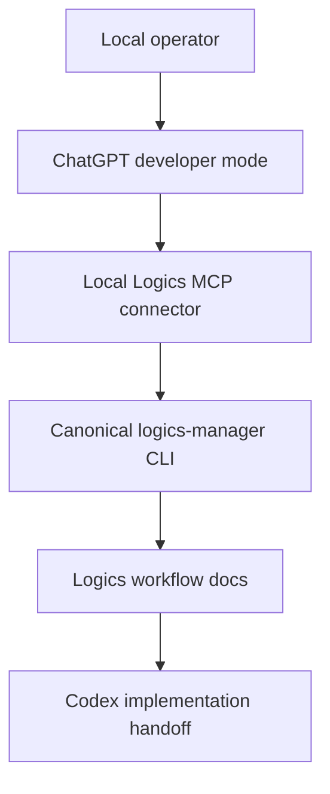

## prod_011_expanded_logics_mcp_action_surface_for_local_chatgpt_workflows - Expanded Logics MCP action surface for local ChatGPT workflows
> Date: 2026-05-27
> Status: Settled
> Related request: `req_192_expand_local_chatgpt_mcp_action_surface`
> Related backlog: `item_353_read_list_search_and_context_mcp_tools`, `item_354_closure_and_deterministic_maintenance_mcp_tools`, `item_355_controlled_workflow_document_mutation_mcp_tools`, `item_356_split_and_audit_repair_mcp_tools`, `item_357_local_mcp_connector_launcher_for_chatgpt_developer_mode`
> Related task: `task_154_read_list_search_and_context_mcp_tools`, `task_155_closure_and_deterministic_maintenance_mcp_tools`, `task_156_controlled_workflow_document_mutation_mcp_tools`, `task_157_split_and_audit_repair_mcp_tools`, `task_158_local_mcp_connector_launcher_for_chatgpt_developer_mode`
> Related architecture: (none yet)
> Reminder: Update status, linked refs, scope, decisions, success signals, and open questions when you edit this doc.

# Overview
The first ChatGPT MCP test proved that a local Logics repository can be exposed safely enough for a short developer-mode workflow: ChatGPT can create a request, promote it to backlog, promote it to task, run validation, and summarize the diff. That is enough to prove transport and guardrails, but it is not yet enough for a useful day-to-day product workflow.

The next product step is to expand the MCP action surface so ChatGPT can read, understand, refine, and close Logics documents through bounded operations while still avoiding arbitrary shell access and free-form Markdown edits.

# Goals
- Let a local ChatGPT workflow inspect existing Logics docs without loading the whole repository.
- Let ChatGPT make controlled document updates through canonical Logics operations instead of direct Markdown editing.
- Support common workflow loops: understand a request, build context, split scope, update indicators, append report notes, finish tasks, refresh generated metadata, and validate.
- Keep the CLI as the canonical runtime and make MCP a bounded adapter over that runtime.
- Keep the option-A local-first model viable: each user runs their own local MCP server and points ChatGPT developer mode at that endpoint.

# Non-goals
- Building a centralized SaaS or multi-tenant Logics backend.
- Letting ChatGPT run arbitrary shell commands.
- Letting ChatGPT edit arbitrary repository files.
- Letting ChatGPT perform broad free-form Markdown rewrites without a constrained operation.
- Replacing Codex as the execution agent for implementation tasks.
- Rebuilding the VS Code plugin UI in this slice.

# Scope and guardrails
- In:
  - read-only document access with bounded content size;
  - compact context-pack generation for a selected request, backlog item, or task;
  - search/list affordances for workflow docs by kind, status, ref, and query;
  - controlled mutations for workflow indicators such as status, progress, understanding, confidence, theme, and complexity;
  - section-scoped append operations for reports, validation notes, and decision notes;
  - canonical close and finish operations that preserve request -> backlog -> task consistency;
  - deterministic repair operations such as Mermaid signature refresh and audit autofixes where already supported by the CLI;
  - split operations for oversized requests and backlog items.
- Out:
  - direct filesystem browsing outside approved Logics directories;
  - arbitrary file writes;
  - arbitrary shell execution;
  - long-lived unauthenticated tunnel exposure;
  - cloud-hosted orchestration.

# Key product decisions
- Prefer narrow tools over a generic `edit_document` operation.
- Prefer refs or repo-relative paths over absolute paths.
- Every write tool should return changed paths, a validation snapshot, a diff summary, and a next suggested tool when appropriate.
- Read tools should return compact structured data first and bounded text previews second.
- Mutating tools should refuse dirty tracked-source conflicts unless the operation is explicitly designed to reconcile them.
- MCP should expose only operations that already exist in, or can be cleanly added to, `logics-manager`.
- The local HTTP transport should remain bearer-token protected when exposed through a tunnel.

# Candidate MCP tools
- `read_logics_doc`: read one approved Logics document by ref or repo-relative path, returning metadata, key sections, bounded content, and linked refs.
- `build_context_pack`: expose `logics-manager sync context-pack <ref>` for compact assistant grounding.
- `list_logics_docs`: list workflow docs by kind, status, ref prefix, and limit.
- `search_logics_docs`: search approved Logics docs by query with bounded snippets.
- `update_workflow_indicators`: update controlled indicators such as status, progress, understanding, confidence, theme, and complexity.
- `append_report_entry`: append a bounded note to the `# Report` section of a request, backlog item, or task.
- `append_validation_note`: append a bounded note to `# Validation` or create the section when allowed.
- `append_decision_note`: append a bounded note to an approved decision or notes section for workflow rationale.
- `finish_task`: expose `logics-manager flow finish task` so task closure propagates correctly.
- `close_workflow_doc`: expose `logics-manager flow close` for request, backlog, and task documents.
- `close_eligible_requests`: expose the deterministic request closure sync when all linked backlog items are done.
- `refresh_mermaid_signatures`: expose the deterministic Mermaid signature refresh.
- `autofix_ac_traceability`: expose the existing audit autofix for AC traceability skeletons.
- `autofix_structure`: expose supported deterministic structure repairs.
- `split_request`: expose `logics-manager flow split request`.
- `split_backlog`: expose `logics-manager flow split backlog`.

# Prioritized rollout
1. Add read/context tools: `read_logics_doc`, `build_context_pack`, `list_logics_docs`, `search_logics_docs`.
2. Add closure tools: `finish_task`, `close_workflow_doc`, `close_eligible_requests`, `refresh_mermaid_signatures`.
3. Add controlled update tools: `update_workflow_indicators`, `append_report_entry`, `append_validation_note`, `append_decision_note`.
4. Add decomposition and repair tools: `split_request`, `split_backlog`, `autofix_ac_traceability`, `autofix_structure`.
5. Add local connector launcher ergonomics for option-A ChatGPT developer-mode setup.

# User workflow
1. The operator runs a local connector command such as `logics-manager mcp connect`.
2. The command starts the local MCP server, generates a bearer token, establishes or guides a tunnel, and prints ChatGPT developer-mode setup instructions.
3. In ChatGPT, the operator asks for workflow shaping, review, or closure help.
4. ChatGPT reads a compact context pack, proposes bounded actions, applies only explicit MCP tools, and returns validation/diff summaries.
5. Codex remains the execution path for code implementation tasks generated by Logics.

# Success signals
- A ChatGPT session can inspect an existing request and explain its linked backlog/tasks without direct file access.
- A ChatGPT session can safely finish a task through MCP without hand-editing status fields.
- Audit and lint remain clean after ChatGPT-assisted workflow operations.
- Operators no longer need to paste large Markdown docs into ChatGPT for routine Logics review.
- The MCP surface remains small enough to review and document, with no generic shell or arbitrary write primitive.

# Open questions
- Should `read_logics_doc` accept both refs and paths, or only refs for the first version?
- Should controlled update tools support dry-run previews before writes?
- Should append tools require a `reason` field that is included in the returned audit trail?
- How much of `assist` should be exposed through MCP versus kept as CLI-only operator tooling?
- Should the connector command own tunnel lifecycle or only print provider-specific instructions?

# References
- Product back-reference: (none yet)
- Task back-reference: `logics/tasks/task_154_read_list_search_and_context_mcp_tools.md`, `logics/tasks/task_155_closure_and_deterministic_maintenance_mcp_tools.md`, `logics/tasks/task_156_controlled_workflow_document_mutation_mcp_tools.md`, `logics/tasks/task_157_split_and_audit_repair_mcp_tools.md`, `logics/tasks/task_158_local_mcp_connector_launcher_for_chatgpt_developer_mode.md`
- Related request: `logics/request/req_192_expand_local_chatgpt_mcp_action_surface.md`
- Original connector request: `logics/request/req_191_build_a_chatgpt_logics_agent.md`
- Related architecture: `logics/architecture/adr_022_chatgpt_logics_agent_mcp_contract.md`
