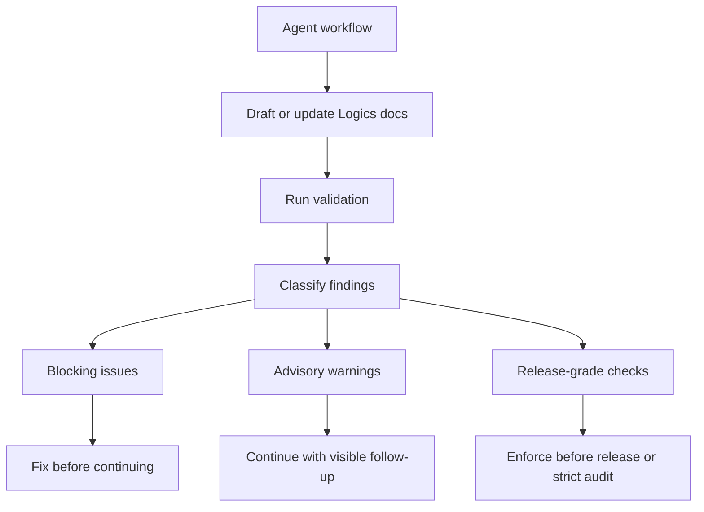

## prod_012_reduce_logics_validation_friction_for_agents - Reduce Logics validation friction for agents
> Date: 2026-06-05
> Status: Settled
> Related request: `req_192_expand_local_chatgpt_mcp_action_surface`, `req_183_make_mermaid_refresh_the_last_step_in_logics_doc_maintenance`, `req_114_fix_false_positive_mermaid_signature_warnings_after_signature_refresh`
> Related backlog: `item_356_split_and_audit_repair_mcp_tools`, `item_201_fix_false_positive_mermaid_signature_warnings_after_signature_refresh`
> Related task: `task_157_split_and_audit_repair_mcp_tools`
> Related architecture: (none yet)
> Reminder: Update status, linked refs, scope, decisions, success signals, and open questions when you edit this doc.

# Overview
Logics is valuable because it makes agent work traceable: requests, backlog items, tasks, companion docs, validation notes, and closure state stay connected. The current operator experience is sometimes heavier than the value it protects, especially when agents are still exploring, resuming context, or shaping a rough product note.

Recent local Codex sessions show the main friction pattern: routine work can be interrupted by strict document-governance failures that are useful eventually, but not always important at the current step. A product companion doc can pass lint and still fail audit because it lacks an overview Mermaid diagram or a primary workflow link. Mermaid signature warnings can also distract from the real delivery risk when the diagram is only stale metadata.

The product direction is to make Logics validation progressive. It should separate blocking correctness from advisory hygiene and release-grade governance, so agents can keep moving while still seeing what must be fixed before merge or release.

# Product problem
The validation surface currently creates avoidable operator friction:
- some governance rules are enforced as hard failures before the workflow is mature enough to benefit from that strictness;
- lint and audit use different severity models, so users see "OK" in one command and "FAILED" in another for the same document state;
- agents tend to treat every failed validation command as a stop-the-world blocker, even when the finding is only documentation polish;
- Mermaid-related findings are overrepresented in user-visible friction because they are easy to detect but often not the most important delivery risk;
- resumed sessions and MCP workflows add enough operational overhead already, so non-critical validation noise compounds the feeling that Logics is clunky.

# Target users and situations
- Primary user: maintainers using Codex or ChatGPT agents to plan, implement, review, and close work through Logics.
- Secondary user: repository maintainers running Logics validation before commit, merge, or release.
- Situation: an agent is drafting or reviewing workflow docs and needs actionable validation output that distinguishes urgent blockers from cleanup work.
- Situation: a companion product or architecture doc is useful as framing, but does not yet have complete lineage or a polished overview diagram.

# Goals
- Keep Logics traceability strong without making early-stage authoring feel punitive.
- Split validation output into clear severity buckets: blocking issues, warnings, and strict/release-only findings.
- Make Mermaid-related findings advisory by default unless they affect a release-grade or explicitly strict validation mode.
- Keep primary workflow lineage visible and important, while avoiding unnecessary hard stops for incomplete companion docs in draft/proposed states.
- Give agents enough structured validation data to decide whether to fix now, continue, or record follow-up work.
- Reduce the number of cases where the user has to explain that a validation finding is not important for the current task.

# Non-goals
- Removing Logics lint or audit.
- Removing Mermaid diagrams from workflow or companion docs.
- Letting agents merge or release with broken primary traceability.
- Hiding validation findings entirely.
- Allowing arbitrary Markdown edits through MCP to bypass the CLI.
- Replacing existing strict audit modes needed for release or governance work.

# Scope and guardrails
- In:
  - severity classification for lint and audit findings;
  - a default validation profile optimized for active agent work;
  - a strict or release profile that preserves today's strongest governance checks;
  - clearer text and JSON output for validation results;
  - guidance for MCP and assistant workflows on which severities block continuation;
  - deterministic repair affordances for Mermaid signatures and supported structure fixes.
- Out:
  - broad redesign of the Logics document schema;
  - weakening request -> backlog -> task traceability for merge/release gates;
  - changing unrelated repository CI checks;
  - introducing AI-only validation decisions without deterministic fallback.

# Key product decisions
- Treat missing or stale Mermaid overview data as a warning in the default profile, unless the document status or selected profile requires release-grade completeness.
- Keep missing primary workflow links stronger than Mermaid polish because lineage is core Logics value.
- Make `lint` and `audit` share a common severity vocabulary even when they check different rule sets.
- Prefer machine-readable severity fields over parsing text like `FAILED`.
- Provide "fix now" commands where deterministic repair exists, such as Mermaid signature refresh.
- Keep strict governance available through an explicit profile instead of making it the default for every exploratory agent turn.

# Proposed validation model
- `blocking`: correctness or traceability failures that should stop normal continuation.
- `warning`: hygiene, polish, or generated-metadata drift that should be visible but not block active work.
- `strict`: governance findings that block only when the user asks for strict validation, release validation, or the document status is mature enough to require it.
- `repairable`: findings with a deterministic command or MCP tool that can fix them.

# Candidate rule changes
- `companion_doc_missing_mermaid`: default warning; strict blocker for `Validated`, `Active` release surfaces, or strict profile.
- stale Mermaid signature in workflow docs: default warning with `sync refresh-mermaid-signatures` suggested.
- missing Mermaid signature comment: default warning unless the document is being closed or released.
- `companion_doc_missing_primary_link`: blocking for `Active` or later companion docs; warning for early `Proposed` framing when no linked request exists yet.
- placeholder indicators in active workflow docs: blocking.
- modified workflow doc without updated required indicators: blocking when the diff changes semantic content.

# User workflow
1. The agent drafts or updates Logics docs.
2. The agent runs the default validation profile.
3. Output lists blocking issues first, then warnings, then strict-only findings.
4. The agent fixes blockers immediately.
5. The agent can continue past warnings while recording visible follow-up work.
6. Before merge or release, the agent runs strict validation and resolves remaining strict findings.

# CLI and MCP experience
- Text output should avoid a single undifferentiated `FAILED` banner when only warnings or strict-only findings exist.
- JSON output should expose `blocking_count`, `warning_count`, `strict_count`, and `repairable_count`.
- MCP tools should return the same severity model so ChatGPT or Codex can decide whether to continue.
- Repairable findings should include suggested commands, for example `logics-manager sync refresh-mermaid-signatures`.
- Validation summaries should include a short "can continue" boolean for active agent workflows and a separate "release ready" boolean.

# Success signals
- Agents stop treating Mermaid polish as a hard blocker during exploratory work.
- Users see fewer interruptions for non-critical Logics hygiene while still seeing the follow-up item.
- Strict validation remains able to catch incomplete companion docs before release or governance review.
- A doc can pass the default active-work profile while still reporting strict-only findings clearly.
- MCP and CLI validation output use the same severity model.
- The user no longer needs to manually explain that a Mermaid linter complaint is not important for the current task.

# Open questions
- Which companion document statuses should trigger strict companion-doc completeness by default?
- Should CI use strict validation, default validation, or a repo-configured profile?
- Should missing primary links ever be non-blocking outside early `Proposed` product or architecture notes?
- Should Logics create an automatic follow-up task when warnings are intentionally deferred?
- Should the default profile be named `active-work`, `standard`, or `operator`?

# References
- Related MCP request: `logics/request/req_192_expand_local_chatgpt_mcp_action_surface.md`
- Mermaid maintenance request: `logics/request/req_183_make_mermaid_refresh_the_last_step_in_logics_doc_maintenance.md`
- Mermaid false-positive request: `logics/request/req_114_fix_false_positive_mermaid_signature_warnings_after_signature_refresh.md`
- MCP repair backlog: `logics/backlog/item_356_split_and_audit_repair_mcp_tools.md`
- Mermaid false-positive backlog: `logics/backlog/item_201_fix_false_positive_mermaid_signature_warnings_after_signature_refresh.md`
- MCP repair task: `logics/tasks/task_157_split_and_audit_repair_mcp_tools.md`
