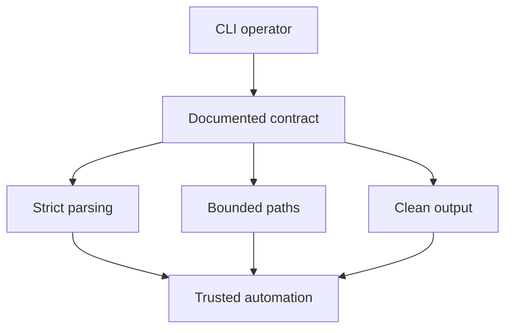

## prod_013_cli_primary_usage_audit_and_hardening - CLI primary usage audit and hardening
> Date: 2026-06-07
> Status: Proposed
> Related request: (none yet)
> Related backlog: (none yet)
> Related task: (none yet)
> Related architecture: (none yet)
> Reminder: Update status, linked refs, scope, decisions, success signals, and open questions when you edit this doc.

# Overview
The Logics Manager CLI is now the primary operator surface for creating, promoting, auditing, and maintaining workflow docs. The product expectation is no longer "the CLI exists as a helper"; it must behave like the canonical interface: predictable, scriptable, bounded to the repo, and aligned with its own help text.

The first audit pass found several CLI contract gaps that directly affect day-to-day use: documented refs are not accepted by `flow promote`/`split`/`close`/`finish`, unknown flags are silently ignored on native root-routed commands, and several `--out` paths can write outside the repository before failing or succeeding. These are product issues because they erode trust in the CLI as the main workflow.

# Goals
- Make the documented CLI examples work exactly as written, especially ref-based workflow commands.
- Make automation output reliable: `--format json` must produce parseable JSON without human text mixed in.
- Keep every write bounded to the repository unless a command explicitly and safely supports external output.
- Fail loudly on unknown flags, invalid paths, and unsupported source forms.
- Preserve the CLI as the canonical workflow entrypoint for local Logics operations.

# Non-goals
- Rebuilding the VS Code plugin UI in this document.
- Adding a remote runtime boundary.
- Redesigning the Logics document model.
- Adding new workflow stages beyond request, backlog, task, product, and architecture.

# Scope and guardrails
- In: `logics-manager` and `python3 -m logics_manager` behavior, npm wrapper behavior, command help, JSON/text output contracts, path confinement, ref/path resolution, and tests for those contracts.
- In: commands used in normal CLI work: `flow`, `sync`, `audit`, `lint`, `index`, `assist`, `bootstrap`, `doctor`, `config`, and `self-update`.
- Out: unrelated VS Code webview changes, non-CLI assistant UX, remote MCP deployment design, and visual redesign.
- Guardrail: CLI fixes should prefer shared helpers over per-command patches, because path validation and source resolution are cross-cutting contracts.

# Key product decisions
- Treat request, backlog, and task refs as first-class CLI inputs wherever help examples show refs.
- Treat repo-relative paths as first-class CLI inputs when they identify valid Logics docs.
- Reject absolute paths and `..` traversal for workflow mutations unless a command explicitly documents an external read/write mode.
- Make strict argument parsing the default for native root-routed commands.
- Keep `--dry-run` side-effect free, including directory creation for planned outputs.
- Keep npm as a thin launcher and Python as the source of CLI behavior.

# Success signals
- `logics-manager flow promote request-to-backlog <request-ref> --dry-run` works when the request exists.
- `logics-manager flow finish task <task-ref> --format json` emits valid JSON only.
- `logics-manager lint --bogus` and `logics-manager audit --bogus` fail with a clear unsupported-argument error.
- `logics-manager index --out ../outside.md` fails before writing anything.
- `logics-manager sync export-graph --out ../outside.json` fails before writing anything.
- The Python and npm CLI tests cover ref resolution, JSON cleanliness, unknown flags, output path confinement, and dry-run side effects.

# References
- Product back-reference: (none yet)
- Task back-reference: (none yet)
- Audit finding: `flow` help documents ref inputs, but implementation resolves sources as filesystem paths.
- Audit finding: `index`, `sync`, and `assist` output paths can escape the repository.
- Audit finding: root-routed native commands use `parse_known_args` and ignore unknown flags.
- Audit finding: some `--format json` commands mix human text with JSON output.
