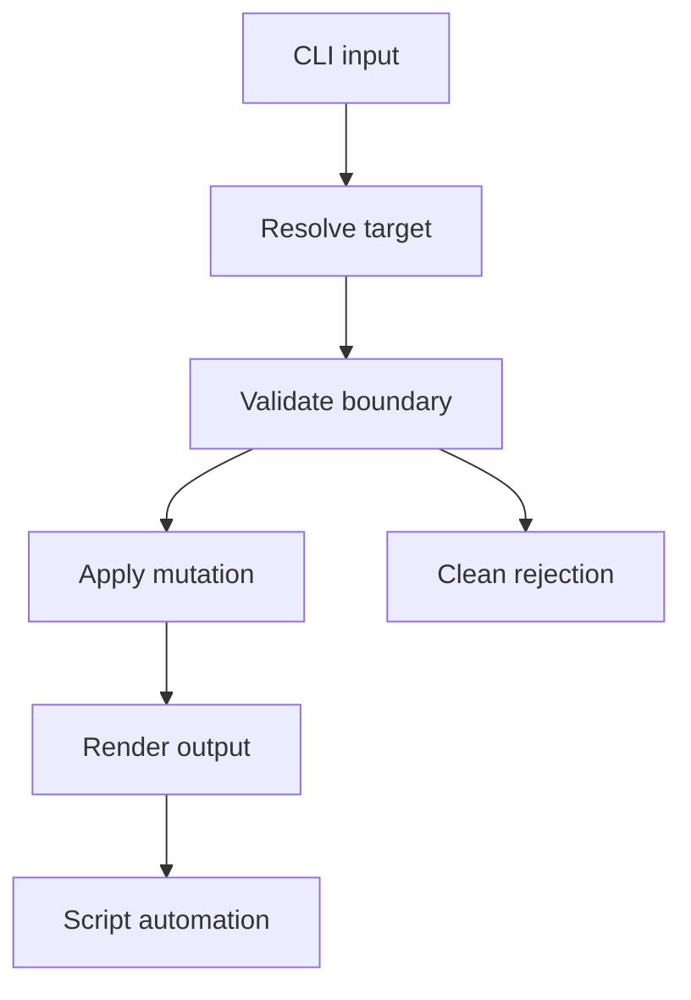

## prod_014_cli_mutation_safety_and_automation_contract - CLI mutation safety and automation contract
> Date: 2026-06-07
> Status: Proposed
> Related request: `req_197_mature_cli_product_contracts`
> Related backlog: `item_361_mature_cli_product_contracts`
> Related task: `task_162_mature_cli_product_contracts`
> Related architecture: (none yet)
> Reminder: Update status, linked refs, scope, decisions, success signals, and open questions when you edit this doc.

# Overview
The second CLI audit pass found a sharper product risk: some workflow mutation commands can operate on files outside the repository, mutate them, and only then fail while formatting output. That behavior breaks the core promise of a local workflow manager: commands should mutate only the intended Logics corpus, and failures should happen before side effects.

This brief defines the product contract for mutation safety and automation-grade output. The CLI should be safe to use directly in a terminal and safe to embed in scripts, hooks, and agent workflows.

# Goals
- Prevent mutation commands from reading or writing workflow files outside the repository.
- Ensure `--dry-run` performs validation and planning only, with no filesystem creation or mutation.
- Ensure `--format json` produces machine-parseable JSON and no extra human text on stdout.
- Convert path boundary failures into concise CLI errors instead of Python tracebacks.
- Make the mutation contract consistent across `flow`, `sync`, `assist`, and `index`.

# Non-goals
- Rebuilding the VS Code plugin UI in this document.
- Adding a remote runtime boundary.
- Introducing a database, server process, or lock service for normal local operations.
- Supporting arbitrary external workflow documents as mutation targets.

# Scope and guardrails
- In: target resolution, output path resolution, mutation ordering, dry-run behavior, stdout/stderr separation, and regression tests.
- In: file-writing commands such as `flow new`, `flow companion`, `flow promote`, `flow split`, `flow close`, `flow finish`, `sync context-pack`, `sync export-graph`, `assist runtime-status`, `assist roi-report`, `assist context`, and `index`.
- Out: changing the Markdown schema beyond what is required to express safe outcomes.
- Guardrail: validate all target and output paths before content generation or mutation.
- Guardrail: prefer a shared path helper and a shared output renderer to one-off fixes.

# Key product decisions
- Mutation targets must resolve to known Logics directories before any write occurs.
- Output destinations must be repo-relative and remain inside the repository after resolution.
- Human progress messages belong on stderr or should be suppressed when JSON output is requested.
- Python tracebacks are developer diagnostics, not normal CLI UX for invalid operator input.
- External files can be read only by explicitly documented read-only commands.

# Success signals
- Closing a task by absolute path outside the repo fails before modifying that file.
- Closing a task by repo-relative path inside `logics/tasks` succeeds.
- Closing a task by task ref succeeds when the task exists.
- `--dry-run` creates no directories and writes no files.
- Invalid `--out` paths fail before writing and include the rejected path in the error.
- JSON mode can be piped directly to `jq` for representative `flow`, `sync`, `assist`, and `index` commands.

# References
- Product back-reference: `item_361_mature_cli_product_contracts`
- Task back-reference: `task_162_mature_cli_product_contracts`
- Second audit finding: `flow close` can mutate an external task file before crashing.
- Second audit finding: `flow promote` accepts external-looking sources and crashes during repo-relative rendering.
- Second audit finding: several dry-run output paths still crash during repo-relative rendering.
- Second audit finding: some JSON-mode commands mix human output with JSON or emit no JSON.
