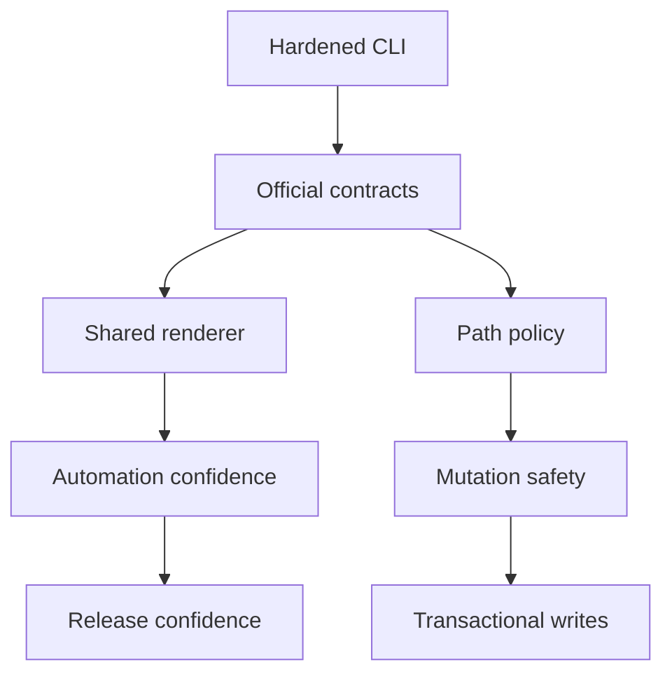

## prod_015_cli_product_maturity_roadmap - CLI product maturity roadmap
> Date: 2026-06-07
> Status: Proposed
> Related request: `req_197_mature_cli_product_contracts`
> Related backlog: `item_361_mature_cli_product_contracts`
> Related task: `task_162_mature_cli_product_contracts`
> Related architecture: (none yet)
> Reminder: Update status, linked refs, scope, decisions, success signals, and open questions when you edit this doc.

# Overview
The CLI hardening work closed the immediate safety and automation gaps. The next product step is to make the CLI mature as a long-lived primary surface: documented contracts, shared rendering primitives, stronger mutation guarantees, and traceable Logics planning.

This brief captures the roadmap after the urgent fixes. The intent is to move from "the CLI is safe enough to use" to "the CLI is predictable, documented, testable, and resilient under repeated manual, scripted, and agent-driven use."

# Goals
- Define the official `--format json` contract across all commands: JSON only on stdout, human diagnostics elsewhere.
- Centralize CLI output rendering so future commands do not reintroduce mixed stdout or duplicated side effects.
- Document supported input forms for workflow targets: ref, repo-relative path, and absolute path inside the repo.
- Decide and enforce policy for configured paths in `logics.yaml`, especially cache and log destinations.
- Add subprocess-level tests for the npm wrapper and installed-style CLI execution.
- Create linked request, backlog, and task docs for CLI hardening so the product briefs are traceable.
- Improve mutation resilience for multi-file operations such as finish, promote, and split.

# Non-goals
- Rebuilding the VS Code plugin UI in this document.
- Adding a remote runtime boundary.
- Replacing Markdown workflow docs with a database.
- Adding networked orchestration or cloud state.
- Redesigning the existing workflow stages.

# Scope and guardrails
- In: CLI contract documentation, shared output helpers, subprocess tests, path policy, mutation atomicity, ID allocation safety, and Logics traceability.
- In: root CLI commands and high-use subcommands under `flow`, `sync`, `assist`, `index`, `audit`, and `lint`.
- Out: VS Code webview UX, MCP protocol design beyond CLI safety implications, and remote runtime features.
- Guardrail: product maturity work should preserve the current local-first model and avoid introducing a daemon or service dependency.
- Guardrail: improvements should be incremental and covered by representative CLI tests before broad refactors.

# Key product decisions
- Treat `--format json` as a stable automation API, not a best-effort display mode.
- Prefer one shared renderer for command payloads and one shared path policy helper for file boundaries.
- Keep absolute paths supported only when they resolve inside the current repository.
- Make configured external paths explicit product decisions rather than accidental behavior.
- Use transaction-like mutation planning for multi-file writes: validate all targets first, then write.
- Make ID allocation collision-aware so concurrent CLI or agent calls cannot silently overwrite each other.

# Success signals
- Every documented JSON command can be piped to `jq` in a subprocess test.
- Unknown flags fail consistently across native root-routed commands and delegated subcommands.
- The README documents CLI target forms and path boundary behavior.
- Npm wrapper tests execute a real CLI command against a temporary repo, not only mocked spawn calls.
- A linked request, backlog item, and task exist for CLI maturity work, and the product briefs reference them.
- Multi-file mutation commands either complete fully or leave a clear recovery path.
- Concurrent ID allocation has a regression test or a documented limitation with a chosen mitigation.

# References
- Product back-reference: `item_361_mature_cli_product_contracts`
- Task back-reference: `task_162_mature_cli_product_contracts`
- Builds on `prod_013_cli_primary_usage_audit_and_hardening`.
- Builds on `prod_014_cli_mutation_safety_and_automation_contract`.
- Follow-up area: shared CLI renderer and stdout policy.
- Follow-up area: configured path policy for logs and caches.
- Follow-up area: transaction-like mutation planning and ID allocation safety.
