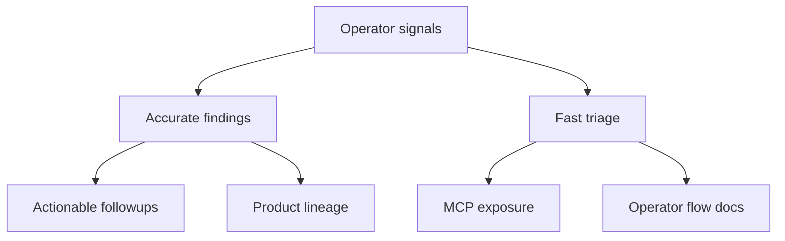

## prod_016_logics_operator_signal_refinement - Logics operator signal refinement
> Date: 2026-06-07
> Status: Proposed
> Related request: `req_198_refine_logics_operator_signal_commands`
> Related backlog: `item_362_refine_logics_operator_signal_commands`
> Related task: `task_163_refine_logics_operator_signal_commands`
> Related architecture: (none yet)
> Reminder: Update status, linked refs, scope, decisions, success signals, and open questions when you edit this doc.

# Overview
The new operator signal commands make Logics easier to inspect from the CLI, but the first live run exposed two product gaps: some signals are still too noisy, and some useful checks are not yet wired into the places where operators and assistants naturally work.

This brief defines the next refinement pass for `status`, `health`, `followups`, `search`, and `product-consistency`. The goal is to turn the new commands from useful diagnostics into dependable triage primitives for humans, scripts, MCP clients, and agent sessions.

# Goals
- Resolve the known `product-consistency` finding for `prod_000_companion_docs_ux_for_the_vs_code_plugin`.
- Reduce `followups` noise by making open actionable work the default view.
- Add filters to `followups` so operators can narrow by source kind and closed/open state.
- Add a strict mode for `product-consistency` so CI or release checks can fail on missing lineage.
- Promote the new signal commands into MCP so assistants can use them without shell access.
- Add subprocess coverage for the new top-level commands and the `--json` alias.
- Document a short operator triage flow from status to health to consistency to follow-ups.
- Improve generated follow-up request titles so they are concise and safe for shell display.

# Non-goals
- Rebuilding the VS Code plugin UI in this document.
- Adding a remote runtime boundary.
- Replacing `lint` or `audit` as the blocking validation contract.
- Rewriting old workflow history solely to satisfy new advisory checks.
- Adding a database, daemon, or persistent service for signal calculation.

# Scope and guardrails
- In: CLI behavior for `status`, `health`, `followups`, `search`, and `product-consistency`.
- In: MCP tool exposure for read-only signal commands.
- In: tests, README guidance, and operator-facing examples.
- In: narrowly scoped cleanup of known product lineage findings when the correct link is identifiable.
- Out: changing workflow stage semantics or adding new required indicators.
- Out: broad rewrites of historical backlog and product docs.
- Guardrail: advisory commands should stay fast, local, and deterministic.
- Guardrail: strict failure modes should be opt-in unless they are adopted explicitly by CI.
- Guardrail: default output should reduce operator noise without hiding data that can be requested through flags.

# Key product decisions
- `status` remains the fastest answer to "what remains?" and should prioritize open work.
- `health` remains a non-blocking dashboard; `lint` and `audit` keep the blocking validation role.
- `followups` should default to open, actionable sources and require an explicit flag to inspect closed history.
- `product-consistency --strict` should be the path for release-grade enforcement of lineage checks.
- MCP should expose these signal commands as read-only tools before the VS Code UI is expanded.
- Search stays a direct CLI shortcut over the existing workflow search implementation, not a second search engine.

# Success signals
- `logics-manager followups --json` returns mostly actionable items without "none" or "no follow-up" noise.
- Operators can run `logics-manager followups --source-kind product --open-only --json`.
- `logics-manager product-consistency --strict` exits non-zero when lineage is missing or broken.
- The known `prod_000` lineage issue is resolved or explicitly documented as intentionally standalone.
- MCP clients can request status, health, follow-ups, search, and product consistency without shell access.
- Subprocess tests cover `status`, `health`, `followups`, `search`, `product-consistency`, and `--json`.
- README includes a compact triage flow that starts with `status` and ends with actionable next steps.

# References
- Product back-reference: `item_362_refine_logics_operator_signal_commands`
- Task back-reference: `task_163_refine_logics_operator_signal_commands`
- Builds on `prod_015_cli_product_maturity_roadmap`.
- Follow-up area: make follow-up extraction open-work-by-default with filters.
- Follow-up area: expose operator signal commands through MCP.
- Follow-up area: add strict product lineage enforcement for release checks.
