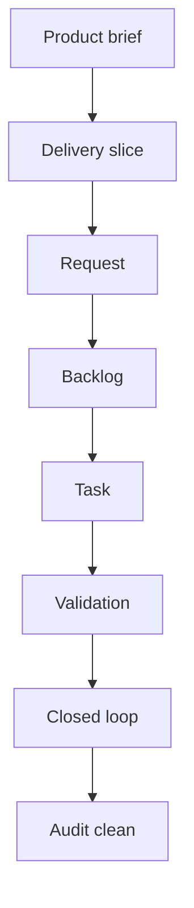

## prod_017_logics_delivery_loop_ergonomics - Logics delivery loop ergonomics
> Date: 2026-06-07
> Status: Proposed
> Related request: (none yet)
> Related backlog: (none yet)
> Related task: (none yet)
> Related architecture: (none yet)
> Reminder: Update status, linked refs, scope, decisions, success signals, and open questions when you edit this doc.

# Overview
This session used Logics Manager as an operator and agent workflow tool, not just as implementation code. That exposed a product gap: Logics has strong primitives, but completing a real delivery loop still requires too many manual steps across product briefs, requests, backlog items, tasks, validation, index refresh, and follow-up linking.

The product opportunity is to make the "turn a product decision into completed traceable work" path a first-class CLI workflow. Agents and humans should be able to close the loop without hand-editing companion links, repairing generated skeletons, or discovering audit fixes through trial and error.

# Goals
- Add a one-pass delivery command that can create request, backlog, task, link a product brief, record validation, finish the task, refresh the index, and run validation.
- Add a safe command for linking companion docs to request, backlog, and task refs without manual Markdown edits.
- Make `flow finish task` harder to misuse by detecting audit-blocking gaps before or during closeout.
- Provide complete generated templates for delivery requests/backlog/tasks when they are created from a product brief.
- Scope Mermaid signature refreshes to changed docs or explicit refs by default so unrelated historical docs are not modified.
- Add a close-loop assistant flow that can summarize commits and propose Logics updates from a Git range.
- Make audit findings actionable by returning suggested repair commands.
- Let product consistency suggest likely missing request/backlog/task links from existing graph/text evidence.

# Non-goals
- Rebuilding the VS Code plugin UI in this document.
- Adding a remote runtime boundary.
- Replacing the existing request/backlog/task model.
- Making Logics infer product intent without operator confirmation.
- Auto-committing generated workflow changes.
- Rewriting historical docs broadly to satisfy new ergonomics.

# Scope and guardrails
- In: CLI orchestration commands, generated doc completeness, validation repair suggestions, and companion-doc link maintenance.
- In: read-only suggestion flows that inspect Git history and existing Logics docs before proposing updates.
- In: targeted mutation commands that preserve Markdown as the source of truth.
- Out: VS Code-specific UI work except later adoption of the same runtime commands.
- Out: background daemons, remote state, or database-backed workflow storage.
- Guardrail: commands that mutate multiple docs must support `--dry-run` and structured JSON output.
- Guardrail: generated traceability should be explicit and reviewable, not hidden behind opaque automation.
- Guardrail: broad maintenance commands must default to changed or explicitly targeted docs.

# Key product decisions
- Introduce `flow deliver` as a high-level orchestration command over existing canonical primitives, not a parallel workflow model.
- Introduce `flow link-product` or a generic companion-link command for safe lineage edits.
- Keep `flow finish task` as the canonical closeout command, but add validation gates and optional repair flags.
- Treat product briefs as valid seeds for complete delivery docs through `--from-product`.
- Make audit output include machine-readable suggested fixes wherever a deterministic repair exists.
- Keep Git-derived close-loop summaries proposal-first; operators still review and commit.

# Success signals
- A user can run one command to create and complete a traceable delivery slice from a product brief after implementation is done.
- Product brief, request, backlog, and task links are updated without hand-editing Markdown.
- `flow finish task` either produces audit-clean docs or clearly refuses with suggested fixes.
- `sync refresh-mermaid-signatures` can safely target `--changed-only` or `--refs`.
- `assist close-loop --since <commit>` returns commit summary, touched surfaces, suggested validation notes, and AC traceability proposals.
- Audit JSON includes repair commands for unchecked DoR, missing traceability, stale Mermaid signatures, and missing companion links where deterministic.
- Product consistency can report likely missing task/request/backlog candidates with a reason.
- The delivery-loop workflow is covered by subprocess tests and documented as the recommended agent closeout path.

# References
- Product back-reference: (none yet)
- Task back-reference: (none yet)
- Builds on `prod_016_logics_operator_signal_refinement`.
- Builds on `prod_015_cli_product_maturity_roadmap`.
- Follow-up area: add `flow deliver --from-product` for one-pass delivery closeout.
- Follow-up area: add companion doc link maintenance commands.
- Follow-up area: add scoped Mermaid refresh defaults.
- Follow-up area: make audit findings include suggested repair commands.
- Follow-up area: add Git-range close-loop assistance for completed work.
