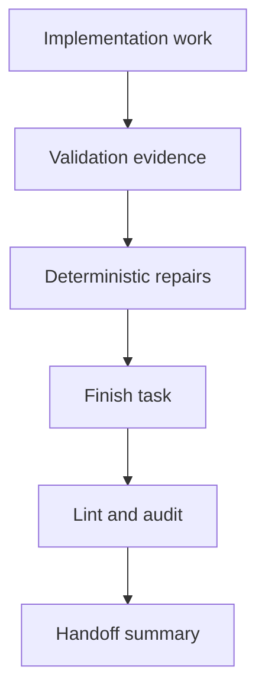

## prod_018_agent_closeout_loop_ergonomics - Agent closeout loop ergonomics
> Date: 2026-06-07
> Status: Proposed
> Related request: (none yet)
> Related backlog: (none yet)
> Related task: (none yet)
> Related architecture: (none yet)
> Reminder: Update status, linked refs, scope, decisions, success signals, and open questions when you edit this doc.

# Overview
Using Logics Manager as the assistant operating loop exposed a second-order product gap: the workflow primitives are now strong enough to create and close traceable work, but the final closeout still requires too many commands and too much judgment from the agent.

The current path asks the agent to remember the right sequence: create or link docs, append validation notes, finish the task, refresh generated index state, run lint, run audit, interpret audit findings, repair deterministic issues, and summarize the handoff. Each step is individually useful, but the loop is not yet optimized for fast, reliable assistant closeout.

The product opportunity is to add a first-class "close the loop" surface: one command path that handles validation notes, deterministic repair, finish propagation, index refresh, lint/audit verification, and a concise handoff summary.



# Goals
- Add a one-command closeout path that can run `flow deliver`, append validation evidence, finish the task, refresh the index, lint, audit, and print a final summary.
- Add a `flow validate-closeout` preflight that reports exactly why a task cannot be safely closed.
- Add deterministic repair commands for gates, AC traceability, companion links, and Mermaid signatures.
- Make note-appending commands refresh Mermaid signatures when the note changes a signature-relevant section.
- Make generated delivery docs avoid weak placeholders after the CLI already knows the linked request, backlog item, task, and product brief.
- Add an assistant handoff command that summarizes commits, touched surfaces, Logics docs, validations, and next actions.

# Non-goals
- Rebuilding the VS Code plugin UI in this document.
- Adding a remote runtime boundary.
- Replacing existing `flow finish task`, `sync append-note`, `lint`, or `audit` primitives.
- Hiding validation failures behind automatic success.
- Auto-committing workflow changes.

# Scope and guardrails
- In: CLI orchestration around closeout, validation capture, deterministic repairs, and final handoff.
- In: structured JSON output for agent integrations and concise text output for humans.
- In: dry-run support before any multi-file mutation.
- Out: broad historical doc rewrites.
- Out: background daemons, remote state, or database-backed workflow storage.
- Guardrail: commands may repair deterministic formatting and link gaps, but must not invent acceptance criteria or validation proof.
- Guardrail: every mutation should list changed docs and the exact checks it ran.
- Guardrail: closeout commands should fail loudly when validation evidence is missing or audit blockers remain.

# Key product decisions
- Introduce `flow closeout` or extend `flow deliver --finish` into a complete closeout orchestration command.
- Keep `flow finish task` as the primitive that changes workflow status, but make the high-level closeout command call it after preflight and validation capture.
- Introduce `flow validate-closeout <task>` as a read-only preflight.
- Introduce deterministic repair surfaces such as `flow repair gates`, `flow repair ac-traceability`, `flow repair links`, and `flow repair mermaid`.
- Let `sync append-note` refresh Mermaid signatures for the touched doc when possible.
- Add `assist handoff --since <rev>` for concise assistant-to-assistant transfer.
- Prefer explicit validation evidence flags over implicit test detection.

# Candidate CLI shape
```bash
logics-manager flow closeout task_164 \
  --validation "PYTHONPATH=\"$PWD\" pytest python_tests -q passed" \
  --index \
  --lint \
  --audit
```

```bash
logics-manager flow validate-closeout task_164
logics-manager flow repair gates task_164
logics-manager flow repair ac-traceability req_199
logics-manager flow repair mermaid --refs req_199 item_363 task_164
logics-manager assist handoff --since HEAD~1
```

# Success signals
- An assistant can finish a normal implementation loop with one closeout command after tests pass.
- `flow validate-closeout` reports missing DoR/DoD checks, missing AC traceability, stale Mermaid signatures, missing companion links, and missing validation evidence before mutation.
- Deterministic repair commands return changed paths and are safe to run with `--dry-run`.
- `sync append-note` no longer creates signature-stale workflow docs.
- `flow deliver --from-product` emits audit-clean request/backlog/task docs without manual placeholder cleanup.
- `assist handoff --since <rev>` returns a compact summary suitable for a fresh assistant session.
- Lint and audit stay clean after closeout without requiring the agent to discover hidden ordering rules.

# References
- Product back-reference: (none yet)
- Task back-reference: (none yet)
- Builds on `prod_017_logics_delivery_loop_ergonomics`.
- Follow-up area: add `flow closeout` or complete `flow deliver --finish --validate`.
- Follow-up area: add read-only closeout preflight.
- Follow-up area: add deterministic repair commands for common audit/lint blockers.
- Follow-up area: add assistant handoff summary command.
