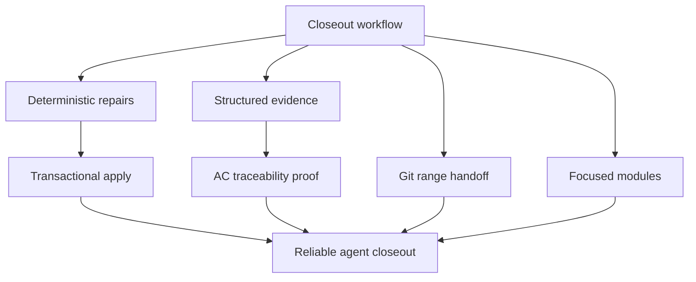

## prod_019_closeout_evidence_hardening_and_modularity_roadmap - Closeout evidence hardening and modularity roadmap
> Date: 2026-06-07
> Status: Validated
> Related request: `req_200_implement_agent_closeout_loop_ergonomics`
> Related backlog: `item_364_implement_agent_closeout_loop_ergonomics`
> Related task: `task_165_implement_agent_closeout_loop_ergonomics`
> Related architecture: (none yet)
> Reminder: Update status, linked refs, scope, decisions, success signals, and open questions when you edit this doc.

# Overview
The agent closeout ergonomics work made the final delivery path much stronger: closeout preflight, deterministic repair commands, Mermaid refresh, delivery doc cleanup, flow closeout orchestration, and handoff summaries now exist as first-class CLI surfaces.

The next product step is to harden the quality of evidence and reduce maintenance risk. The current implementation proves the workflow shape, but several parts still rely on permissive text heuristics, large multipurpose modules, and multi-file mutations without a transaction boundary. Those are acceptable for a first pass, but they should not become the long-term contract for agent-driven closeout.

This brief captures the follow-up roadmap: make validation and AC traceability proof more explicit, make handoff summaries accurate across committed ranges, split the large modules into focused surfaces, and add safer apply/rollback behavior for repair and closeout commands.

Post-release smoke testing of `2.2.0` confirmed the core CLI loop works from both the repo entrypoint and the globally installed binary. It also exposed two concrete follow-up defects: `assist handoff --since <rev>` reports commits but loses changed paths for already committed ranges, and minimal `flow companion product` output can create a product brief that immediately triggers the standard audit warning `companion_doc_missing_mermaid`.



# Goals
- Harden closeout validation evidence so passing preflight means the task has concrete validation proof, not only a matching word in Markdown.
- Harden AC traceability so repair commands cannot satisfy proof requirements by echoing acceptance criteria text as proof.
- Make `assist handoff --since <rev>` report changed paths and surfaces from the Git commit range, even when the worktree is clean.
- Make generated product companion briefs audit-clean by default, including the required overview Mermaid block.
- Split closeout, repair, handoff, and test fixtures out of oversized files while preserving the public CLI contract.
- Add transaction-like behavior for multi-file repair and closeout commands: plan targets, apply changes, run requested checks, and roll back or report recovery steps on failure.
- Keep the existing local-first CLI workflow and JSON/text outputs stable for agents.

# Non-goals
- Rebuilding the VS Code plugin UI in this document.
- Adding a remote runtime boundary.
- Replacing Markdown workflow docs with a database.
- Rewriting historical Logics docs broadly.
- Auto-generating real test evidence without a command result or operator-provided validation note.
- Changing the existing request/backlog/task lifecycle.

# Scope and guardrails
- In: `flow validate-closeout`, `flow repair`, `flow closeout`, `assist handoff`, and the shared helpers behind those commands.
- In: validation evidence schema, AC proof rules, Git range summarization, companion product generation, module boundaries, and multi-file mutation safety.
- In: regression tests that distinguish synthetic traceability from real proof.
- Out: unrelated UI redesign, cloud-hosted orchestration, and broad product strategy changes.
- Guardrail: repair commands may add missing structural links, but must not invent delivery proof.
- Guardrail: stricter validation should fail with actionable messages and suggested commands, not vague policy text.
- Guardrail: refactors should be behavior-preserving and covered by subprocess or CLI-level tests before broad file movement.
- Guardrail: rollback support should not hide failures; it should leave the operator with a clear changed-files and checks summary.

# Key product decisions
- Treat validation proof as a structured closeout artifact. A validation line should identify the command or check, its outcome, and the date or session context where possible.
- Treat AC traceability proof as delivery evidence, not a restatement of the acceptance criterion. Generated repairs should create placeholders or explicit "needs proof" entries unless real evidence is supplied.
- Keep deterministic repair commands, but separate "repair structure" from "record evidence" so automated commands remain honest.
- Make `assist handoff --since` use Git range changed-path data from commits rather than current working-tree diff state.
- Extract closeout preflight and repair logic from `logics_manager/flow.py` into focused modules once the behavior is pinned by tests.
- Extract handoff summarization from `logics_manager/assist.py` into a focused helper or command module.
- Keep the broad CLI entrypoints unchanged: users should still call `python3 -m logics_manager flow ...` and `python3 -m logics_manager assist ...`.
- Introduce transaction-like mutation planning for commands that touch multiple workflow docs.

# Success signals
- `flow validate-closeout` rejects validation sections that only contain generic wording or unresolved placeholders.
- `flow repair ac-traceability` does not create false-positive `Proof:` lines from request AC text alone.
- A task with real validation evidence and real AC proof passes preflight without additional manual repair.
- `assist handoff --since <rev>` reports non-zero changed paths for a committed range that includes changed files, even when `git status` is clean.
- `flow companion product --title ...` emits an audit-clean product brief without requiring a manual Mermaid repair.
- `logics_manager/flow.py`, `logics_manager/assist.py`, and the CLI test file shrink into focused units without losing command coverage.
- Multi-file repair and closeout commands can be dry-run, applied, and failed checks can be recovered from predictably.
- Existing validation remains clean: Python tests pass, Logics lint passes, and workflow audit reports no blockers.

# Candidate CLI and data shape
```bash
logics-manager flow closeout task_165 \
  --validation-command 'PYTHONPATH="$PWD" pytest python_tests -q' \
  --validation-result passed \
  --validation-note '178 passed'
```

```bash
logics-manager flow repair ac-traceability req_200 \
  --proof-source task_165 \
  --proof 'AC1 covered by closeout preflight regression test'
```

```bash
logics-manager assist handoff --since 5367d38
```

# Follow-up delivery slices
- Done: Evidence schema now accepts explicit validation lines with command, result, date/session, and optional note; `flow closeout` can write them with `--validation-command`, `--validation-result`, and `--validation-note`.
- Done: Traceability honesty keeps generated structure as `Evidence needed` unless an operator supplies real proof; `flow repair ac-traceability` can now record explicit `--proof` and `--proof-source`.
- Done: Handoff accuracy uses Git commit-range changed paths for clean worktrees.
- Done: Product companion completeness generates an overview Mermaid block by default.
- Done: Module boundaries were improved by extracting handoff/surface helpers, flow evidence helpers, and shared flow test fixtures while preserving CLI entrypoints.
- Done: Transaction safety covers `flow closeout` rollback and repair verification/rollback via `--verify-closeout`.

# Completion evidence
- Commits: `f3884fc`, `78e8d49`, `fbc2a65`, `72d3553`, `f78ed17`, `5b98959`, `6d6cbc3`, `b1e3c93`, `13e1e86`, `b370b54`, `af802ab`.
- Validation: `PYTHONPATH="$PWD" pytest python_tests -q`.
- Validation: `npm run test -- --run`.
- Validation: `npm run lint`.
- Validation: `python3 -m logics_manager lint --require-status`.
- Validation: `python3 -m logics_manager audit --legacy-cutoff-version 1.1.0 --group-by-doc`.

# References
- Product back-reference: `item_364_implement_agent_closeout_loop_ergonomics`
- Task back-reference: `task_165_implement_agent_closeout_loop_ergonomics`
- Builds on `prod_018_agent_closeout_loop_ergonomics`.
- Builds on `prod_017_logics_delivery_loop_ergonomics`.
- Builds on `prod_015_cli_product_maturity_roadmap`.
- Code surface: `logics_manager/flow.py`.
- Code surface: `logics_manager/assist.py`.
- Test surface: `python_tests/test_logics_manager_cli.py`.
