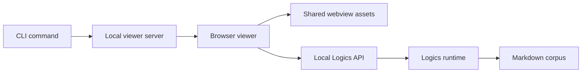

## prod_020_local_web_viewer_for_cli_driven_logics_work - Local web viewer for CLI-driven Logics work
> Date: 2026-06-07
> Status: Settled
> Related request: `req_201_add_a_local_web_viewer_for_cli_driven_logics_work`
> Related backlog: `item_365_add_a_local_web_viewer_for_cli_driven_logics_work`
> Related task: `task_166_add_a_local_web_viewer_for_cli_driven_logics_work`
> Related architecture: (none yet; browser host adapter ADR likely)
> Reminder: Update status, linked refs, scope, decisions, success signals, and open questions when you edit this doc. Concrete viewer experience refined on 2026-06-07.

# Overview
Logics has become usable from the CLI, but the operator still loses the visual scanability that makes the VS Code webview useful.
The product opportunity is a local browser viewer launched from the CLI: a lightweight, local-only web surface that lets an operator inspect the Logics corpus, board, details, links, audits, and document content without opening VS Code.

The direction is not to recreate VS Code in the browser.
It is to make the existing webview experience portable through a small host adapter and a local server.
The CLI remains the canonical command surface, while the browser viewer becomes a visual companion for reading, scanning, and eventually triggering bounded actions.

The intended product feeling is: the operator keeps using the CLI, but can open a local visual cockpit when the workflow becomes too document-heavy for terminal output alone.
The viewer should feel like a standalone Logics webview: familiar to extension users, but not dependent on VS Code.



# Product problem
The CLI is strong for commands, validation, automation, and scripted flows.
It is weaker for visual work:
- scanning many workflow documents;
- understanding which docs are related;
- switching between board, detail, and markdown views;
- seeing audit and lint signals in context;
- reviewing the shape of a delivery wave before deciding the next command.

The VS Code plugin solves part of this through the webview, but it creates a dependency on opening VS Code and using the extension host.
CLI-first users should not need to leave their terminal workflow just to get a visual map of the corpus.

The current product gap is therefore a missing middle layer:
- richer than terminal text output;
- lighter than VS Code;
- local-first and repo-native;
- backed by the same Logics runtime and webview rendering concepts.

# Target users and situations
- Primary user: an operator working mainly from the terminal who wants visual feedback before choosing the next Logics command.
- Primary situation: a repo has many requests, backlog items, tasks, product briefs, and architecture docs, and directory browsing is no longer efficient.
- Secondary user: an agent-assisted operator who wants a local visual surface to confirm state, inspect generated docs, and review validation results.
- Secondary situation: VS Code is unavailable, inconvenient, or too heavy for the current workflow.

# Goals
- Add a CLI-launched local viewer command, for example `logics-manager view` or `logics-manager serve-view`.
- Open a browser page that shows the Logics board, document details, relationships, status indicators, and markdown content.
- Reuse the existing webview assets and behavior where practical instead of creating a separate UI model.
- Introduce a clean host adapter boundary so the same UI can run under VS Code or under a local browser server.
- Keep the first version read-only by default so the feature is useful without creating mutation risk.
- Expose simple local API endpoints for corpus data, document reads, lint/audit summaries, and refresh signals.
- Preserve CLI authority: command execution and mutations stay owned by `logics-manager`, not by an independent browser app.
- Make the viewer easy to start, easy to stop, and safe to run on `127.0.0.1`.

# Concrete experience
The primary command should be intentionally simple:

```bash
logics-manager view
```

The CLI should print a short status block with the URL, repository, and safety mode:

```text
Logics viewer running:
http://127.0.0.1:8765

Repo: logics-manager
Mode: read-only
```

The browser should open directly when configured to do so, or the terminal should provide a copyable URL when automatic browser launch is disabled.
The first screen should be the working surface itself, not an explanatory or marketing page.

The default layout should be dense and operator-oriented:
- left rail or top band: search, filters, stage selectors, and status filters;
- center: board or dense document list;
- right detail pane: rendered markdown, indicators, links, acceptance criteria, traceability, and related docs;
- top bar: repo name, active root, last refresh time, lint/audit status, and refresh action.

The viewer should communicate local server state clearly but quietly.
It should show when data is fresh, when refresh is running, and when validation state changed, without turning normal navigation into a command log.

# Initial views
- Board view: the existing Logics board metaphor for requests, backlog items, tasks, product briefs, and architecture docs.
- Document view: rendered markdown with metadata, links, AC traceability, related request/backlog/task/product/architecture docs, and copyable refs.
- Health view: visual lint/audit summary with blocking issues, warnings, affected docs, and a path back to the relevant document.

These three views should be enough for the first release.
They cover the core need: see the corpus, inspect a document, and understand validation health.

# Local API shape
The local server should expose a deliberately small API surface at first:
- `GET /api/items` for indexed Logics docs and board data;
- `GET /api/doc?path=...` for markdown content and metadata;
- `GET /api/lint` for lint summary;
- `GET /api/audit` for audit summary;
- `POST /api/refresh` for read-only refresh of in-memory state.

The browser host adapter should replace VS Code-specific primitives such as `acquireVsCodeApi`, webview URIs, and extension-host message routing.
It should provide equivalent read-only capabilities for loading state, refreshing data, persisting lightweight UI preferences, and opening or copying document refs.

# Non-goals
- Rebuilding VS Code or embedding VS Code behavior in the browser.
- Replacing the CLI as the canonical workflow entrypoint.
- Replacing Markdown workflow docs with a database.
- Hosting Logics remotely or adding cloud state.
- Making the first version a full mutation console.
- Creating a second implementation of board, detail, relationship, or status semantics.

# Scope and guardrails
- In: a local HTTP server, static asset serving, browser-compatible host API, read-only corpus browsing, document detail rendering, markdown preview, search, filters, and status/audit summaries.
- In: reuse or adaptation of `media/*.js`, existing CSS, webview selectors, rendering logic, and tested webview harness patterns.
- In: endpoints that read from the repository and call existing Logics runtime commands for validation summaries.
- In: a clear shutdown and port-selection story, including the ability to print the URL and optionally open the browser.
- Out: public HTTPS tunnels as the default viewer mode.
- Out: broad workflow mutations from the browser in the first release.
- Out: extension-host-only assumptions such as direct reliance on `acquireVsCodeApi`.
- Guardrail: all writes, if added later, must route through the same CLI/runtime mutation contracts and validation checks as terminal commands.
- Guardrail: the viewer must not make local repo content available beyond localhost unless the user explicitly asks for an external tunnel.

# Key product decisions
- Treat the viewer as a visual companion to the CLI, not a replacement for either CLI or VS Code.
- Start read-only, then add bounded actions only after the host adapter and API boundary are stable.
- Keep dangerous or mutating work in the terminal for the first version.
- Prefer a browser local server over a rich terminal TUI because document navigation, board scanning, and markdown reading benefit from real layout, links, and persistent UI state.
- Reuse the existing webview implementation through a browser host adapter instead of maintaining a parallel UI.
- Keep the local API intentionally small: corpus data, document content, validation summaries, and refresh.
- Use the existing Logics runtime as the source of truth for doc discovery, status, audit, lint, and future mutations.
- Keep security boring: bind to `127.0.0.1`, avoid external exposure by default, and make any tunnel flow explicit.
- Design the server so it can later support the MCP/local-service story, but do not make MCP a prerequisite for the viewer.

# Candidate user flow
1. The operator runs `logics-manager view`.
2. The CLI starts a local server on an available localhost port.
3. The CLI prints the URL and optionally opens the browser.
4. The browser loads the Logics board and detail pane from the current repo.
5. The operator searches, filters, opens related docs, and reads markdown previews.
6. The operator returns to the terminal to run the next command, or later uses bounded viewer actions once they exist.

# Delivery slices
- Slice 1: read-only local viewer shell with static assets, host adapter, board, details, and refresh.
- Slice 2: markdown document preview and relationship navigation across request, backlog, task, product, and architecture docs.
- Slice 3: lint/audit summary panels with direct links to affected docs and validation context.
- Slice 4: bounded actions that call existing CLI/runtime operations, starting with safe refresh-style commands.
- Slice 5: optional external tunnel integration for ChatGPT or remote inspection, gated behind explicit user intent.

# Success signals
- A terminal-first user can inspect the Logics corpus visually without launching VS Code.
- The viewer shows the same core board/detail state as the VS Code webview for the same repo.
- Starting the viewer is a single command and produces a copyable local URL.
- The first version cannot accidentally mutate workflow docs.
- Existing webview tests or harnesses cover the shared browser-host behavior.
- Lint/audit state can be reviewed faster than reading raw terminal output.
- The feature reduces context switching between terminal, editor, and file browser.

# Risks and mitigations
- Risk: UI duplication between VS Code and local browser viewer.
  Mitigation: introduce a shared host API and keep rendering logic common.
- Risk: the browser viewer becomes a second command surface with weaker safety.
  Mitigation: start read-only and route any future mutation through existing CLI/runtime contracts.
- Risk: localhost server creates accidental exposure concerns.
  Mitigation: bind to `127.0.0.1` by default and require an explicit tunnel command for public access.
- Risk: packaging becomes more complex.
  Mitigation: reuse existing packaged `media/` assets and keep the server implementation minimal.
- Risk: the first version tries to include too much.
  Mitigation: ship board, details, markdown preview, and refresh before adding actions.

# Open questions
- Should the server live primarily in Python with the CLI runtime, or in Node to stay closer to the webview asset pipeline?
- Should `logics-manager view` open the browser by default, or only print the URL unless `--open` is passed?
- What is the minimum local API contract needed to hydrate the existing webview without VS Code?
- Should future mutations be exposed as buttons in the viewer, or should the viewer remain mainly read-only while the terminal remains the action surface?
- How much of the existing VS Code webview HTML generation should be shared directly versus replaced with a standalone browser entrypoint?

# References
- `logics/request/req_201_add_a_local_web_viewer_for_cli_driven_logics_work.md`
- `logics/backlog/item_365_add_a_local_web_viewer_for_cli_driven_logics_work.md`
- `logics/tasks/task_166_add_a_local_web_viewer_for_cli_driven_logics_work.md`
- `logics/product/prod_005_logics_corpus_navigation_views.md`
- `logics/product/prod_009_logics_cli_as_the_primary_operator_surface_and_unified_runtime_api.md`
- `logics/product/prod_015_cli_product_maturity_roadmap.md`
- `src/logicsWebviewHtml.ts`
- `media/mainApp.js`
- `media/renderBoardApp.js`
- `media/renderDetails.js`
- `tests/webviewHarnessTestUtils.ts`
