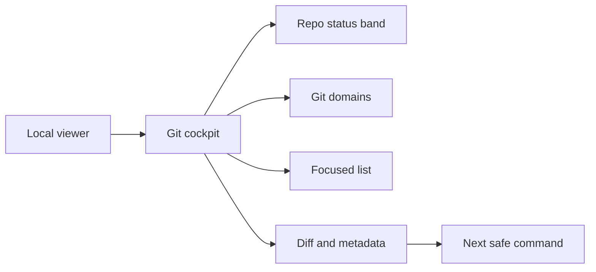

## prod_021_git_cockpit_for_the_local_viewer - Git cockpit for the local viewer
> Date: 2026-06-09
> Status: Proposed
> Related request: `req_218_add_a_git_cockpit_to_the_local_viewer`
> Related backlog: `item_382_add_a_git_cockpit_to_the_local_viewer`
> Related task: `task_183_add_a_git_cockpit_to_the_local_viewer`
> Related architecture: (none yet)
> Reminder: Update status, linked refs, scope, decisions, success signals, and open questions when you edit this doc.

# Overview
The local Logics viewer already gives operators a visual cockpit for workflow documents, health, activity, and markdown review.
The next product opportunity is to make repository state just as scannable.
Git is the substrate behind every Logics workflow document, but the current viewer does not yet expose a Git-focused surface that helps an operator understand working tree state, branch position, recent commits, and affected documents before choosing the next command.

The design direction is dense, contextual, keyboard-friendly, and organized around the user's current Git question.
The goal is not to recreate a terminal TUI in the browser.
It is to bring a compact Git cockpit into `logics-manager view`, where repository status, changed files, history, branches, and diffs stay visible in one coherent workspace.

# Product problem
Operators often need to answer Git questions while working through Logics:
- Which branch am I on?
- Is the repo dirty?
- What changed since the last refresh?
- Which changed files are Logics docs versus implementation files?
- Are there staged changes, unstaged changes, or untracked files?
- Am I ahead or behind the remote?
- What is the recent commit context before I close, commit, release, or hand off?

Today those answers usually require switching back to the terminal and running several Git commands.
That is powerful, but it breaks the visual workflow the viewer is meant to support.
The viewer can show repository identity and recent activity, but it does not yet provide a Git-native mental model for inspecting changes and deciding the next action.

# Target users and situations
- Primary user: a terminal-first Logics operator using `logics-manager view` as the visual companion for local work.
- Primary situation: the operator is editing workflow docs and code in the same repo and needs to verify repository state before committing, finishing a task, or handing work to another agent.
- Secondary user: an agent-assisted operator who wants a quick visual check that the repo state matches the claimed implementation state.
- Secondary situation: multiple viewer windows or repositories are open, and the operator needs a fast branch/status signal without reading raw terminal output.

# Goals
- Add a Git cockpit to the local viewer that makes working tree state, branch state, and recent history visible at a glance.
- Organize Git information around focused domains: changes, staged changes, branches, history, stash, and remote state.
- Keep the primary interaction model contextual: selecting a file, commit, branch, or stash updates the detail pane with the relevant diff or metadata.
- Make Logics-related changes easier to distinguish from implementation changes.
- Preserve CLI authority for mutating operations until explicit write flows are designed and guarded.
- Support dense scanning without creating a noisy command dashboard.
- Make the screen useful even when the repository is clean.

# Non-goals
- Implementing a full terminal emulator.
- Making the first version a broad Git mutation console.
- Replacing the terminal as the canonical command surface for commit, reset, rebase, merge, or push.
- Reimplementing Git history analysis beyond what is needed for local operator awareness.
- Turning the viewer into a general-purpose Git GUI unrelated to Logics workflows.
- Adding remote hosting or exposing repository data outside the viewer's localhost safety model.

# Scope and guardrails
- In:
  - a Git-focused view or tab in the local browser viewer;
  - compact repository status summary with branch, dirty state, ahead/behind, last fetch when available, and changed-file count;
  - changed-file list grouped by staged, unstaged, untracked, deleted, renamed, and conflicted states;
  - diff preview for the selected file or commit;
  - recent commit list with concise metadata;
  - branch list with current branch and remote tracking signals;
  - Logics document markers for changed files under `logics/`;
  - keyboard-friendly selection and predictable focus behavior;
  - read-only Git inspection as the first release mode.
- Out:
  - commits, amends, rebases, force pushes, conflict resolution, and destructive resets in the first release;
  - broad Git configuration editing;
  - background polling that hides repository changes from the operator;
  - external network access beyond the existing explicit viewer model.
- Guardrail: any future Git mutation button must route through explicit CLI/runtime contracts, show the exact intended action, and avoid destructive defaults.
- Guardrail: raw Git data should be summarized for scanning, but exact command output should remain available through terminal workflows when output fidelity matters.

# Key product decisions
- Use a dense cockpit-style information architecture, not a command-output report.
- Prefer a three-zone layout: Git domain navigation, focused list, contextual detail.
- Keep the top repository status band always visible because branch and dirty state are orientation signals.
- Make `Changes` the default domain because it answers the most common operator question: "what is different right now?"
- Separate staged and unstaged state visually; do not collapse them into a single changed-files bucket.
- Show diffs as the primary detail content, with metadata above the diff instead of in a separate verbose panel.
- Keep action controls compact and contextual, and hide unavailable actions rather than showing disabled command clutter.
- Start read-only and add write actions only when the safety model is explicit.
- Treat Logics docs as first-class Git changes by marking request, backlog, task, product, architecture, and spec files in the file list.

# Proposed screen model
The Git cockpit should feel like a work surface, not a report.

Top status band:
- repository name and root indicator;
- current branch;
- dirty or clean state;
- ahead/behind counts when upstream exists;
- changed-file count split by staged and unstaged;
- last refresh and manual refresh action.

Left Git domains:
- `Changes`;
- `Staged`;
- `History`;
- `Branches`;
- `Stash`;
- `Remote`.

Center list:
- for `Changes`, group files by state and show path, compact status marker, Logics type marker when relevant, and line-change summary when available;
- for `History`, show recent commits with SHA, message, author, date, and tag/release markers;
- for `Branches`, show local and remote branches with current, upstream, ahead/behind, and stale indicators.

Right detail:
- selected file diff, staged/unstaged distinction, and file metadata;
- selected commit summary, changed files, and commit diff;
- selected branch metadata, upstream, recent commit, and safe next command suggestions.

Bottom contextual action bar:
- read-only first: copy ref, open file, open Logics doc, refresh, open terminal command hint;
- future guarded actions: stage, unstage, discard, checkout, stash, commit, push.

# Candidate user workflow
1. The operator opens `logics-manager view`.
2. The topbar shows repository identity and the Git status band shows branch and dirty state.
3. The operator opens the Git cockpit.
4. The default `Changes` domain lists staged, unstaged, and untracked files.
5. Selecting a Logics request, backlog item, or task shows its diff and document type marker.
6. Selecting an implementation file shows the code diff and path metadata.
7. The operator decides whether to return to the terminal, inspect related Logics docs, or later run a guarded viewer action.

# Delivery slices
- Slice 1: read-only Git status band plus `Changes` domain with grouped files and selected-file diff.
- Slice 2: Logics-aware file markers, open-document integration, and relationship navigation from changed Logics docs.
- Slice 3: recent commit history with commit detail and changed-file summary.
- Slice 4: branch and remote tracking view with ahead/behind and current branch orientation.
- Slice 5: first guarded write actions, only after the viewer mutation model is explicit and tested.

# Success signals
- The operator can answer "what changed?" without leaving the viewer.
- The operator can distinguish Logics document changes from implementation changes immediately.
- A clean repository still provides useful branch, remote, and recent-history context.
- Dirty, staged, unstaged, and untracked states are visually distinct.
- The screen reduces terminal round-trips for inspection while preserving terminal authority for risky commands.
- Future implementation work can add Git actions without redesigning the information architecture.

# Risks and mitigations
- Risk: the screen becomes a noisy Git GUI instead of a Logics operator cockpit.
  Mitigation: default to inspection, keep actions contextual, and prioritize Logics-aware signals.
- Risk: Git commands differ across platforms or repository states.
  Mitigation: keep the first release read-only and parse structured Git outputs where possible.
- Risk: diff rendering creates performance issues on large changes.
  Mitigation: cap initial diff size, show truncation clearly, and allow explicit expansion.
- Risk: write actions could create destructive outcomes.
  Mitigation: defer write actions, require explicit confirmation, and route through tested CLI/runtime contracts.
- Risk: terminal-oriented Git patterns do not fit the browser.
  Mitigation: keep the information hierarchy while adapting interaction and rendering to the viewer.

# Open questions
- Should the Git cockpit be a top-level viewer tab, a Health subview, or a persistent side panel?
- What is the minimum Git command set needed for fast, structured, cross-platform status hydration?
- Should file diffs be generated server-side, client-side from patch text, or through a shared renderer?
- Which write action is safe enough to introduce first, if any: stage/unstage, stash, or commit message draft?
- Should Logics workflow closure checks surface directly in the Git cockpit when changed files include active tasks?

# References
- `logics/product/prod_020_local_web_viewer_for_cli_driven_logics_work.md`
- `logics/request/req_210_improve_local_logics_viewer_controls_and_activity_signals.md`
- `logics/request/req_211_improve_viewer_repository_identity_and_recent_activity_scanning.md`
- `logics/backlog/item_374_improve_local_logics_viewer_controls_and_activity_signals.md`
- `logics/backlog/item_375_improve_viewer_repository_identity_and_recent_activity_scanning.md`
- `logics_manager/viewer.py`
- `clients/viewer/index.html`
- `clients/viewer/browser-host.js`
- `clients/viewer/viewer.css`
- `clients/shared-web/media/webviewChrome.js`
- Product back-reference: `item_382_add_a_git_cockpit_to_the_local_viewer`
- Task back-reference: `task_183_add_a_git_cockpit_to_the_local_viewer`
