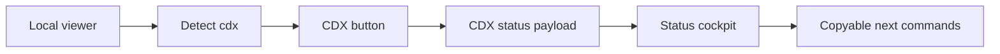

## prod_022_cdx_status_cockpit_for_the_local_viewer - CDX status cockpit for the local viewer
> Date: 2026-06-09
> Status: Settled
> Related request: `req_219_add_a_cdx_status_cockpit_to_the_local_viewer`
> Related backlog: `item_383_add_a_cdx_status_cockpit_to_the_local_viewer`
> Related task: `task_184_add_a_cdx_status_cockpit_to_the_local_viewer`
> Related architecture: (none yet)
> Reminder: Update status, linked refs, scope, decisions, success signals, and open questions when you edit this doc.

# Overview
The local Logics viewer is becoming the operator cockpit for repository work.
It now exposes workflow documents, health, activity, Git state, and markdown previews in one local browser surface.
The next adjacent opportunity is to make the assistant runtime state visible when `cdx-manager` is available.

CDX already answers important operator questions through `cdx status`: which sessions exist, which providers are usable, what authentication or quota state looks like, and whether any agent surface needs attention.
That information is currently terminal-only.
When an operator is using `logics-manager view`, they should be able to inspect CDX state next to Git and Logics health without switching context.

The product direction is a read-only `CDX` cockpit in the local viewer.
If `cdx` is detected on `PATH`, the viewer shows a `CDX` button next to `Git`.
Clicking it opens a polished status screen based on structured `cdx status` output, with clear provider/session health, quota or readiness signals, and copyable next commands.

# Product problem
Logics work increasingly happens with agent assistance.
Before starting or resuming agent work, the operator often needs to know:
- whether `cdx-manager` is installed and reachable;
- which provider/session is active;
- whether Codex, Claude, or another configured provider is authenticated;
- whether a quota, degraded backend, or missing login will block work;
- which command should be run next to repair or refresh runtime state.

Today the operator gets those answers by leaving the viewer and running `cdx status`.
That is acceptable for power users, but it weakens the local viewer's role as a cockpit.
It also means Git state, Logics workflow state, and assistant-runtime state are scattered across separate terminal commands.

# Target users and situations
- Primary user: a terminal-first operator using `logics-manager view` while coordinating Codex, Claude, or other CDX-managed assistant sessions.
- Primary situation: the operator wants to know whether assistant runtime state is ready before starting a Logics task, handing context to an agent, or resuming work.
- Secondary user: an agent-assisted operator who wants a quick visual check that provider/auth/quota state matches what the assistant claims.
- Secondary situation: `cdx-manager` is not installed, stale, misconfigured, or missing provider credentials, and the viewer should make that absence clear without failing.

# Goals
- Detect whether `cdx` is available on `PATH` when the local viewer starts or refreshes.
- Show a `CDX` button next to `Git` only when the integration can provide useful state, or show a bounded unavailable state when the feature is explicitly opened.
- Render a read-only CDX status screen with dense, scan-friendly information.
- Prefer structured `cdx status --json` output over parsing terminal text.
- Surface provider/session readiness, authentication, quota, degraded states, and next commands without exposing secrets.
- Integrate with viewer refresh: if the CDX screen is open, manual and automatic refresh should update CDX status.
- Keep all CDX mutations out of scope for the first version.

# Non-goals
- Replacing the `cdx` CLI.
- Launching, killing, renaming, or reconfiguring CDX sessions from the viewer.
- Editing provider credentials or auth files.
- Adding remote access to CDX state.
- Parsing colorful terminal output as the primary data contract.
- Making `cdx-manager` a hard dependency for `logics-manager view`.
- Showing tokens, credential paths, raw environment secrets, or unredacted provider error bodies.

# Scope and guardrails
- In:
  - backend detection of the `cdx` executable;
  - a local read-only API endpoint such as `GET /api/cdx-status`;
  - invocation of `cdx status --json` with a short timeout;
  - graceful unavailable, timeout, command-failed, and invalid-JSON states;
  - a `CDX` topbar button adjacent to `Git`;
  - source and packaged viewer assets;
  - scan-friendly cards and lists for providers, sessions, quota/readiness, and next commands;
  - refresh integration when the CDX screen is open.
- Out:
  - running mutating `cdx` commands from the viewer;
  - storing CDX state in Logics docs;
  - provider-specific API calls from Logics;
  - bypassing `cdx-manager` abstractions to read private config directly;
  - requiring CDX for normal Logics viewer startup.
- Guardrail: all displayed command suggestions are copyable text only in the first release.
- Guardrail: any future mutating CDX action must go through explicit confirmation and the same CLI contracts as terminal use.

# Key product decisions
- Treat CDX as optional. The viewer remains fully useful without it.
- Use `cdx status --json` as the desired integration contract.
- If the installed `cdx` does not provide a usable JSON shape, return a clear integration error rather than scraping human text.
- Keep detection and status collection bounded by timeout so a broken CDX install cannot hang the viewer.
- Render status semantically, not as a pasted terminal transcript.
- Keep secrets boring: redact suspicious fields, avoid raw environment dumps, and show high-level failure reasons.
- Place `CDX` next to `Git` because both are repository-adjacent operator state screens.

# Proposed screen model
Topbar order:
- `Auto`
- `Refresh`
- `Git`
- `CDX`
- `Insights`
- `Health`

CDX screen layout:
- Summary cards:
  - availability;
  - active provider or selected session;
  - ready/degraded state;
  - blocked provider count;
  - quota or limit signal when available;
  - last refresh time.
- Sessions section:
  - session name;
  - provider;
  - model;
  - permission/power/fast/logics flags when available;
  - status or readiness.
- Providers section:
  - provider name;
  - auth state;
  - availability;
  - quota/reset signal when available;
  - short issue text.
- Next commands:
  - copyable `cdx status --refresh`;
  - provider login or repair command when the JSON payload exposes a safe suggestion;
  - no automatic execution in the first version.

# Candidate user workflow
1. The operator runs `logics-manager view`.
2. The viewer detects `cdx` on `PATH`.
3. The topbar shows `CDX` after `Git`.
4. The operator clicks `CDX`.
5. The viewer calls `/api/cdx-status`, which runs `cdx status --json` with a short timeout.
6. The screen renders provider/session state and next commands.
7. When the operator clicks `Refresh`, the CDX screen updates without closing.
8. If `cdx` is missing or broken, the screen explains the state and preserves the rest of the viewer.

# Delivery slices
- Slice 1: backend CDX detection and `/api/cdx-status` with timeout, unavailable, failed, and invalid-JSON states.
- Slice 2: topbar `CDX` button, read-only status screen, and source/packaged viewer asset updates.
- Slice 3: refresh integration and focused tests for open-CDX refresh behavior.
- Slice 4: visual polish for dense provider/session rendering and copyable command suggestions.
- Slice 5: optional follow-up for a stricter shared JSON contract if `cdx status --json` lacks stable fields for provider readiness.

# Success signals
- Operators can understand CDX readiness without leaving the local viewer.
- Missing or broken CDX installs do not break `logics-manager view`.
- The CDX screen is visually distinct from Git, Health, and Insights while using the same secondary-screen pattern.
- Manual and automatic refresh update open CDX state.
- Tests cover available, unavailable, command failure, timeout, invalid JSON, and refresh behavior.
- No mutating CDX actions are exposed.

# Risks and mitigations
- Risk: `cdx status --json` changes shape or is unavailable in older installs.
  Mitigation: detect invalid or unsupported payloads and show a clear compatibility message.
- Risk: running CDX status slows the viewer.
  Mitigation: collect status only when opening the CDX screen or when it is already open during refresh, with a short timeout.
- Risk: sensitive auth details leak into the viewer.
  Mitigation: sanitize payload fields, avoid raw env/config dumps, and prefer high-level state fields.
- Risk: the screen becomes a clone of terminal output.
  Mitigation: design around cards, tables, status badges, and copyable commands.
- Risk: optional CDX becomes perceived as required.
  Mitigation: hide or gracefully degrade the button and keep core viewer startup independent.

# Open questions
- Is `cdx status --json` currently stable enough for direct consumption, or should `cdx-manager` expose a dedicated machine-readable viewer payload?
- Should the `CDX` button be hidden when unavailable, or visible with an unavailable explanation?
- Which provider readiness fields are most important for the first screen: auth, quota, selected model, session enablement, or runtime health?
- Should copyable next commands use existing viewer button styling or a compact command-list component shared with Health/Git?
- Should `logics-manager view` expose a startup diagnostic line indicating whether CDX was detected?

# References
- `logics/product/prod_020_local_web_viewer_for_cli_driven_logics_work.md`
- `logics/product/prod_021_git_cockpit_for_the_local_viewer.md`
- `logics_manager/viewer.py`
- `clients/viewer/index.html`
- `clients/viewer/browser-host.js`
- `clients/viewer/viewer.css`
- `logics_manager/viewer_assets/viewer/index.html`
- `logics_manager/viewer_assets/viewer/browser-host.js`
- `tests/python/test_logics_manager_cli.py`
- `tests/viewer.browser-host.test.ts`
- Product back-reference: `item_383_add_a_cdx_status_cockpit_to_the_local_viewer`
- Task back-reference: `task_184_add_a_cdx_status_cockpit_to_the_local_viewer`
