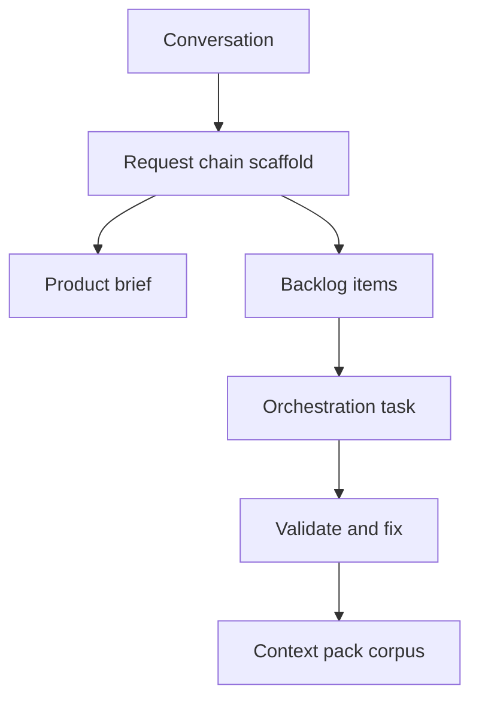

## prod_023_agent_authored_logics_workflow_scaffolding_and_validation - Agent-authored Logics workflow scaffolding and validation
> Date: 2026-06-18
> Status: Proposed
> Related request: `req_249_improve_logics_workflow_scaffolding_validation_agent_docs`
> Related backlog: `item_434_add_rich_request_chain_scaffolding_for_development_ready_logics_work`, `item_435_make_request_splitting_ac_aware_and_task_orchestration_friendly`, `item_436_add_deterministic_validation_repair_and_fixable_diagnostics`, `item_437_improve_context_pack_corpus_generation_for_implementation_handoff`, `item_438_improve_agent_ergonomics_for_recent_docs_and_structured_workflow_output`
> Related task: `task_225_add_rich_request_chain_scaffolding_for_development_ready_logics_work`
> Related architecture: (none yet)
> Reminder: Update status, linked refs, scope, decisions, success signals, and open questions when you edit this doc.

# Overview
Logics should turn a product conversation into a development-ready workflow corpus with one predictable process. The operator should be able to ask an assistant to create a request, split it into items, create an orchestration task, generate product context, validate the result, and commit with minimal manual repair.

# Goals
- Reduce agent-generated Logics workflow creation from many manual patch/validate cycles to one scaffold/validate/corpus flow.
- Make generated docs specific enough to be ready for development without relying on the transcript that produced them.
- Keep `logics-manager` CLI as the canonical write path for workflow docs.
- Produce structured output that agents can consume without broad file scans.

# Non-goals
- Automatically implementing generated tasks.
- Replacing every existing `flow` command in the first delivery.
- Adding cloud-hosted orchestration.
- Granting assistants permission to perform destructive operations without explicit operator intent.

# Scope and guardrails
- In:
  - one-pass request-chain scaffold from structured input
  - AC-aware split and orchestration task options
  - deterministic repair/validate UX
  - context-pack corpus output for implementation handoff
  - recent/open/changed document discovery for agents
- Out:
  - unrelated viewer redesign
  - historical doc migration
  - provider-specific assistant prompts

# Key product decisions
- Treat generated workflow corpus as the source of truth, not the assistant transcript.
- Prefer explicit structured input over long prompt-only generation.
- Make safe fixes easy and unsafe fixes explicit.
- Keep the first version local-first and repo-bounded.

# Success signals
- A new agent can create a request/product/items/task/context-pack chain and pass lint/audit without copying expected signatures manually.
- The operator sees fewer generic generated sections that need full rewrites.
- The command output names the next action and exact fixable blockers.
- Context-pack output is compact enough to hand to an implementation agent directly.

# References
- Product back-reference: `logics/request/req_249_improve_logics_workflow_scaffolding_validation_agent_docs.md`
- Task back-reference: `logics/tasks/task_225_add_rich_request_chain_scaffolding_for_development_ready_logics_work.md`
