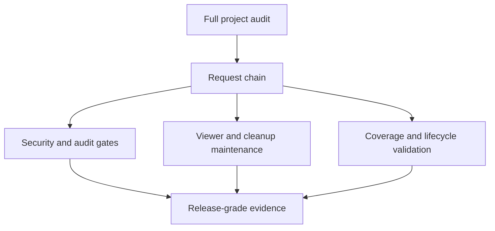

## prod_024_project_audit_remediation_plan - Project audit remediation plan
> Date: 2026-06-19
> Status: Proposed
> Related request: `req_250_address_project_audit_follow_up_actions`
> Related backlog: `item_439_resolve_npm_audit_blocking_dependency_findings`, `item_440_make_ci_check_enforce_npm_audit_policy`, `item_441_plan_viewer_surface_modularization_and_asset_sync_safeguards`, `item_442_add_local_artifact_cleanup_command`, `item_443_target_coverage_gaps_in_high_risk_modules`, `item_444_document_lifecycle_test_prerequisites_and_execution_path`
> Related task: `task_233_orchestrate_project_audit_remediation`
> Related architecture: `adr_025_bound_viewer_cdx_modularization_around_payload_state_and_asset_sync`
> Reminder: Update status, linked refs, scope, decisions, success signals, and open questions when you edit this doc.

# Overview
A maintenance workflow for converting the latest audit into implementation-ready work while keeping release gates truthful.

# Goals
- Remove the only current blocking validation signal from `npm run audit:ci`.
- Make release and CI validation reflect the same policy gates operators run locally.
- Lower future viewer maintenance risk by planning modular boundaries around the largest browser and Python surfaces.
- Keep local generated artifacts bounded and easy to purge.

# Non-goals
- Implement every remediation immediately in the scaffold task.
- Rewrite the viewer architecture in one large change.
- Delete local ignored artifacts as part of this workflow corpus creation.

# Scope and guardrails
- In: scaffolded request, product, backlog, orchestration task, validation, and handoff context.
- Out: unrelated workflow docs and implementation of generated tasks.

# Key product decisions
- Use structured input as the source of truth for generated docs.
- Keep generated write paths local and repo-bounded.
- Treat viewer/CDX modularization as a staged risk-reduction plan around payload helpers, browser state, rendering, and the existing asset sync gate rather than a broad rewrite.

# Success signals
- Generated docs pass lint and audit without broad manual rewrites.
- Context-pack output can be handed to an implementation agent directly.

# References
- Product back-reference: `req_250_address_project_audit_follow_up_actions`
- Task back-reference: `task_233_orchestrate_project_audit_remediation`
- Architecture back-reference: `adr_025_bound_viewer_cdx_modularization_around_payload_state_and_asset_sync`
