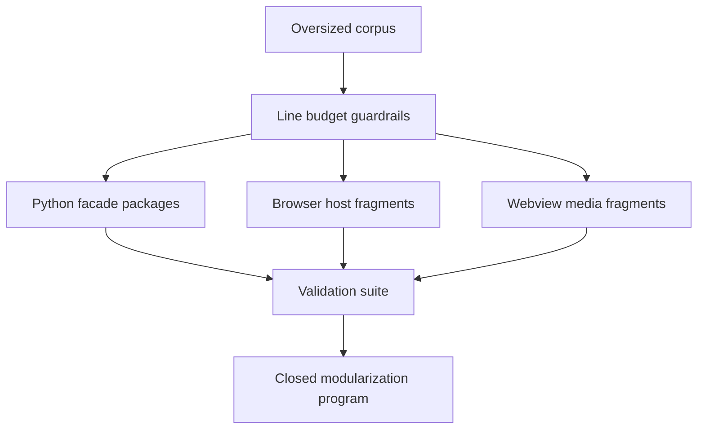

## prod_025_oversized_source_modularization - Oversized source modularization
> Date: 2026-06-22
> Status: Settled
> Related request: `req_270_modularize_oversized_source_files_across_the_codebase`
> Related backlog: `item_474_establish_modularization_guardrails_and_viewer_esbuild_bundle_pipeline`
> Related task: `task_267_orchestrate_the_oversized_source_modularization_program`
> Related architecture: (none yet)
> Reminder: Update status, linked refs, scope, decisions, success signals, and open questions when you edit this doc.

# Overview
A behavior-preserving decomposition of every >1000-line source file into cohesive modules, using only tooling already present in the repository.

# Goals
- Reduce per-file cognitive load and merge-conflict surface across the largest source files.
- Establish a repeatable pattern: Python monoliths become packages with re-export facades; large browser scripts become esbuild-bundled ES modules.
- Add a lightweight guardrail so file size does not silently regress after this effort.

# Non-goals
- Changing runtime behavior, public APIs, or user-facing features.
- Introducing a frontend framework (Preact/Lit/etc.) or any new runtime dependency.
- Refactoring vendored or generated artifacts (mermaid.min.js, dist/, build/, out/).

# Scope and guardrails
- In: scaffolded request, product, backlog, orchestration task, validation, and handoff context.
- Out: unrelated workflow docs and implementation of generated tasks.

# Key product decisions
- Use structured input as the source of truth for generated docs.
- Keep generated write paths local and repo-bounded.

# Success signals
- Generated docs pass lint and audit without broad manual rewrites.
- Context-pack output can be handed to an implementation agent directly.

# References
- Product back-reference: `item_474_establish_modularization_guardrails_and_viewer_esbuild_bundle_pipeline`
- Task back-reference: `task_267_orchestrate_the_oversized_source_modularization_program`
