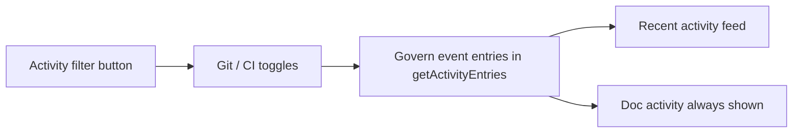

## prod_028_recent_activity_event_filter - Recent activity event filter
> Date: 2026-06-22
> Status: Settled
> Related request: `req_275_add_a_git_ci_event_filter_to_the_recent_activity_view`
> Related backlog: `item_488_surface_recent_git_commits_as_activity_events`
> Related task: `task_272_orchestrate_the_recent_activity_event_filter`
> Related architecture: (none yet)
> Reminder: Update status, linked refs, scope, decisions, success signals, and open questions when you edit this doc.

# Overview
A filter button on the Recent activity view to toggle git and CI events, reusing the project filter button design, the existing activity event channel, and the existing persisted webview state.

# Goals
- Let users focus the activity feed on the event categories they care about without losing logics-doc activity.
- Reuse the project filter button, the activityKind event channel, and existing persistence rather than building new UI infrastructure.
- Surface already-parsed git commits in the feed so the Git toggle is meaningful.

# Non-goals
- A separate events panel or tab distinct from Recent activity.
- Reimplementing CI events (delivered by req_274) or adding a new git fetch.
- Filtering or hiding logics-doc activity entries.

# Scope and guardrails
- In: scaffolded request, product, backlog, orchestration task, validation, and handoff context.
- Out: unrelated workflow docs and implementation of generated tasks.

# Key product decisions
- Use structured input as the source of truth for generated docs.
- Keep generated write paths local and repo-bounded.

# Success signals
- Generated docs pass lint and audit without broad manual rewrites.
- Context-pack output can be handed to an implementation agent directly.

# References
- Product back-reference: `item_488_surface_recent_git_commits_as_activity_events`
- Task back-reference: `task_272_orchestrate_the_recent_activity_event_filter`
