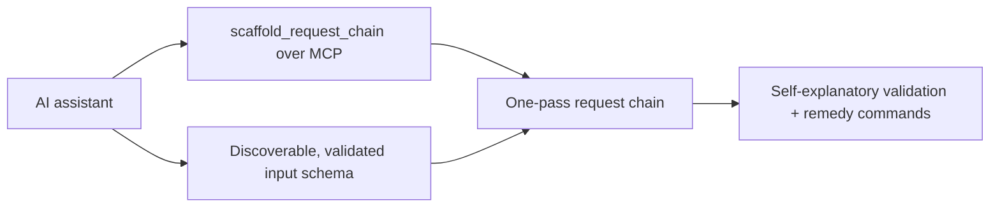

## prod_029_assistant_authoring_ergonomics - Assistant authoring ergonomics
> Date: 2026-06-22
> Status: Settled
> Related request: `req_276_improve_logics_manager_authoring_ergonomics_for_ai_assistants`
> Related backlog: `item_490_expose_scaffold_request_chain_and_deliver_as_mcp_tools`
> Related task: `task_273_orchestrate_the_assistant_authoring_ergonomics_improvements`
> Related architecture: (none yet)
> Reminder: Update status, linked refs, scope, decisions, success signals, and open questions when you edit this doc.

# Overview
Close the gaps that make one-pass logics authoring hard for AI assistants: expose scaffolding over MCP, make the input schema discoverable and validated, and make validation output self-explanatory.

# Goals
- Give every client (MCP, CLI, any repo) the same one-pass authoring path, not just shell users of this repo.
- Make the scaffold input schema and validation remedies discoverable from the tool itself.
- Reduce false-alarm noise so a freshly scaffolded request reads as ready-to-dev.

# Non-goals
- Changing the workflow doc model or the scaffold output shape.
- Reimplementing authoring logic; new surfaces reuse existing code paths.
- Adding a new runtime dependency or a new CLI framework.

# Scope and guardrails
- In: scaffolded request, product, backlog, orchestration task, validation, and handoff context.
- Out: unrelated workflow docs and implementation of generated tasks.

# Key product decisions
- Use structured input as the source of truth for generated docs.
- Keep generated write paths local and repo-bounded.

# Success signals
- Generated docs pass lint and audit without broad manual rewrites.
- Context-pack output can be handed to an implementation agent directly.

# References
- Product back-reference: `item_490_expose_scaffold_request_chain_and_deliver_as_mcp_tools`
- Task back-reference: `task_273_orchestrate_the_assistant_authoring_ergonomics_improvements`
