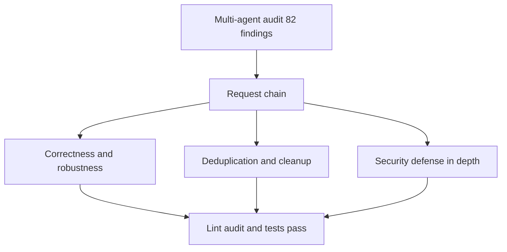

## prod_030_audit_remediation_hardening_and_cleanup - Audit remediation: hardening and cleanup
> Date: 2026-06-26
> Status: Proposed
> Related request: `req_278_act_on_the_multi_agent_audit_hardening_and_cleanup`
> Related backlog: `item_496_harden_viewer_server_against_malformed_content_length`, `item_497_make_the_public_cdxlogicsmodel_api_null_safe`, `item_498_unify_and_guard_workflow_statuses_across_python_and_typescript`, `item_499_fix_confirmed_correctness_one_liners`, `item_500_delete_dead_and_over_engineered_mcp_and_cli_code`, `item_501_remove_workshop_terminal_race_conditions`, `item_502_consolidate_duplicated_python_parsing_helpers`, `item_503_address_local_only_security_findings_as_defense_in_depth`, `item_504_consolidate_duplicated_viewer_boilerplate`, `item_505_clean_up_duplicated_and_dead_client_js_ts_code`
> Related task: `task_275_orchestrate_the_audit_remediation`
> Related architecture: (none yet)
> Reminder: Update status, linked refs, scope, decisions, success signals, and open questions when you edit this doc.

# Overview
Act on the 82 confirmed findings of a multi-agent audit, grouped into eleven coherent slices: harden the viewer server and the public JS API, unify and guard workflow statuses, fix confirmed correctness defects, remove the workshop terminal races, consolidate duplicated Python helpers and viewer boilerplate, clean up the MCP/CLI/client surfaces, and address local-only security findings as defense-in-depth, all without behavior changes.

# Goals
- Make the local viewer server robust to malformed request headers.
- Make the public CdxLogicsModel API null-safe at its boundary.
- Give workflow statuses a single source of truth, fix the Obsolete dropdown bug, and reject invalid transitions.
- Fix the confirmed high/medium correctness defects at their root, including the workshop terminal races.
- Shrink and de-duplicate the MCP, CLI, viewer, Python-helper, and client surfaces.
- Address local-only security findings as defense-in-depth.

# Non-goals
- Changing public APIs, payload schemas, or CLI output.
- Introducing any new runtime dependency or framework.
- Reworking the media-mirror duplication into a build pipeline (tracked separately).
- Adding the spec kind to audit or other low-value schema reconciliation beyond what these slices require.

# Scope and guardrails
- In: scaffolded request, product, backlog, orchestration task, validation, and handoff context.
- Out: unrelated workflow docs and implementation of generated tasks.

# Key product decisions
- Use structured input as the source of truth for generated docs.
- Keep generated write paths local and repo-bounded.

# Success signals
- Generated docs pass lint and audit without broad manual rewrites.
- Context-pack output can be handed to an implementation agent directly.

# References
- Product back-reference: `req_278_act_on_the_multi_agent_audit_hardening_and_cleanup`
- Task back-reference: `task_275_orchestrate_the_audit_remediation`
