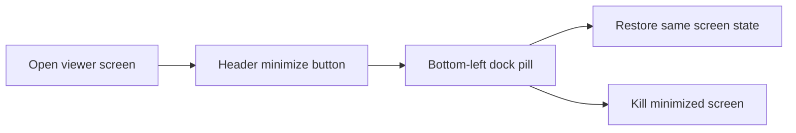

## prod_032_minimizable_viewer_screens - Minimizable viewer screens
> Date: 2026-06-26
> Status: Settled
> Related request: `req_283_minimize_desktop_viewer_screens_to_a_bottom_left_dock`
> Related backlog: `item_513_add_minimize_restore_screen_state_and_the_header_minimize_button`, `item_514_build_the_bottom_left_minimized_dock_of_stacked_pills`, `item_515_preserve_live_screen_state_across_minimize_and_re_fit_terminal_on_restore`
> Related task: `task_280_orchestrate_minimize_screens_to_dock_for_the_desktop_viewer`
> Related architecture: (none yet)
> Reminder: Update status, linked refs, scope, decisions, success signals, and open questions when you edit this doc.
> Non-semantic edit: Added overview Mermaid diagram.

# Overview
A desktop-only minimize-to-dock affordance for viewer screens: hide a screen (kept mounted) behind a bottom-left pill, keep several at hand, and restore or kill them individually — reusing the existing body-class screen model instead of a window manager.

# Goals
- Let operators park a screen and keep working without losing its state.
- Support several minimized screens at once via a simple stacked dock.
- Preserve live Workshop terminal state across minimize/restore.

# Non-goals
- A draggable/resizable floating window manager.
- Multiple instances of the same screen.
- Persisting the minimized dock across page reloads.
- Exposing the control on LAN/mobile.

# Scope and guardrails
- In: scaffolded request, product, backlog, orchestration task, validation, and handoff context.
- Out: unrelated workflow docs and implementation of generated tasks.

# Key product decisions
- Use structured input as the source of truth for generated docs.
- Keep generated write paths local and repo-bounded.

# Success signals
- Generated docs pass lint and audit without broad manual rewrites.
- Context-pack output can be handed to an implementation agent directly.

# References
- Product back-reference: `req_283_minimize_desktop_viewer_screens_to_a_bottom_left_dock`
- Task back-reference: `task_280_orchestrate_minimize_screens_to_dock_for_the_desktop_viewer`
